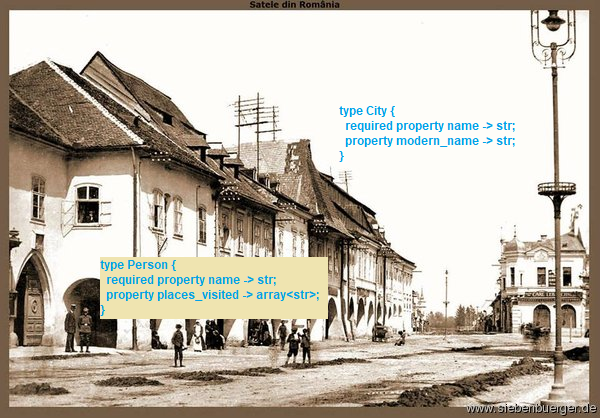

# Welcome!

Welcome to the tutorial to learn EdgeDB in plain English. "Plain English" means using simple phrases and short sentences so you can quickly get the information you need. This lets you learn EdgeDB with a minimum of distractions, and is helpful if English is your second (or third, fourth...) language.

Nevertheless, simple English doesn't mean boring. We will imagine that we are creating the database for a game that is based on the book Bram Stoker's Dracula. Because it will use the events in the book for the background, we need a database to tie everything together. It will need to show the connections between the characters, locations, dates, and more.


# Chapter 1 - Jonathan Harker travels to Transylvania



In the beginning of the book we see the main character Jonathan Harker, a young lawyer who is going to meet a client. The client is a rich man named Count Dracula who lives somewhere in Eastern Europe. Jonathan still doesn't know that Count Dracula is a vampire, so he's enjoying the trip to a new part of Europe. Here is how the book begins, with parts that are good for a database in **bold**:

>**3 May**. **Bistritz**.—Left **Munich** at **8:35 P.M.**, on **1st May**, arriving at **Vienna** early next morning; should have arrived at 6:46, but train was an hour late. **Buda-Pesth** seems a wonderful place, from the glimpse which I got of it from the train...

## Schema, object types

This is already a lot of information, and it helps us start to think about our database schema (structure). EdgeQL uses [SDL (schema definition language)](https://edgedb.com/docs/edgeql/sdl/index#ref-eql-sdl) that makes migration easy. So far our schema needs the following:

- Some kind of City or Location type. Cities should have a name and a location, and sometimes a different name or spelling. Bistritz for example is now called Bistrița (it's in Romania), and Buda-Pesth is now written Budapest.
- Some kind of Person type. We need it to have a name, and also a way to track the places that the person visited.
 
To make a type in EdgeQL, just use the keyword `type` followed by the type name, then `{}` curly brackets. Our `Person` type will start out like this:

```
type Person {
}
```

That's all you need to create a type, but there's nothing inside there yet. Inside it we add the properties for our `Person` type. Use `required property` if the type needs it, and just `property` if it is optional. 

```
type Person {
  required property name -> str;
  property places_visited -> array<str>;
}
```

With `required property name` we are guaranteed to always have `Person` objects with a name - you can't make a `Person` object without it.

A `str` is just a string, and goes inside either single quotes: `'Jonathan Harker'` or double quotes: `"Jonathan Harker"`. An `array` is a collection of the same type, and our array here is an array of `str`s. We want it to look like this: `["Bistritz", "Vienna", "Buda-Pesth"]`. The idea is to easily search later and see which character has visited where.

`places_visited` is not a `required` property because we might later add minor characters that don't go anywhere. Maybe one person will be the "innkeeper_in_bistritz" or something, and we won't know or care about `places_visited` for him.

Now for our City type:

```
type City {
  required property name -> str;
  property modern_name -> str;
}
```

This is similar, just properties with strings. The book Dracula was published in 1897 when spelling for cities was sometimes different. All cities have a name in the book, but some won't need a different modern name. Vienna is still Vienna, for example. We are imagining that our game will link the city names to their modern names so we can easily place them on a map.

## Migration

We haven't created our database yet, though. There are two small steps that we need to do first [after installing EdgeDB](https://edgedb.com/download). First we create a database with the `CREATE DATABASE` keyword and our name for it:

```
CREATE DATABASE dracula;
```

Then we type ```\c dracula``` to connect to it.

Lastly, we we need to do a migration. This will give the database the structure we need to start interacting with it. Migrations are not difficult with EdgeDB:

- First you start them with `START MIGRATION TO {}`
- Inside this you add at least one `module`, so your types can be accessed. A module is a namespace, a place where similar types go together. If you wrote `module default` for example and then `type Person`, the type `Person` would be at `default::Person`. So when you see a type like `std::bytes` for example, this means the type `bytes` in the standard library (std).
- Then you add the types we mentioned above, and type `POPULATE MIGRATION` to add the data.
- Finally, you type `COMMIT MIGRATION` and the migration is done.

## Selecting

Here are three operators in EdgeDB that have the `=` sign: 

- `:=` is used to declare, 
- `=` is used for equality (not `==`),
- `!=` is the opposite of `=`.

Let's try them out with `SELECT`. `SELECT` is the main query command in EdgeDB, and you use it to see results based on the input that comes after it. By the way, keywords in EdgeDB are case insensitive, so `SELECT`, `select` and `SeLeCT` are all the same. But using capital letters is the normal practice for databases so we'll continue to use them that way.

First we'll just select a string:

```
SELECT 'Jonathan Harker';
```

This returns `{'Jonathan Harker'}`, no surprise there.

Next we'll use `:=` to assign a variable:

```
SELECT jonathans_name := 'Jonathan Harker';
```

This returns the same output: `{'Jonathan Harker'}`. But this time it's a string that we assigned called `jonathans_name` that is being returned.

Finally, we can do a `SELECT` by first assigning to `jonathans_name` and then comparing it to `'Count Dracula'`:

```
SELECT jonathans_name := 'Jonathan Harker' = 'Count Dracula';
SELECT jonathans_name := 'Jonathan Harker' != 'Count Dracula';
```

The output is `{false}`, then `{true}`. Of course, you can just write `SELECT 'Jonathan Harker' = 'Count Dracula'` and `SELECT 'Jonathan Harker' != 'Count Dracula'` for the same result. Soon we will actually do something with the variables we assign with `:=`.

## Inserting objects

Let's get back to the schema. Later on we can think about adding time zones and locations for the cities for our imaginary game. But in the meantime, we will add some items to the database using `INSERT`. 

Don't forget to separate each property by a comma, and finish the `INSERT` with a semicolon. EdgeDB also prefers two spaces for indentation.

```
INSERT Person {
  name := 'Jonathan Harker',
  places_visited := ["Bistritz", "Vienna", "Buda-Pesth"],
};

INSERT City {
  name := 'Munich',
};

INSERT City {
  name := 'Buda-Pesth',
  modern_name := 'Budapest'
};

INSERT City {
  name := 'Bistritz',
  modern_name := 'Bistrița'
};
```

Note that a comma at the end is optional - you can put it in or leave it out. Here we put a comma at the end sometimes and left it out at other times to show this.

Hmm. We can see already that our schema needs some improvement though.

- We have a `Person` type, and a `City` type,
- The `Person` type has the property `places_visited` with the names of the cities, but they are just strings in an array. It would be better to link this property to the `City` type somehow.

We'll fix this soon by changing `array<str>` from a `property` to something called `multi link` to the `City` type. This will actually join them together. But first let's look a bit closer at what happens when we use `INSERT`.

As you can see, `str`s are fine with unicode letters like ț. Even emojis and special characters are just fine: you could create a `City` called '🤠' or '(╯°□°)╯︵ ┻━┻' if you wanted to.

EdgeDB also has a byte literal type that gives you the bytes of a string, but in this case it must be a character that is 1 byte long. You create it by adding a `b` in front of the string:

```
SELECT b'Bistritz';
{b'Bistritz'}
```

And because the characters must be 1 byte long, only ASCII works for this type. So the name in `modern_name` as a byte literal will generate an error:

```
SELECT b'Bistrița';
error: invalid bytes literal: character 'ț' is unexpected, only ascii chars are allowed in bytes literals
```

Every time you `INSERT` an item, EdgeDB gives you a `uuid` back. That's the unique number for each item. It will look like this:

```
{Object {id: d2af670c-f1d6-11ea-a30f-8b40bc5413e0}}
```

It is also what shows up when you use `SELECT` to select a type. Just typing `SELECT` with a type will show you all the `uuid`s for the type. Let's look at all the cities we have so far:

```
SELECT City;
```

This gives us three items:

```
{
  Object {id: d2b64e00-f1d6-11ea-a30f-1f161d0b15ae},
  Object {id: d2c023b2-f1d6-11ea-a30f-e3069a47b57e},
  Object {id: d37bc838-f1d6-11ea-a30f-afb031317264},
}
```

This only tells us that there are three objects of type `City`. To see inside them, we can add property names to the query. We'll select all `City` types and display their `modern_name` with this query:

```
SELECT City {
  modern_name,
};
```

Once again, you don't need the comma after `modern_name` because it's at the end of the query.

You will remember that one of our cities (Vienna) doesn't have anything for `modern_name`. But it still shows up as an "empty set", because every value in EdgeDB is a set of elements, even if there's nothing inside. Here is the result:

```
{Object {modern_name: {}}, Object {modern_name: 'Budapest'}, Object {modern_name: 'Bistrița'}}
```

So there is some object with an empty set for `modern_name`, while the other two have a name. This shows us that EdgeDB doesn't have `null` like in some languages: if nothing is there, it will return an empty set.

The first object is a mystery so we'll add `name` to the query so we can see that it's the city of Vienna:

```
SELECT City {
  name,
  modern_name
};
```

This gives the output:


```
{
  Object {name: 'Vienna', modern_name: {}},
  Object {name: 'Bistritz', modern_name: 'Bistrița'},
  Object {name: 'Buda-Pesth', modern_name: 'Budapest'}
}
```

If you just want to return the names without the object structure, you can write `SELECT City.modern_name`. That will give this output:

```
{'Budapest', 'Bistrița'}
```

You can also change property names like `modern_name` to any other name if you want by using `:=` after the name you want. For example:

```
SELECT City {
  name_in_dracula := .name,
  name_today := .modern_name,
};
```

This prints:

```
{
  Object {name_in_dracula: 'Munich', name_today: {}},
  Object {name_in_dracula: 'Buda-Pesth', name_today: 'Budapest'},
  Object {name_in_dracula: 'Bistritz', name_today: 'Bistrița'},
}
```

This will not change the name of the property itself - it's just a quick name to use in a query.

So if you can make a quick `name_in_dracula` property from `.name`, can we make other things too? Indeed we can. For the moment we'll just keep it simple but here is one example:

```
SELECT City {
  name_in_dracula := .name,
  name_today := .modern_name,
  oh_and_by_the_way := 'This is a city in the book Dracula'
};
```

And here is the output:

```
{
  Object {name_in_dracula: 'Munich', name_today: {}, oh_and_by_the_way: 'This is a city in the book Dracula'},
  Object {name_in_dracula: 'Buda-Pesth', name_today: 'Budapest', oh_and_by_the_way: 'This is a city in the book Dracula'},
  Object {name_in_dracula: 'Bistritz', name_today: 'Bistrița', oh_and_by_the_way: 'This is a city in the book Dracula'},
}
```

Also note that `oh_and_by_the_way` is of type `str` even though we didn't have to tell it. The introduction mentions that EdgeDB is strongly typed: everything needs a type and it will not try to mix them together. On the other hand, it can use "type inference" to guess the type like here where it knows that we are creating a `str`. We will look at changing types and working with different types soon.

## Links

So now the last thing left to do is to change a `property` in `Person` to a `link`. Right now, `places_visited` gives us the names we want, but it makes more sense to link `Person` and `City` together. After all, the `City` type has `.name` inside it so we should link to `City` instead of rewriting the names inside `Person`. We'll change `Person` to this:

```
type Person {
  required property name -> str;
  multi link places_visited -> City;
}
```

We wrote `multi` in front of `link` because one `Person` should be able to link to more than one `City`. The opposite of `multi` is `single`, which only allows one object to link to it. But `single` is the default, so if you just write `link` then EdgeDB will treat it as `single`.

Now when we insert Jonathan Harker, he will be connected to the type `City`. Since `places_visited` is not `required`, we can still just enter this to create him now:

```
INSERT Person {
  name := 'Jonathan Harker',
};
```

But this will only create a `Person` type connected to the `City` type with nothing in it. Let's see what's inside:

```
SELECT Person {
  name,
  places_visited
};
```

Here is the output: `{Object {name: 'Jonathan Harker', places_visited: {}}}`

That's not good enough. We'll change `places_visited` when we `INSERT` to `places_visited := City`:

```
INSERT Person {
  name := 'Jonathan Harker',
  places_visited := City,
};
```

Now it will put all the `City` types in there. Now let's see the places that Jonathan has visited. The code below is almost but not quite what we need: 

```
select Person {
  name,
  places_visited
};
```

Here is the output:

```
  Object {
    name: 'Jonathan Harker',
    places_visited: {
      Object {id: 5ba2c9b2-f64d-11ea-acc7-d3a96742e345},
      Object {id: 5bbb2368-f64d-11ea-acc7-ffb002eabe1a},
      Object {id: 5bc2bba0-f64d-11ea-acc7-8b468bbfae39},
    },
  },
```

Close! Now we just need to let EdgeDB know that we want to see the `name` property of the `City` type. To do that, we add a colon and then put `name` inside curly brackets.

```
select Person {
  name,
  places_visited: {
    name
  }
};
```

Success! Now we get the output we wanted:

```
  Object {
    name: 'Jonathan Harker',
    places_visited: {Object {name: 'Munich'}, Object {name: 'Buda-Pesth'}, Object {name: 'Bistritz'}},
  },
```

Of course, right now Jonathan Harker is being connected to every city in the database. Right now we only have three `City` objects, so this is no problem yet. But later on we will have more cities and so we will have to use `FILTER`. We will learn that in the next chapter.

[Here is all our code so far up to Chapter 1.](chapter_1_code.md)

## Time to practice

1. Entering `SELECT my_name = 'Timothy' != 'Benjamin';` returns an error. Try adding one character to make it return `{true}`.
2. Try inserting a `City` called Constantinople, but now known as İstanbul.
3. Try displaying all the names of the cities in the database. (Hint: you can do it in a single line of code and won't need `{}` to do it)
4. Try selecting all the `City` types along with their `name` and `modern_name` properties, but change `.name` to say `old_name` and change `modern_name` to say `name_now`.
5. Will typing `SelecT City;` produce an error?

[Here are the answers to the five questions.](answers_chapter_1.md)

# Chapter 2 - At the Hotel in Bistritz

We continue to read the story as we think about the database we need to store the information. The important information is in bold:

>Jonathan Harker has found a hotel in **Bistritz**, called the **Golden Krone Hotel**. He gets a welcome letter there from Dracula, who is waiting in his **castle**. Jonathan Harker will have to take a **horse-driven carriage** to get there tomorrow. We also see that Jonathan Harker is from **London**. The innkeeper at the Golden Krone Hotel seems very afraid of Dracula. He doesn't want Jonathan to leave and says it will be dangerous, but Jonathan doesn't listen. An old lady gives Jonathan a golden crucifix and says it will protect him. Jonathan is embarrassed, and takes it to be polite. He doesn't know how much it will help him later.

Now we are starting to see some detail about the city. Right away we see that we could add another property to `City`, and we will call it `important_places`. We're not sure if the places will be their own types yet, so we'll just make it an array of strings: `property important_places -> array<str>;` We can put the names of important places in there and maybe develop it more later. It will now look like this:

```
type City {
  required property name -> str;
  property modern_name -> str;
  property important_places -> array<str>;
}
```

Now our original insert for Bistritz will look like this:

```
INSERT City {
  name := 'Bistritz',
  modern_name := 'Bistrița',
  important_places := ['Golden Krone Hotel'],
};
```

## Enums, scalar types, and extending

We now have two types of transport in the book: train, and horse-drawn carriage. The book is based in 1887, and our game will let the characters use different types of transport too. Here an `enum` is probably the best choice, because an `enum` is about making one choice between options. The variants of the enum should be written in UpperCamelCase.

Here we see the word `scalar` for the first time: this is a `scalar type` because it only holds a single value at a time. The other types (`City`, `Person`) are `object types` because they can hold multiple values at the same time.

The other keyword we will see for the first time is `extending`, which means to take a type as a base and extend it. This gives you all the power of the type that you are extending, and add some more options. We will write our `Transport` type like this:

```
scalar type Transport extending enum<Feet, Train, HorseDrawnCarriage>;
```

Did you notice that `scalar type` ends with a semicolon and the other types don't? That's because the other types have a `{}` to make a full expression. But here on a single line we don't have `{}` so we need the semicolon to show that the expression ends here.

This `Transport` type is going to be for player characters in our game, not the characters in the book (their stories and choices are already finished). That means that we want to make a `PC` type and an `NPC` type, but our `Person` type should stay too, and work as a base type. To do this, we can make `Person` an `abstract type` instead of just a `type`. Then with this abstract type, we can use the keyword `extending` again for the other `PC` and `NPC` types.

So now this part of the schema looks like this:

```
abstract type Person {
  required property name -> str;
  multi link places_visited -> City;
}
type PC extending Person {
  required property transport -> Transport;
}
type NPC extending Person {
}
```

Now the characters from the book will be `NPC`s (non-player characters), while `PC` is being made with our game in mind. And because `Person` is now an abstract type, we can't use it directly anymore. It will give us this error if we try to do something like `INSERT Person {name := 'Mr. HasAName'};`:

```
error: cannot insert into abstract object type 'default::Person'
  ┌─ query:1:8
  │
1 │ INSERT Person {
  │        ^^^^^^^ error
```

No problem - just change `Person` to `NPC` and it will work.

Let's also experiment with a player character. We'll make one called Emil Sinclair who starts out traveling by horse-drawn carriage. We'll also just give him `City` so he'll have all three cities.

```
INSERT PC {
  name := 'Emil Sinclair',
  places_visited := City,
  transport := <Transport>HorseDrawnCarriage,
};
```

Note that we didn't just write `HorseDrawnCarriage`, because we have to choose the enum `Transport` and then make a choice of one of the variants. The `<>` angle brackets do casting, meaning to change one type into another. EdgeDB won't try to change one type into another unless you ask it to with casting. That's why this won't give us `true`:

```
SELECT 'feet' IS Transport;
```

We will get an output of `{false}`, because 'feet' is just a `str` and nothing else. But this will work:

```
SELECT <Transport>'feet' IS Transport;
```

Then we get `{true}`.

You can cast more than once at a time if you need to. This example isn't something you will ever do but shows how you can cast over and over again if you want:

```
SELECT <str><int64><str><int32>50 is str; 
```

That also gives us `{true}` because all we did is ask if it is a `str`, which it is. 

Casting works from right to left, with the final cast on the far left. So `<str><int64><str><int32>50` means "50 into an int32 into a string into an int64 into a string". Or you can read it left to right like this: "A string from an int64 from a string from an int32 from the number 50".

## Filter

Finally, let's learn how to `FILTER` before we're done Chapter 2. You can use `FILTER` after the curly brackets in `SELECT` to only show certain results. Let's `FILTER` to only show `Person` types that have the name 'Emil Sinclair':

```
select Person {
  name,
  places_visited: {name},
} FILTER .name = 'Emil Sinclair';
```

`FILTER .name` is short for `FILTER Person.name`. You can write `FILTER Person.name` too if you want - it's the same thing.

The output is this: 

```
{Object {name: 'Emil Sinclair', places_visited: {Object {name: 'Munich'}, Object {name: 'Buda-Pesth'}, Object {name: 'Bistritz'}}}}
```

Let's filter the cities now. One flexible way to search is with `LIKE` or `ILIKE` to match on parts of a string. 

- `LIKE` is case-sensitive: "Bistritz" matches "Bistritz" but "bistritz" does not. 
- `ILIKE` is not case-sensitive, so "Bistritz" matches "BiStRitz", "bisTRITz", etc.

You can also add `%` on the left and/or right which means match anything. Here are some examples with the matched part **in bold**:

- `LIKE Bistr%` matches "**Bistr**itz" (but not "bistritz"),
- `ILIKE '%IsTRiT%'` matches "B**istri**tz",
- `LIKE %athan Harker` matches "Jon**athan Harker**",
- `ILIKE %n h%` matches "Jonatha**n H**arker".

Let's `FILTER` to get all the cities that start with a capital B. That means we'll need `LIKE` because it's case-sensitive:

```
SELECT City {
  name,
  modern_name,
} FILTER .name LIKE 'B%';
```

Here is the result:

```
  Object {name: 'Buda-Pesth', modern_name: 'Budapest'},
  Object {name: 'Bistritz', modern_name: 'Bistrița'},
```

You can also index a string with `[]` square brackets, starting at 0. For example, the string 'Jonathan' looks like this:

```
Jonathan
01234567
```

So `'Jonathan'[0]` is 'J' and `'Jonathan'[4]` is 't'.

Let's try it:

```
SELECT City {
  name,
  modern_name,
} FILTER .name[0]; = 'B'; # First character must be 'B'
```

That gives the same result. Careful though: if you set the number too high then it will try to search outside of the string, which is an error. If we change 0 to 18, we'll get this:

```
ERROR: InvalidValueError: string index 18 is out of bounds
```

And if you have any `City` types with a name of `''`, even a search for index 0 will cause an error. But if you use `LIKE` or `ILIKE` with an empty parameter, it will just give an empty set: `{}` instead of an error.

[Here is all our code so far up to Chapter 2.](chapter_2_code.md)

# Chapter 3 - Jonathan goes to Castle Dracula

In this chapter we are going to start to think about time, as you can see from what Jonathan Harker is doing:

>Jonathan Harker has just arrived at Castle Dracula after a ride in the carriage through the mountains. The ride was terrible: there was snow, strange blue fires and wolves everywhere. It was night when he arrived, and he meets and talks with Count Dracula. Dracula leaves before the sun rises though, because vampires are hurt by sunlight. Jonathan still doesn't know that he's a vampire. But he does notice something strange: the castle seems completely empty. If Dracula is so rich, where are his servants? Who is making his meals that he finds every morning? But Jonathan finds Dracula's stories of history very interesting, and so far is enjoying his trip.

Now we are completely inside Dracula's castle, so this is a good time to create a `Vampire` type. We can extend it from `abstract type Person` because that type only has `name` and `places_visited`, which are good for `Vampire` too. But vampires are different from humans because they can live forever. Let's add `age` to `Person` so that all the other types can use it too. Now `Person' looks like this:

```
abstract type Person {
  required property name -> str;
  multi link places_visited -> City;
  property age -> int16;
}
```

`int16` means a 16 bit (2 byte) integer, which has enough space for -32768 to +32767. That's enough for age, so we don't need the bigger `int32` or `int64` types which are much larger. We also don't want it a `required property`, because we don't care about everybody's age.

First we'll make `Vampire` a type that extends `Person`, and adds age:

```
type Vampire extending Person {            
  property age -> int16;
}
```

We will also take `age` out of `Person`, because `Vampire` specifies it. 

Now we can create Count Dracula. We know that he lives in Romania, but that isn't a city. This is a good time to change the `City` type. We'll change the name to `Place` and make it an `abstract type`, and then `City` can extend from it. We'll also add a `Country` type that does the same thing. Now they look like this:

```
abstract type Place {
  required property name -> str;
  property modern_name -> str;
  property important_places -> array<str>;
}
type City extending Place;
type Country extending Place;
```

Now it's easy to make a `Country`, just do an insert and give it a name. We'll quickly insert a `Country` objects for Hungary and Romania:

```
INSERT Country {
  name := 'Hungary'
};
INSERT Country {
  name := 'Romania'
};
```

## Capturing a SELECT expression

We are now ready to make Dracula. Now, `places_visited` is still defined as a `Place`, and that includes many things: London, Bistritz, Hungary, etc. We only know that Dracula has been in Romania, so we can do a quick `FILTER` instead. When doing this, we put the `SELECT` inside `()` brackets. The brackets are necessary to capture the result of the `SELECT`.

```
INSERT Vampire {
  name := 'Count Dracula',
  places_visited := (SELECT Place FILTER .name = 'Romania'),
  # In other words, .places_visited is the result of this SELECT query.
};
```

The result is `{Object {id: 0a1b83dc-f2aa-11ea-9f40-038d228e2bba}}`.

The `uuid` there is the reply from the server showing that we were successful.

Let's check if `places_visited` worked. We only have one `Vampire` object now, so let's `SELECT` it:

```
SELECT Vampire {
  places_visited: {
    name
  }
};
```

This gives us: `{Object {places_visited: {Object {name: 'Romania'}}}}` Perfect.

## Adding constraints

Now let's think about `age`. It was easy for the `Vampire` type, because they can live forever. But now we want to give `age` to the `PC` and `NPC` types too, who are humans who don't live forever (we don't want them living up to 32767 years). For this we can add a "constraint". Instead of `age`, we'll give them a new type called `HumanAge`. Then we can write `constraint` on it and use [one of the functions](https://edgedb.com/docs/datamodel/constraints) that it can take. We will use `max_value()`. 

Here's the signature for `max_value()`:

`std::max_value(max: anytype)`

The `anytype` part is interesting, because it means it can work on types like strings too. With a constraint `max_value('B')` for example you couldn't use 'C'.

Now let's go back to our constraint for `HumanAge`, which is 120. It looks like this:

```
scalar type HumanAge extending int16 {
  constraint max_value(120);
}
```

Then add it to the `NPC` type. 

```
type NPC extending Person {
  property age -> HumanAge;
}
```

It's our own type, but underneath it's an `int16` that won't be able to be more than 120. So if we write this, it won't work:

```
insert NPC {
    name := 'The innkeeper',
    age := 130
};
```

Here is the error: `ERROR: ConstraintViolationError: Maximum allowed value for HumanAge is 120.` Perfect.

Now if we change `age` to 30, we get a message showing that it worked: `{Object {id: 72884afc-f2b1-11ea-9f40-97b378dbf5f8}}`. Now no NPCs can be over 120 years old.

[Here is all our code so far up to Chapter 3.](chapter_3_code.md)

# Chapter 4 - "What a strange man this Count Dracula is."

>Jonathan Harker wakes up late and is alone in the castle. Dracula appears after nightfall and they talk **through the night**. Dracula is making plans to move to London, and Jonathan gives him some advice. Dracula tells him not to go into any of the locked rooms, because it could be dangerous. Jonathan notices that it's almost morning, and that they talked through the whole night. Dracula suddenly stands up and says he must go, and leaves the room. Jonathan thinks about **Mina** back in London, who he is going to marry when he returns. He is beginning to feel that there is something wrong with Dracula, and the castle. Where are the other people?

First let's create Jonathan's girlfriend, Mina Murray. But we'll also add a new link to the `Person` type in the schema called `lover`:

```
abstract type Person {
  required property name -> str;
  multi link places_visited -> City;
  link lover -> Person;
}
```

With this we can link the two of them together. We will assume that a person can only have one `lover`, so this is a `single link` but we can just write `link`.

Mina is in London, and we don't know if she has been anywhere else. So for the meantime, we are just going to create the city of London. It couldn't be easier:

```
INSERT City {
    name := 'London',
};
```

To give her the city of London, we will just do a quick `SELECT City FILTER .name = 'London'`. This gives her the `City` that matches `.name = 'London'`, but it won't give an error if the city's not there: it will just return a `{}` empty set.

## DETACHED, LIMIT, and EXISTS

For `lover` it is the same process but a bit more complicated:

```
INSERT NPC {
  name := 'Mina Murray',
  lover := (SELECT DETACHED NPC Filter .name = 'Jonathan Harker' LIMIT 1),
  places_visited := (SELECT City FILTER .name = 'London'),
};
```

You'll notice two things here:

- `DETACHED`. This is because we are inside of an `INSERT` for the `NPC` type, but we want to link to the same type: another `NPC`. We need to add `DETACHED` to tell EdgeDB that we are talking about `NPC` in general, not the `NPC` that we are inserting right now.
- `LIMIT 1`. This is because the link is a `single link`. EdgeDB doesn't know how many results we might get: for all it knows, there might be 2 or 3 or more `Jonathan Harkers`. To guarantee that we are only creating a `single link`, we use `LIMIT 1`. And of course `LIMIT 2` will work just fine if we want to link to up to 2 objects.

We will also add Mina to Jonathan Harker as well in the same way. Now we want to make a query to see who is single and who is not. This is easy by using a "computable", where we can create a new variable that we define with `:=`. First here is a normal query:

```
select Person {
  name,
  lover: {
    name
  }
};
```

This gives us:

```
  Object {name: 'Count Dracula', lover: {}},
  Object {name: 'Mina Murray', lover: 'Jonathan Harker'},
  Object {name: 'Jonathan Harker', lover: 'Mina Murray'},
```

But what if we just want to say `true` or `false` depending on if the character has a lover? To do that we can add a computable to the query, using `EXISTS`. `EXISTS` will return `true` if a set is returned, and `false` if it gets `{}` (if there is nothing). This is once again a result of not having null in EdgeDB. It looks like this:

```
select Person {
  name,
  is_single := NOT EXISTS Person.lover,
};
```

Now this prints:

```
  Object {name: 'Count Dracula', is_single: true},
  Object {name: 'Mina Murray', is_single: false},
  Object {name: 'Jonathan Harker', is_single: false},
```

This also shows why abstract types are useful. Here we did a quick search on `Person` for data from both `Vampire` and `NPC`, because they both come from `abstract type Person`.

We can also put a computable in the type itself. Here's the same computable except now it's inside the `Person` type:

```
abstract type Person {
  required property name -> str;
  multi link places_visited -> City;
  property lover -> Person;
  property is_single := NOT EXISTS .lover;
}
```

We won't keep `is_single` in the type definition though, because it's not useful enough for our game.

We will now learn about time, because it might be important for our game. Remember, vampires can only go outside at night.

The part of Romania where Jonathan Harker is has an average sunrise of around 7 am and a sunset of 7 pm. This changes by season, but to keep it simple, we will just use 7 am and 7 pm to decide if it's day or night.

## Ways to tell time

EdgeDB uses two major types for time.

-`std::datetime`, which is very precise and always has a timezone. Times in `datetime` use the ISO 8601 standard.
-`cal::local_datetime`, which doesn't worry about the timezone.

There are two others that are almost the same as `cal::local_datetime`:

-`cal::local_time`, when you only need to know the time of day, and
-`cal::local_date`, when you only need to know the month and the day.

We'll start with `cal::local_time` first.

`cal::local_time` is easy to create, because you can just cast to it from a `str`:

```
SELECT <cal::local_time>('15:44:56');
```

This gives us the output:

```
{<cal::local_time>'15:44:56'}
```

We will imagine that our game has a clock that gives the time as a `str`, like the '15:44:56' in the example above. We'll make a quick `Date` type that can help. It looks like this:

```
type Date {
  required property date -> str;
  property local_time := <cal::local_time>.date;
  property hour := .date[0:2];
}
```

`.date[0:2]` is an example of ["slicing"](https://www.edgedb.com/docs/edgeql/funcops/array#operator::ARRAYSLICE). [0:2] means start from index 0 (the first index) and stop *before* index 2, which means indexes 0 and 1. This is fine because to cast a `str` to `cal::local_time` you need to write the hour with two numbers (e.g. 09 instead of 9).

So this won't work:

```
SELECT <cal::local_time>'9:55:05';
```

It gives this error:

```
ERROR: InvalidValueError: invalid input syntax for type cal::local_time: '9:55:05'
```

Because of that, we are sure that slicing from index 0 to 2 will give us two numbers that indicate the hour of the day.

Now with this `Date` type, we can get the hour by doing this:

```
INSERT Date {
    date := '09:55:05',
};
```

And then we can `SELECT` our `Date` types and everything inside:

```
SELECT Date {
  date,
  local_time,
  hour,
};
```

That gives us a nice output that shows everything, including the hour: 

```{Object {date: '09:55:05', local_time: <cal::local_time>'09:55:05', hour: '09'}}```.

Finally, we can add some logic to the `Date` type to see if vampires are awake or asleep. We could use an `enum` but to be simple, we will just make it a `str`.

```
type Date {
  required property date -> str;
  property local_time := <cal::local_time>.date;
  property hour := .date[0:2];
  property awake := 'asleep' IF <int16>.hour > 7 AND <int16>.hour < 19 ELSE 'awake';
}
```

So `awake` is calculated like this:

- First EdgeDB checks to see if the hour is greater than 7 and less than 19 (7 pm). But it's better to compare with a number than a string, so we write `<int16>.hour` to cast instead of `.hour` so it can compare a number to a number.
- Then it gives us a string saying either 'asleep' or 'awake' depending on that.

Now if we `SELECT` this with all the properties, it will give us this: 

```Object {date: '09:55:05', local_time: <cal::local_time>'09:55:05', hour: '09', awake: 'asleep'}```

## SELECT while you INSERT
One good trick to know is that you can `SELECT` the item you just `INSERT`ed, same as with anything else. Because when we insert a new `Date`, all we get is a `uuid`:

```
INSERT Date {
  date := '22.44.10'
};
```

The output is just something like this: `{Object {id: 528941b8-f638-11ea-acc7-2fbb84b361f8}}` But what if we want to display its properties too?

That's not hard: just wrap the whole entry in `SELECT ()`. Because it's enclosed in brackets, we are taking the whole item that we just inserted, select it, and can do a normal query. That means that we can choose the properties to display, same as always. We can even add a computable while we are at it.

```
SELECT ( # Start a selection
  INSERT Date { # Put the insert inside it
    date := '22.44.10'
}) # The bracket finishes the selection
  { # Now just choose the properties we want
    date,
    hour,
    awake,
    double_hour := <int16>.hour * 2
  };
```

Now the output is more meaningful to us: `{Object {date: '22.44.10', hour: '22', awake: 'awake', double_hour: 44}}` We know the date and the hour, we can see that the vampire is awake, and even make a computable from the object we just entered.

[Here is all our code so far up to Chapter 4.](chapter_4_code.md)

# Chapter 5 - Jonathan tries to leave the castle

Jonathan is not having much luck. Here's what happens to him in this chapter:

>During the day, Jonathan decides to try to explore the castle but too many doors and windows are locked. He doesn't know how to get out, and wishes he could at least send Mina a letter. He pretends that there is no problem, and keeps talking to Dracula during the night. One night he sees Dracula climb out of his window and down the castle wall, like a snake, and now he is very afraid. A few days later he breaks one of the doors and finds another part of the castle. The room is very strange and he feels sleepy. When he opens his eyes, he sees three vampire women next to him. He is attracted to and afraid of them at the same time. He can't move...

## std::datetime

Since Jonathan was thinking of Mina back in London, let's learn about `std::datetime` because it uses time zones. To create a datetime, you can just cast a string in ISO 8601 format with `<datetime>`. That format looks like this:

```YYYY-MM-DDTHH:MM:SSZ```

And an actual date looks like this.

`'2020-12-06T22:12:10Z'`

The `T` inside there is just a separator, and the `Z` at the end means "zero timeline". That means that it is 0 different (offset) from UTC: in other words, it *is* UTC.

One other way to get a `datetime` is to use the `to_datetime()` function. [Here is its signature](https://edgedb.com/docs/edgeql/funcops/datetime/#function::std::to_datetime), which shows that there are six ways to make a `datetime` with this function depending on how you want to make it. 

By the way, you'll notice one unfamiliar type inside called a [`decimal`](https://www.edgedb.com/docs/datamodel/scalars/numeric#type::std::decimal) type. This is a float with "arbitrary precision", meaning that you can give it as many numbers after the decimal point as you want. This is because float types on computers [become imprecise after a while](https://www.youtube.com/watch?v=-3c8G0JMM5Q) thanks to rounding errors. This example shows it:

```
edgedb> SELECT 6.777777777777777; # Good so far
{6.777777777777777}
edgedb> SELECT 6.7777777777777777; # Add one more digit...
{6.777777777777778}
```

If you want to avoid this, add an `n` to the end to get a `decimal` type which will be as precise as it needs to be.

```
edgedb> SELECT 6.7777777777777777n;
{6.7777777777777777n}
edgedb> SELECT 6.7777777777777777777777777777777777777777777777777n;
{6.7777777777777777777777777777777777777777777777777n}
```

Meanwhile, there is a `bigint` type that also uses `n` for an arbitrary size. That's because even int64 has a limit: it's 9223372036854775807.

```
edgedb> SELECT 9223372036854775807; # Good so far...
{9223372036854775807}
edgedb> SELECT 9223372036854775808; # But add 1 and it will fail
ERROR: NumericOutOfRangeError: std::int64 out of range
```

So here you can just add an `n` and it will create a `bigint` that can accommodate any size.

```
edgedb> SELECT 9223372036854775808n;
{9223372036854775808n}
```

Now that we know all the numeric types, let's get back to the six signatures for the `std::to_datetime` function:

```
std::to_datetime(s: str, fmt: OPTIONAL str = {}) -> datetime
std::to_datetime(local: cal::local_datetime, zone: str) -> datetime
std::to_datetime(year: int64, month: int64, day: int64, hour: int64, min: int64, sec: float64, timezone: str) -> datetime
std::to_datetime(epochseconds: decimal) -> datetime
std::to_datetime(epochseconds: float64) -> datetime
std::to_datetime(epochseconds: int64) -> datetime
```

The easiest is probably the third if you find ISO 8601 formatting unfamiliar or you have a bunch of separate numbers to make into a date. With this, our game could have a function that generates integers for times that then use `to_datetime()` to get get a proper time stamp. Let's imagine that it's May 12. It's a bright morning at 10:35 in Castle Dracula. The sun is up, Dracula is asleep somewhere, and Jonathan is trying to use the time during the day to escape to send Mina a letter. In Romania the time zone is 'EEST' (Eastern European Summer Time). We'll use `to_datetime()` to generate this. We won't worry about the year, because the story takes place in the same year - we'll just use 2020 for convenience. We type this:

`SELECT to_datetime(2020, 5, 12, 10, 35, 0, 'EEST');`

And get the following output:

`{<datetime>'2020-05-12T07:35:00Z'}`

The `07:35:00` part shows that it was automatically converted to UTC, which is London where Mina lives.

We can also use this to see the duration between events, using a `duration` type that you can get by subtracting a datetime from another one. Let's see the exact number of seconds between one date in Central Europe and another in Korea:

```
SELECT to_datetime(2020, 5, 12, 6, 10, 0, 'CET') - to_datetime(2000, 5, 12, 6, 10, 0, 'KST');
```

This takes May 12 2020 6:10 am in Central European Time and subtracts May 12 2000 6:10 in Korean Standard Time. The result is: `{631180800s}`.

Now let's try something similar. Imagine Jonathan in Castle Dracula on May 12 at 10:35 am, trying to escape. On the same day, Mina is in London at 6:10 am, drinking her morning tea. They are in different time zones, so how many seconds passed in between the two events? That's easy:

```
SELECT to_datetime(2020, 5, 12, 10, 35, 0, 'EEST') - to_datetime(2020, 5, 12, 6, 10, 0, 'UTC');
```

The answer is 5100 seconds: `{5100s}`.

To make the query easier for us to read, we can also use the `WITH` keyword to create variables. We can then use the variables in `SELECT` below. We'll make one called `jonathan_wants_to_escape` and another called `mina_has_tea`, and subtract one from another to get a `duration`. Now it's a bit easier to read:

```
WITH 
  jonathan_wants_to_escape := to_datetime(2020, 5, 12, 10, 35, 0, 'EEST'),
  mina_has_tea := to_datetime(2020, 5, 12, 6, 10, 0, 'UTC'),
  SELECT jonathan_wants_to_escape - mina_has_tea;
```

The output is `{5100s}`. As long as we know the timezone, the `datetime` type does the work for us when we need a `duration`.

## Required links

Now we need to make a type for the three female vampires. We'll call it `MinorVampire`. These have a link to the `Vampire` type, which needs to be `required` because Dracula controls them and they are only `MinorVampire`s because of him.

```
type MinorVampire extending Person {
  required link master -> Vampire;
}
```

Now that it's required, we can't insert a `MinorVampire` with just a name. It will give us this error: `ERROR: MissingRequiredError: missing value for required link default::MinorVampire.master`.

```
INSERT MinorVampire {
  name := 'Woman 1',
  master := (SELECT Vampire Filter .name = 'Count Dracula'),
};
```

This works because there is only one 'Count Dracula' (remember, `required link` is short for `required single link`). If there were more than one, we would have to add `LIMIT 1`.

## DESCRIBE

Our `MinorVampire` type extends `Person`, and so does `Vampire`. Types can continue to extend other types, plus they can extend more than one type at the same time. The more you do this, the more annoying it can be to try to combine it all together in your mind. Here you can use `DESCRIBE` to show exactly what our type is made of. There are three ways to do it:

- `DESCRIBE TYPE MinorVampire` - the [DDL (data definition language)](https://www.edgedb.com/docs/edgeql/ddl/index/) description of a type. DDL is a lower level language than SDL, the language we have been using. It is more explicit and less convenient, but can be useful for quick changes. We won't look at DDL in this course but later on you might find it useful sometimes later on. For example, with it you can quickly create functions without needing to do a migration. And if you understand SDL it will not be hard to pick up some tricks in DDL. Here is what our Person type looks like in DDL:

```
{
  'CREATE TYPE default::MinorVampire EXTENDING default::Person {
    CREATE REQUIRED SINGLE LINK master -> default::Vampire;
};',
}
```

The `CREATE` keyword shows that it's a series of quick commands, which is why the order is important. Also, because it only shows the DDL commands to create it, we can't see everything inside. So we don't want that. The next method is:

- `DESCRIBE TYPE MinorVampire AS SDL` - same thing, but in SDL.

The output is almost the same too, just the SDL version of the above. It's also not enough information for what we want now:

```
{
  'type default::MinorVampire extending default::Person {
    required single link master -> default::Vampire;
};',
}
```

The third method is `DESCRIBE TYPE MinorVampire AS TEXT`, and is what we want - it shows everything inside the type. Here's the output:

```
{
  'type default::MinorVampire extending default::Vampire {
    required single link __type__ -> schema::Type {
        readonly := true;
    };
    optional single link lover -> default::Person;
    required single link master -> default::Vampire;
    optional multi link places_visited -> default::Place;
    optional single property age -> std::int16;
    required single property id -> std::uuid {
        readonly := true;
    };
    required single property name -> std::str;
};',
}
```

The parts that say `readonly := true` we don't need to worry about, as they are automatically generated (and we can't touch them). For everything else, we can see that we need a `name` and a `master`, and could add a `lover`, `age` and `places_visited` for these `MinorVampire`s.

And for a *really* long output, try typing `DESCRIBE MODULE default` (with `AS SDL` or `AS TEXT` if you want). You'll get an output showing the whole module we've built so far.

[Here is all our code so far up to Chapter 5.](chapter_5_code.md)

# Chapter 6 - Still no escape

>Jonathan can't move and the women vampires are next to him. Suddenly, Dracula runs into the room and tells the women to leave: "You can have him later, but not tonight!" The women listen to him. Jonathan wakes up in his bed and it feels like a bad dream...but he sees that somebody folded his clothes, and he knows it was not just a dream. The castle has some visitors from Slovakia the next day, so Jonathan has an idea. He writes two letters, one to Mina and one to his boss. He gives the visitors some money and asks them to send the letters. But Dracula finds the letters, and burns them in front of Jonathan. Jonathan is still stuck in the castle, and Dracula knows that Jonathan tried to trick him.

## Filtering on sets when doing an insert

There is not much new in this lesson when it comes to types, so let's look at improving our schema. Right now Jonathan Harker is still inserted like this:

```
INSERT NPC {
  name := 'Jonathan Harker',
  places_visited := City,
};
```

This was fine when we only had cities, but now we have the `Place` and `Country` type. First we'll insert two `Country` types so we don't just have cities:

```
INSERT Country {
  name := 'Romania'
};
INSERT Country {
  name := 'Slovakia'
};
```

(In Chapter 9 we'll learn how to do this with just one `INSERT`!)

Then we'll make a new type called `OtherPlace` for places that aren't cities or countries. That's easy: `type OtherPlace extending Place;` and it's done.

Then we'll insert our first `OtherPlace`:

```
INSERT OtherPlace {
  name := 'Castle Dracula'
};
```

That gives us a good number of types from `Place` that aren't of the `City` type.

So back to Jonathan: in our database, he's been to four cities, one country, and one `OtherPlace`...but he hasn't been to Slovakia, so we can't just insert him with `places_visited := SELECT Place`. Instead, we can filter on `Place` types that match the name of the places he has visited. It looks like this:

```
INSERT NPC {
  name := 'Jonathan Harker',
  places_visited := (SELECT Place FILTER .name in {'Munich', 'Buda-Pesth', 'Bistritz', 'London', 'Romania', 'Castle Dracula'})
};
```

You'll notice that we just wrote the names in a set using `{}`, so we didn't need to use an array with `[]` to do it.

Now what if Jonathan ever escapes Castle Dracula and runs away to a new place? Let's pretend that he escapes and runs away to Slovakia. Of course, we can change his `INSERT` signature to include `'Slovakia'` in the set of names. But how about a quick update? For that we have the `UPDATE` and `SET` keywords. `UPDATE` selects the type to start the update, and `SET` is for the parts we want to change. It looks like this:

```
UPDATE NPC
  FILTER
  .name = 'Jonathan Harker'
  SET {
    places_visited += (SELECT Place FILTER .name = 'Slovakia')
};
```

And since Jonathan hasn't visited Slovakia, we can use `-=` instead of `+=` with the same `UPDATE` syntax to remove it now.

Here's one more example of a very simple update which doesn't filter at all. This update would give every `Person` type every single `Place` in the database under `places_visited`.

```
UPDATE Person
  SET {
    places_visited := Place
    };
```

## Concatenation with ++

One other operator is `++`, which does concatenation (joining together) instead of adding.

You can do simple operations with it like: ```SELECT 'My name is ' ++ 'Jonathan Harker';``` which gives `{'My name is Jonathan Harker'}`. Or you can do more complicated concatenations as long as you continue to join strings to strings:

```
SELECT 'A character from the book: ' ++ (SELECT NPC.name) ++ ', who is not ' ++ (SELECT Vampire.name);
```

This prints:

```
{
  'A character from the book: Jonathan Harker, who is not Count Dracula',
  'A character from the book: The innkeeper, who is not Count Dracula',
  'A character from the book: Mina Murray, who is not Count Dracula',
}
```

(The concatenation operator works on arrays too, putting them into a single array. So `SELECT ['I', 'am'] ++ ['Jonathan', 'Harker'];` gives `{['I', 'am', 'Jonathan', 'Harker']}`.)

Let's also change the `Vampire` type to link it to `MinorVampire` from that side instead. You'll remember that Count Dracula is the only real vampire, while the others are of type `MinorVampire`. That means we need a `multi link`:

```
type Vampire extending Person {            
  property age -> int16;
  multi link slaves -> MinorVampire;
}
```

Then we can `INSERT` the `MinorVampire` type at the same time as we insert the information for Count Dracula. But first let's remove the link from `MinorVampire`, because we don't want two objects linking to each other. There are two reasons for that:

- When we declare a `Vampire` it has `slaves`, but if there are no `MinorVampire`s yet then it will be empty: {}. And if we declare the `MinorVampire` type first it has a `master`, but if we declare them first then their `master` (a `required link`) will not be there.
- If both types link to each other, we won't be able to delete them if we need to. The error looks something like this:

```
ERROR: ConstraintViolationError: deletion of default::Vampire (cc5ee436-fa23-11ea-85e0-e78b548f5a59) is prohibited by link target policy

DETAILS: Object is still referenced in link master of default::MinorVampire (cc87c78e-fa23-11ea-85e0-8f5149329e3a).
```

So first we simply change `MinorVampire` to a type extending `Person`:

```
type MinorVampire extending Person {
}
```

and then we create them all together with Count Dracula like this:

```
INSERT Vampire {
  name := 'Count Dracula',
  age := 800,
  slaves := {
    (INSERT MinorVampire {
      name := 'Woman 1',
  }),
    (INSERT MinorVampire {
     name := 'Woman 2',
  }),
    (INSERT MinorVampire {
     name := 'Woman 3',
  }),
 }
};
```

With this we don't have to insert the `MinorVampire` types first and then filter: we can just put them in together with Dracula.

Then when we `select Vampire` like this:

```
SELECT Vampire {
  name,
  slaves: {name}
};
```

We have a nice output that shows them all together:

```
Object {
  name: 'Count Dracula',
  slaves: {Object {name: 'Woman 1'}, Object {name: 'Woman 2'}, Object {name: 'Woman 3'}},
  },
```

## Just type \<json> to generate json

What do we do if we want the same output in json? It couldn't be easier: just cast using `<json>`. Any type in EdgeDB (except `bytes`) can be cast to json this easily:

```
SELECT <json>Vampire { 
      # <json> is the only difference from the SELECT above
  name,
  slaves: {name}
};
```

The output is:

```
{
  "{\"name\": \"Count Dracula\", \"slaves\": [{\"name\": \"Woman 1\"}, {\"name\": \"Woman 2\"}, {\"name\": \"Woman 3\"}]}",
}
```

[Here is all our code so far up to Chapter 6.](chapter_6_code.md)

# Chapter 7 - Jonathan finally "leaves" the castle

> Jonathan sneaks into Dracula's room during the day and sees him sleeping inside a coffin. Now he knows that he is a vampire. A few days later Count Dracula says that he will leave tomorrow. Jonathan thinks this is a chance, and asks to leave now. Dracula says, "Fine, if you wish..." and opens the door: but there are a lot of wolves outside. Jonathan knows that Dracula called the wolves, and asks him to please close the door. Dracula smiles and closes the door - he knows that Jonathan is trapped. Later, Jonathan hears Dracula tell the women that they can have him tomorrow after he leaves. Dracula's friends take him away (he is inside a coffin), and Jonathan is alone... and soon it will be night. All the doors are locked. He decides to escape out the window, because it is better to die by falling than to be alone with the vampire women. He writes "Good-bye, all! Mina!" and begins to climb the wall.

## More constraints

While Jonathan climbs the wall, we can continue to work on our database schema. In our book, no character has the same name. This is a good time to put a [constraint](https://edgedb.com/docs/datamodel/constraints#ref-datamodel-constraints) on `name` in the `Person` type, to make sure that we don't have duplicate inserts. A `constraint` is a limitation, which we saw already in `age` for humans that can only go up to 120. For `name` we can give it another one called `constraint exclusive` which will prevent two objects of the same type from having the same name. You can put a `constraint` in a block after the property, like this:

```
abstract type Person {
  required property name -> str { ## Add a block
      constraint exclusive;       ## and the constraint
  }
  multi link places_visited -> Place;
  link lover -> Person;
}
```

Now we know that there will only be one `Jonathan Harker`, one `Mina Murray`, and so on. In real life this is often useful for email addresses, User IDs, and other properties that you always want to be unique. In our database we'll also add `constraint exclusive` to `name` inside `Place` because these places are also all unique:

```
abstract type Place {
  required property name -> str {
      constraint exclusive;
  };
  property modern_name -> str;
  property important_places -> array<str>;
}
```

## Using functions in queries

Let's also think about our game mechanics a bit. The book says that the doors inside the castle are too difficult for Jonathan to open, but Dracula is strong enough to open them all. In a real game it will be more complicated but for our case we can just do this:

- Doors have a strength, and people have strength as well. 
- If the person has greater strength than the door, then he or she can open it. 

So we'll create a type `Castle` and give it some doors. For now we only want to give it some "strength" numbers, so we'll just make it an `array<int16>`:

```
type Castle extending Place {
    property doors -> array<int16>;
}
```

Then we'll say there are three main doors to enter and leave Castle Dracula, so we `INSERT` them as follows:

```
INSERT Castle {
    name := 'Castle Dracula',
    doors := [6, 19, 10],
};
```

Then we will also add a property `strength -> int16;` to our `Person` type. It won't be required because we don't know the strength of everybody in the book...though later on we could make it required if the game needs it.

Now we'll give Jonathan a strength of 5. We'll use `UPDATE` and `SET` like before:

```
UPDATE Person FILTER .name = 'Jonathan Harker'
  SET {
    strength := 5
};
```

Great. Now we can see if Jonathan can break out of the castle. To do that, he needs to have a strength greater than that of a door. Or in other words, he needs a greater strength than the weakest door. (Of course, we know that he can't do it but we want to make a query that can give the answer.)

There is a function called `min()` that gives the minimum value of a set, so we can use that. If his strength is higher than the door with the smallest number, then he can escape. This almost works, but not quite:

```
WITH 
  jonathan_strength := (SELECT Person FILTER .name = 'Jonathan Harker').strength,
  castle_doors := (SELECT Castle FILTER .name = 'Castle Dracula').doors,
    SELECT jonathan_strength > min(castle_doors);
```

Here's the error:

```
error: operator '>' cannot be applied to operands of type 'std::int16' and 'array<std::int16>'
```

We can [look at the function signature](https://edgedb.com/docs/edgeql/funcops/set#function::std::min) to see the problem:

```
std::min(values: SET OF anytype) -> OPTIONAL anytype
```

So it needs a set, so something in curly brackets. We can't just put curly brackets around the array, because then it becomes a set of one item (one array). So `SELECT min({[5, 6]});` just returns `{[5, 6]}` because that is the minimum value of the one array.

That also means that `SELECT min({[5, 6], [2, 4]});` will give us the output `{[2, 4]}` (instead of 2). That's not what we want.

Instead, what we want to use is the [array_unpack()](https://edgedb.com/docs/edgeql/funcops/array#function::std::array_unpack) function which takes an array and unpacks it into a set. So we'll use that on `weakest_door`:

```
WITH 
  jonathan_strength := (SELECT Person FILTER .name = 'Jonathan Harker').strength,
  doors := (SELECT Castle FILTER .name = 'Castle Dracula').doors,
    SELECT jonathan_strength > min(array_unpack(doors));
```

That gives us `{false}`. Perfect! Now we know that Jonathan can't open any doors. He will have to climb out the window to escape.

Along with `min()` there is of course `max()`. `len()` and `count()` are also useful: `len()` gives you the length of an object, and `count()` the number of them. Here is an example of `len()` to get the name length of all the `NPC`  types:

```
SELECT (NPC.name, 'Name length is: ' ++ <str>len(NPC.name));
```

Don't forget that we need cast with `<str>` because `len()` returns an integer, and EdgeDB won't concatenate a string to an integer. This prints:

```
{
  ('The innkeeper', 'Name length is: 13'),
  ('Mina Murray', 'Name length is: 11'),
  ('Jonathan Harker', 'Name length is: 15'),
}
```

The other example is with `count()`, which also has a cast to a `<str>`:

```
SELECT 'There are ' ++ <str>(SELECT count(Place) - count(Castle)) ++ ' more places than castles';
```

It prints: `{'There are 6 more places than castles'}`.

In a few chapters we will learn how to create our own functions to make queries shorter.

[Here is all our code so far up to Chapter 7.](chapter_7_code.md)

# Chapter 8 - Dracula takes the boat to England

We are finally away from Castle Dracula. Here is what happens in this chapter:

> A boat leaves from the city of Varna. It has a **captain, first mate, second mate, cook**, and **five crew**. Inside is Dracula, but they don't know that he's there. Every night Dracula leaves his coffin, and every night one of the men disappears. They are afraid but don't know what to do. One of them sees Dracula but the others don't believe him. On the last day the ship gets close to the city of Whitby in England and all the men are dead except the captain. He ties his hands to the wheel so that the ship will go straight even if Dracula finds him. The next day the ship hits the beach, all the men are dead, and Dracula turns into a wolf and runs onto the shore. People find the captain's notebook in his hand and start to read the story.

> Meanwhile, Mina and Lucy are in Whitby on vacation...

## Multiple inheritance

Let's learn about multiple inheritance. We know that you can `extend` a type on another, and we have done this many times: `Person` on `NPC`, `Place` on `City`, etc. Multiple inheritance is doing this with more than one type at the same time. We'll try this with the ship's crew. The book doesn't give them any names, so we will give them numbers instead. Most `Person` types won't need a number, so we'll create an abstract type called `HasNumber` only for the types that need a number:

```
abstract type HasNumber {
    required property number -> int16;
}
```

We will also remove `required` from `name` for the `Person` type. Not every `Person` type will have a name now, and we trust ourselves enough to input a name if there is one. We will of course keep it `exclusive`.

Now we can use multiple inheritance for the `Crewman` type. It looks like this:

```
type Crewman extending HasNumber, Person {
}
```

Now that we have this type and don't need a name, it's super easy to insert our crewmen thanks to `count()`. We just do this five times:

```
INSERT Crewman {
  number := count(DETACHED Crewman) + 1
};
```

So if there are no `Crewman` types, he will get the number 1. The next will get 2, and so on. So after doing this five times, we can `SELECT Crewman {number};` to see the result. It gives us:

```
{
  Object {number: 1},
  Object {number: 2},
  Object {number: 3},
  Object {number: 4},
  Object {number: 5},
}
```

Next is the `Sailor` type. The sailors have ranks, so first we will make an enum for that:

```
scalar type Rank extending enum<Captain, FirstMate, SecondMate, Cook>;
```

And then we will make a `Sailor` type that uses `Person` and this `Rank` enum:

```
type Sailor extending Person {
    property rank -> Rank;
}
```

Then finally a we make `Ship` type to hold them all.

```
type Ship {
  required property name -> str;
  multi link sailors -> Sailor;
  multi link crew -> Crewman;
}
```

Now to insert the sailors we just give them each a name and choose a rank from the enum:

```
INSERT Sailor {
  name := 'The Captain',
  rank := 'Captain'
};
```

We do that for the Captain, First Mate, Second Mate, and Cook.

Inserting the `Ship` is easy because right now every `Sailor` and every `Crewman` type is part of this ship - we don't need to `FILTER` anywhere.

```
INSERT Ship {
  name := 'The Demeter',
  sailors := Sailor,
  crew := Crewman
};
```

Then we can look up the `Ship` to make sure that the whole crew is there:

```
SELECT Ship {
  name,
  sailors: {
    name,
    rank,
    },
  crew: {
    number
    },
};
```

The result is:

```
{
  Object {
    name: 'The Demeter',
    sailors: {
      Object {name: 'Petrofsky', rank: First mate},
      Object {name: 'The Second Mate', rank: Second mate},
      Object {name: 'The Cook', rank: Cook},
      Object {name: 'The Captain', rank: Captain},
    },
    crew: {
      Object {number: 1},
      Object {number: 2},
      Object {number: 3},
      Object {number: 4},
      Object {number: 5},
    },
  },
}
```

## Using IS to query multiple types

So now we have quite a few types that extend the `Person` type, many with their own properties. The `Crewman` type has a property `number`, while the `NPC` type has a property called `age`. 

But this gives us a problem if we want to query them all at the same time. They all extend `Person`, but `Person` doesn't have all of their links and properties. So this query won't work:

```
SELECT Person {
  name,
  age,
  number,
};
```

The error is `ERROR: InvalidReferenceError: object type 'default::Person' has no link or property 'age'`. 

Luckily there is an easy fix for this: we can use `IS` inside square brackets to specify the type. Here's how it works:

- `.name`: this stays the same, because `Person` has this property
- `.age`: this belongs to the `NPC` type, so change it to `[IS NPC].age`
- `.number`: this belongs to the `Crewman` type, so change it to `[IS Crewman].number`

Now it will work:

```
SELECT Person {
  name,
  [IS NPC].age,
  [IS Crewman].number,
};
```

The output is now quite large, so here's just a part of it. You'll notice that types that don't have a property or a link will return an empty set: `{}`.

```
{
  Object {name: 'Woman 1', age: {}, number: {}},
  Object {name: 'The innkeeper', age: 30, number: {}},
  Object {name: 'Mina Murray', age: {}, number: {}},
  Object {name: {}, age: {}, number: 1},
  Object {name: {}, age: {}, number: 2},
   # /snip
}
```

This is pretty good, but the output doesn't show us the type for each of them. To refer to self in a query in EdgeDB you can use `__type__`. Calling just `__type__` will just give a `uuid` though, so we need to add `{name}` to indicate that we want the name of the type. All types have this `name` field that you can access if you want to show the object type in a query.

```
SELECT Person {
  __type__: { 
    name      # Name of the type inside module default
  },
  name, # Person.name
  [IS NPC].age,
  [IS Crewman].number,
};
```

Choosing the five objects from before from the output, it now looks like this:

```
{
  Object {__type__: Object {name: 'default::MinorVampire'}, name: 'Woman 1', age: {}, number: {}},
  Object {__type__: Object {name: 'default::NPC'}, name: 'The innkeeper', age: 30, number: {}},
  Object {__type__: Object {name: 'default::NPC'}, name: 'Mina Murray', age: {}, number: {}},
  Object {__type__: Object {name: 'default::Crewman'}, name: {}, age: {}, number: 1},
  Object {__type__: Object {name: 'default::Crewman'}, name: {}, age: {}, number: 2},
}
```


[Here is all our code so far up to Chapter 8.](chapter_8_code.md)

# Chapter 9 - Strange events in England

We'll only read part of the introduction to start this chapter. Here it is:

> We still don't know where Jonathan is, and the ship is on its way to England. Meanwhile, Mina Harker is writing letters to her friend Lucy Westenra. Lucy has three boyfriends (named Dr. John Seward, Quincey Morris, and Arthur Holmwood), and they all want to marry her....

## Working with dates some more

It looks like we have some more people to insert. But first, let's think about the ship a little more. Everyone on the ship was killed by Dracula, but we don't want to delete the crew because they will still be a part of our game. The book tells us that the ship left on the 6th of July, and the last person (the captain) died on the 4th of August (in 1887). 

This is a good time to add a `first_appearance` and `last_appearance` property to the `Person` type. We will choose `last_appearance` instead of `death`, because for the game it doesn't matter: we just want to know when characters are present.

For these two properties we will use `cal::local_date` because we can use the year 1887 for it. There is also `cal::local_datetime` that includes time, but we should be fine with just the date. (And of course there is the `cal::local_time` type with just the time of day that we use in our `Date` type.)

We won't insert all the `first_appearance` and `last_appearance` values here, but the format looks like this:

```
INSERT Crewman {
  number := count(DETACHED Crewman) +1,
  first_appearance := cal::to_local_date(1887, 7, 6),
  last_appearance := cal::to_local_date(1887, 7, 16),
};
```

And the easiest way to set them all is to use the `UPDATE` and `SET` syntax if we know the same date for all of them.

Since `cal::local_date` has a pretty simple YYYYMMDD format, the easiest way to insert would be just casting from a string:

```
SELECT <cal::local_date>'1887-07-08';
```

But we imagined before that we had a function that gave us separate numbers to put into a function, so we can use something similar.

Before we used the function `std::to_datetime` which took seven parameters; this time we'll use a similar but shorter [`cal::to_local_date`](https://www.edgedb.com/docs/edgeql/funcops/datetime#function::cal::to_local_date) function. It just takes three integers.

Here are its signatures (we're using the third):

```
cal::to_local_date(s: str, fmt: OPTIONAL str = {}) -> local_date
cal::to_local_date(dt: datetime, zone: str) -> local_date
cal::to_local_date(year: int64, month: int64, day: int64) -> local_date
```

Now we update the `Crewman` types and give them all the same date to keep things simple:

```
UPDATE Crewman
  SET {
  first_appearance := cal::to_local_date(1887, 7, 6),
  last_appearance := cal::to_local_date(1887, 7, 16)
};      
```

This will of course depend on our game. Can a `PC` actually visit the ship when it's sailing to England? If so, then we will need more precise dates. But we're fine for now.

## Adding defaults to a type, and the overloaded keyword

Now let's get back to inserting the new characters. First we'll insert Lucy:

```
INSERT NPC {
  name := 'Lucy Westenra',
  places_visited := (SELECT City FILTER .name = 'London')
};
```

Hmm, it looks like we're doing a lot of work to insert 'London' every time. We have three characters left and they will all be from London too. To save ourselves some work, we can make London the default for `places_visited` for `NPC`. To do this we will need two things: `default` to declare a default, and the keyword `overloaded`. `overloaded` is to indicate that we are using `placed_visited` in a different manner than the `Person` type that we got it from.

With `default` and `overloaded` added, it now looks like this:

```
type NPC extending Person {
  property age -> HumanAge;
  overloaded multi link places_visited -> Place {
    default := (SELECT City FILTER .name = 'London');
  }
}
```

## Using FOR and UNION

We're almost ready to insert our three characters, and now we don't need to add `(SELECT City FILTER .name = 'London')` every time. But wouldn't it be nice if we could use a single insert instead of three?

To do this, we can use a `FOR` loop, followed by the keyword `UNION`. First, here's the `FOR` part:

```
FOR character_name IN {'John Seward', 'Quincey Morris', 'Arthur Holmwood'}
```

In other words: take this set of three strings and do something to each one, which we will call `character_name` every time.

`UNION` is because it is the keyword used to join sets together. For example, this query:

```
WITH city_names := (SELECT City.name),
  castle_names := (SELECT Castle.name),
  SELECT city_names UNION castle_names;
```

joins the names together to give us the output `{'Munich', 'Buda-Pesth', 'Bistritz', 'London', 'Castle Dracula'}`.

Back to the `FOR` loop with the variable name `character_name`, which looks like this:

```
FOR character_name IN {'John Seward', 'Quincey Morris', 'Arthur Holmwood'}
  UNION (
    INSERT NPC {
    name := character_name,
    lover := (SELECT Person FILTER .name = 'Lucy Westenra'),
});
```

We get three `uuid`s as a response to show that they were entered.

Then we can check to make sure that it worked:

```
SELECT NPC {
  name,
  places_visited: {
    name,
  },
  lover: {
  name,
  },
} FILTER .name IN {'John Seward', 'Quincey Morris', 'Arthur Holmwood'};
```

And as we hoped, they are all connected to Lucy now.

```
  Object {
    name: 'John Seward',
    places_visited: {Object {name: 'London'}},
    lover: Object {name: 'Lucy Westenra'},
  },
  Object {
    name: 'Quincey Morris',
    places_visited: {Object {name: 'London'}},
    lover: Object {name: 'Lucy Westenra'},
  },
  Object {
    name: 'Arthur Holmwood',
    places_visited: {Object {name: 'London'}},
    lover: Object {name: 'Lucy Westenra'},
  },
}
```

By the way, now we can use this to insert our five `Crewman` types inside one `INSERT` instead of five. We can put their numbers inside a single set, and use the same `FOR` and `UNION` method to insert them:

```
FOR n IN {1, 2, 3, 4, 5}
  UNION (
  INSERT Crewman {
  number := n
});
```

Now it's time to update Lucy with three lovers. Lucy has already ruined our plans to have `lover` as just a `link` (which means `single link`). We'll set it to `multi link` instead so we can add all three of the men. Here is our update for her:

```
UPDATE NPC FILTER .name = 'Lucy Westenra'
SET {
  lover := (
    SELECT Person FILTER .name IN {'John Seward', 'Quincey Morris', 'Arthur Holmwood'}
  )
};
```

Now we'll select her to make sure it worked. Let's use `LIKE` this time for fun when doing the filter:

```
SELECT NPC {
  name,
  lover: {
  name
  }
} FILTER .name LIKE 'Lucy%';
```

And this does indeed print her out with her three lovers.

```
{
  Object {
    name: 'Lucy Westenra',
    lover: {
      Object {name: 'John Seward'},
      Object {name: 'Quincey Morris'},
      Object {name: 'Arthur Holmwood'},
    },
  },
}
```

## Overloading instead of making a new type

So now that we know the keyword `overloaded`, we don't need the `HumanAge` type for `NPC` anymore. Right now it looks like this:

```
scalar type HumanAge extending int16 {
      constraint max_value(120);
}
```

You will remember that we made this type because vampires can live forever, but humans only live up to 120. But now we can simplify things. First we move the `age` property over to the `Person` type. Then (inside the `NPC` type) we use `overloaded` to add a constraint on it there. Now `NPC` uses `overloaded` twice:

```
type NPC extending Person {
  overloaded property age {
    constraint max_value(120)
  }
  overloaded multi link places_visited -> Place {
    default := (SELECT City filter .name = 'London');
  }
}
```

This is convenient because we can delete it from `Vampire` too:

```
type Vampire extending Person {    
  # property age -> int16; **Delete this one now**
  multi link slaves -> MinorVampire;
}
```

Okay, let's read the rest of the introduction for this chapter. Let's see what Lucy is up to:

>...She chooses to marry Arthur Holmwood, and says sorry to the other two. The other two men are sad, but fortunately they become friends with each other. Dr. Seward is sad and tries to concentrate on his work. He is a psychiatrist who is studying a strange man named Renfield. Renfield is sometimes calm, sometimes completely crazy, and seems to believe that he can get power from living things by eating them. He's not a vampire, but seems to act similar sometimes.

Oops! Looks like Lucy doesn't have three lovers anymore. Now we'll have to update her to only have Arthur:

```
UPDATE NPC FILTER .name = 'Lucy Westenra'
  SET {
    lover := (SELECT NPC FILTER .name = 'Arthur Holmwood'),
};
```

And then remove her from the other two. We'll just give them an empty set.

```
UPDATE NPC FILTER .name in {'John Seward', 'Quincey Morris'}
  SET {
    lover := {} # 😢
};
```

Looks like we are mostly up to date now. The only thing left is to insert the mysterious Renfield. He is easy because he has no lover to `FILTER` for:

```
INSERT NPC {
  name := 'Renfield',
  first_appearance := cal::to_local_date(1887, 5, 26),
  strength := 10,
};
```

But he has some sort of relationship to Dracula, similar to the `MinorVampire` type but different. He is also quite strong, as we will see later, so we gave him 10. We will have to think about his relationship with Dracula later.

# Chapter 10 - Terrible events in Whitby

> Mina and Lucy are enjoying their time in Whitby. One night there is a huge storm and a ship arrives - it's the Demeter, carrying Dracula. Lucy later begins to sleepwalk at night and looks very pale, and always says strange things. Mina tries to stop her, but sometimes Lucy gets outside. One night Lucy watches the sun go down and says: "His red eyes again! They are just the same." Mina is worried and asks Dr. Seward for help. He doesn't know what the problem is and calls his old teacher Abraham Van Helsing, who comes from the Netherlands to help. Van Helsing examines Lucy. Then he turns to the others and says, "Listen. I have something to tell you that you might not believe..."

The city of Whitby is in the northeast of England. Right now our `City` type just extends `Place`, which only gives us the properties `name`, `modern_name` and `important_places`. This could be a good time to give it a `property population` which can help us draw the cities in our game. It will be an `int64` to give us the size we need:

```
type City extending Place {
    property population -> int64;
}
```

By the way, here's the approximate population for our three cities at the time of the book. They are much smaller back in 1887:

- Buda-Pesth (Budapest): 402706
- London: 3500000
- Munich: 230023
- Whitby: 14400
- Bistritz (Bistrița): 9100

Inserting Whitby is easy enough:

```
INSERT City {
  name := 'Whitby',
  population := 14400
};
```

But for the rest of them it would be nice to update everything at the same time. 

## Working with tuples and arrays

If we have all the city data together, we can do a single insert with a `FOR` and `UNION` loop again. Let's imagine that we have some data inside a tuple, which seems similar to an array but is quite different. For one, a tuple can hold different types, so this is okay:

`('Buda-Pesth', 402706), ('London', 3500000), ('Munich', 230023), ('Bistritz', 9100)`

In this case, the type is called a `tuple<str, int64>`.

Before we start using these tuples, let's make sure that we understand how to slice arrays so we can understand the difference between the two.

You'll remember that to access part of an array, string etc. we use square brackets. So `SELECT ['Mina Murray', 'Lucy Westenra'][1];` will give the output `{'Lucy Westenra'}` (that's index number 1).

You'll also remember that we can separate the starting and ending index with a colon, like in this example:

```
SELECT NPC.name[0:10];
```

This prints the first ten letters of every NPC's name:

```
{
  'Jonathan H',
  'The innkee',
  'Mina Murra',
  'John Sewar',
  'Quincey Mo',
  'Lucy Weste',
  'Arthur Hol',
}
```

But the same can be done with a negative number if you want to start from the index at the end. For example:

```
SELECT NPC.name[2:-2];
```

This prints from index 2 up to 2 indexes away from the end (it'll cut off the first two letters on each side). Here's the output:

```
{
  'nathan Hark',
  'e innkeep',
  'na Murr',
  'hn Sewa',
  'incey Morr',
  'cy Westen',
  'thur Holmwo',
}
```

Now, tuples are different because they are more like individual object types with properties that have numbers instead of names. This is why tuples can hold different types together: `string`s with `array`s, `int64`s with `float32`s, anything.

So this is completely fine:

```
SELECT {('Bistritz', 9100, cal::to_local_date(1887, 5, 6)), ('Munich', 230023, cal::to_local_date(1887, 5, 8))};
```

The output is:

```
{
  ('Bistritz', 9100, <cal::local_date>'1887-05-06'),
  ('Munich', 230023, <cal::local_date>'1887-05-08'),
}
```

But now that the type is set (this one is type `tuple<str, int64, cal::local_date>`) you can't mix it up with other tuple types. So this is not allowed:

```
SELECT {(1, 2, 3), (4, 5, '6')};
```

EdgeDB will give an error because it won't try to work with tuples that are of different types. It complains:

```
ERROR: QueryError: operator 'UNION' cannot be applied to operands of type 'tuple<std::int64, std::int64, std::int64>' and 'tuple<std::int64, std::int64, std::str>'
  Hint: Consider using an explicit type cast or a conversion function.
```

In the above example we could easily just cast the last string into an integer and EdgeDB will be happy again: `SELECT {(1, 2, 3), (4, 5, <int64>'6')};`.

To access the fields of a tuple you still start from the number 0, but you write the numbers after a `.` instead of inside a `[]`. Now that we know all this, we can update all our cities at the same time. It looks like this:

```
FOR data in {('Buda-Pesth', 402706), ('London', 3500000), ('Munich', 230023), ('Bistritz', 9100)}
  UNION (
    UPDATE City FILTER .name = data.0
    SET {
    population := data.1
});
```

So it sends each tuple into the `FOR` loop, filters by the string (which is `data.0`) and then updates with the population (which is `data.1`).

## Ordering results and using math

Now that we have some numbers, we can do some math on them. Here we order them by population with `ORDER BY`:

```
SELECT City {
  name,
  population
} ORDER BY .population DESC;
```

This returns:

```
{
  Object {name: 'London', population: 3500000},
  Object {name: 'Buda-Pesth', population: 402706},
  Object {name: 'Munich', population: 230023},
  Object {name: 'Whitby', population: 14400},
  Object {name: 'Bistritz', population: 9100},
}
```

What's `DESC`? It means descending, so largest first and then going down. If you don't write `DESC` then it will assume that you meant ascending. You can also write `ASC` to make it clear to somebody else reading the code, but you don't need to.

For some actual math, you can check out the functions in `std` [here](https://edgedb.com/docs/edgeql/funcops/set#function::std::sum) as well as `math` [here](https://edgedb.com/docs/edgeql/funcops/math#function::math::stddev). Let's do a single big query to show some of them all together. To make the output nice, we will write it together with strings explaining the results and then cast them all to `<str>` so we can join them together using `++`.

```
WITH cities := City.population
  SELECT (
   'Number of cities: ' ++ <str>count(cities),
   'All cities have more than 50,000 people: ' ++ <str>all(cities > 50000),
   'Total population: ' ++ <str>sum(cities),
   'Smallest and largest population: ' ++ <str>min(cities) ++ ', ' ++ <str>max(cities),
   'Average population: ' ++ <str>math::mean(cities),
   'At least one city has more than 5 million people: ' ++ <str>any(cities > 5000000),
   'Standard deviation: ' ++ <str>math::stddev(cities)
);
```

This used quite a few functions: `count()`, `all()`, `sum()`, `max()`, `min()`, `math::mean()`, `any()`, and `math::stddev()`. But the output makes it clear how they work:

```
{
  (
    'Number of cities: 5',
    'All cities have more than 50,000 people: false',
    'Total population: 4156229',
    'Smallest and largest population: 9100, 3500000',
    'Average population: 831245.8',
    'At least one city has more than 5 million people: false',
    'Standard deviation: 1500876.8248',
  ),
}
```

`any()`, `all()` and `count()` are particularly useful in operations to give you an idea of your data.

## Some more computables for names

In the letter from Dr. Van Helsing to Dr. Seward, he starts it as follows:

```
Letter, Abraham Van Helsing, M. D., D. Ph., D. Lit., etc., etc., to Dr. Seward.

“2 September.

“My good Friend,—
“When I have received your letter I am already coming to you.
```

This might be a good time to think about more about the `name` property inside our `Person` type. Right now our `name` property is just a simple string, but we have people with a lot of different types of names, in this order:

Title | First name | Last name | Degree

So there is 'Count Dracula' (title and name), 'Dr. Seward' (title and name), 'Dr. Abraham Van Helsing, M.D, Ph. D. Lit.' (title + first name + last name + degrees), and so on.

But then again, not every character has these exact four parts to their name. Some others that don't are 'Woman 1' and 'The Innkeeper', and our game would certainly have a lot more of these. So it's probably not a good idea to get rid of `name` or always build it from parts of names. But in our game we might have characters writing letters or talking to each other, and they will have to use things like titles and degrees.

Let's try to imitate that by adding these properties to `Person`:

```
property title -> str;
property degrees -> str;
property conversational_name := .title ++ ' ' ++ .name IF EXISTS .title ELSE .name;
property pen_name := .name ++ ', ' ++ .degrees IF EXISTS .degrees ELSE .name;
```

We could try to do something fancier with `degrees` by making it an `array<str>` for each degree, but our game probably doesn't need that much precision. We are just using this for our conversation engine.

Now it's time to insert Van Helsing:

```
INSERT NPC {
  name := 'Abraham Van Helsing',
  title := 'Dr.',
  degrees := 'M.D., Ph. D. Lit., etc.'
};
```

Now we can make use of these properties to liven up our conversation engine in the game. For example:

```
WITH helsing := (SELECT NPC filter .name ILIKE '%helsing%')
  SELECT(
 'There goes ' ++ helsing.name ++ '.',
 'I say! Are you ' ++ helsing.conversational_name ++ '?',
 'Letter from ' ++ helsing.pen_name ++ ',\n\tI am sorry to say that I bring bad news about Lucy.');
```

By the way, the `\n` inside the string creates a new line, while `\t` moves it one tab to the right.

This gives us:

```
{
  (
    'There goes Abraham Van Helsing.',
    'I say! Are you Dr. Abraham Van Helsing?',
    'Letter from Abraham Van Helsing, M.D., Ph. D. Lit., etc.,
        I am sorry to say that I bring bad news about Lucy.',
  ),
}
```

## UNLESS CONFLICT ON + ELSE + UPDATE

We put an `exclusive constraint` on `name` so that we won't be able to have two characters with the same name. Our idea for this is that someone might see a character in the book and insert it, and then someone else would try to do the same. So thanks to that, this character named Johnny will work:

```
INSERT NPC {
  name := 'Johnny'
};
```

But if we try again we will get this error: `ERROR: ConstraintViolationError: name violates exclusivity constraint`

But sometimes we might want to do something else instead of just generating an error. Here we can use `UNLESS CONFLICT ON`, and follow up with an `ELSE` to tell it what to do. It's probably easier to explain with the answer first, so here is what we can do to insert an unlimited number of characters named Johnny:

```
WITH johnnies := (SELECT NPC FILTER .name LIKE '%Johnny%'),
 INSERT NPC {
 name := 'Johnny'
 } UNLESS CONFLICT ON .name
 ELSE (
 UPDATE NPC
 SET {
 name := 'Johnny' ++ <str>(count(johnnies))
 });
```
 
Let's look at it step by step:
 
`WITH johnnies := (SELECT NPC FILTER .name LIKE '%Johnny%'),` Here we select all the `NPC` types that have Johnny in their name.
 
Then a normal insert:
 
```
INSERT NPC {
 name := 'Johnny'
 }
```

But it might not work so we add `UNLESS CONFLICT ON .name`. Then follow it with an `ELSE` to give instructions on what to do.

But here's the important part: we don't write `ELSE INSERT`, because we are already in the middle of an `INSERT`. What we write instead is `UPDATE` for the type we are inserting, so `UPDATE NPC`. We are basically taking the failed data from the insert and updating it to try again. So we'll do this instead:

```
UPDATE NPC
 SET {
 name := 'Johnny' ++ ' ' ++ <str>(count(johnnies))
 }
```

With this, the name becomes Johnny plus a number, namely the number of characters with Johnny in their name already. If there's a Johnny already then the next will be 'Johnny 1', then 'Johnny 2', and so on.

# Chapter 11 - What's wrong with Lucy?

> Dr. Van Helsing thinks that Lucy is being visited by a vampire. He doesn't tell the others yet because they won't believe him, but says they should close the windows and put garlic everywhere. It works, and Lucy gets better. But one day Lucy's mother thinks the room needs fresh air and opens the windows, and Lucy wakes up pale and sick again. Dracula gets in her room every time someone makes a mistake, and every time the men give Lucy their blood to help her get better. Meanwhile, Renfield continues to try to eat living things and Dr. Seward can't understand him. And one day he didn't want to talk, only saying: “I don’t want to talk to you: you don’t count now; the Master is at hand.”

We are starting to see more and more events in the book with various characters. Some events have the three men and Dr. Van Helsing together, others have just Lucy and Dracula. Previous events had Jonathan Harker and Dracula, Jonathan Harker and the three women, and so on. In our game, we could use a sort of `Event` type to group everything together: the people, the time, the place, and so on. 

This `Event` type is a bit long, but it would be the main type for our events in the game so it needs to be detailed. We can put it together like this:

```
type Event {
  required property description -> str;
  required property start_time -> cal::local_datetime;
  required property end_time -> cal::local_datetime;
  required multi link place -> Place;
  required multi link people -> Person;
  multi link excerpt -> BookExcerpt;
  property exact_location -> tuple<float64, float64>;
  property east -> bool;
  property url := 'https://geohack.toolforge.org/geohack.php?params=' ++ <str>.exact_location.0 ++ ' N ' ++ <str>.exact_location.1 ++ ' ' ++ 'E' if .east = true else 'W';
}
```    

You can see that most of the properties now are `required`, because an `Event` type is not useful for our game if it doesn't have the information we need. It will always need a description, a time, place, and people participating. The interesting part of this type is the `url` property: it's a computable that gives us an exact url for the location if we want. This one is not `required` because not every event in the book is in a perfectly known location.

The url that we are generating needs to know whether a location is east or west of Greenwich, and also whether they are north or south. Here is the url for Bistritz, for example:

```https://geohack.toolforge.org/geohack.php?pagename=Bistri%C8%9Ba&params=47_8_N_24_30_E```

Luckily for us, the events in the book all take place in the north part of the planet. So `N` is always going to be there. But sometimes they are east of Greenwich and sometimes west. We will always need to know if it is east or west so we create use a simple `bool`. Then in the `url` property we put all the properties together to create a link, and finish it off with 'E' if `east` is `true`, and 'W' otherwise.

Let's insert one of the events in this chapter. It takes place on the night of September 11th when Dr. Van Helsing is trying to help Lucy. You can see that the `description` property is just a string that we write to explain the event to make it easy to search later on. It can be as long or as short as we like, and we could even just paste in parts of the book.

```
INSERT Event {
  description := "Dr. Seward gives Lucy garlic flowers to help her sleep. She falls asleep and the others leave the room.",
  start_time := cal::to_local_datetime(1887, 9, 11, 18, 0, 0),
  end_time := cal::to_local_datetime(1887, 9, 11, 23, 0, 0),
  place := (SELECT Place FILTER .name = 'Whitby'),
  people := (SELECT Person FILTER .name ILIKE {'%helsing%', '%westenra%', '%seward%'}),
  exact_location := (54.4858, 0.6206),
  east := 'W'
};
```

With all this information we can now find events by description, character, location, etc.

Now let's do a query for this event:

```
SELECT Event {
  description,
  start_time,
  end_time,
  place: {
  __type__: {
    name
    },
  name
   },
  people: {
  name
    },
  exact_location,
  url
} FILTER .description ILIKE '%garlic flowers%';
```

It generates a nice output that shows us everything about the event:

```
{
  Object {
    description: 'Dr. Seward gives Lucy garlic flowers to help her sleep. She falls asleep and the others leave the room.',
    start_time: <cal::local_datetime>'1857-09-11T18:00:00',
    end_time: <cal::local_datetime>'1857-09-11T23:00:00',
    place: {Object {__type__: Object {name: 'default::City'}, name: 'Whitby'}},
    people: {
      Object {name: 'John Seward'},
      Object {name: 'Lucy Westenra'},
      Object {name: 'Abraham Van Helsing'},
    },
    exact_location: (54.4858, 0.6206),
    url: 'https://geohack.toolforge.org/geohack.php?params=54.4858 N 0.6206 W',
  },
}
```

The url works nicely too. Here it is: https://geohack.toolforge.org/geohack.php?params=54.4858_N_0.6206_W It takes you directly to the city of Whitby.

## Writing our own functions

We saw that Renfield is quite strong: he has a strength of 10, compared to Jonathan's 5.

We could use this to experiment with making functions now. Because EdgeQL is strongly typed, you have to indicate the type going in and the type going out in the signature. A function that takes an int16 and gives a float64 for example would have this signature:

```
function does_something(input: int16) -> float64
```

The `->` skinny arrow is used to show the return value.

For the body of the function we do the following:

- Write `using` and then follow it up with `()` brackets,
- Write the function inside it,
- Finish with a semicolon.

So let's write a function where we have two characters fight. We will make it very simple: the character with more strength wins.

```
function fight(one: Person, two: Person) -> str
  using (
    SELECT one.name ++ ' wins!' IF one.strength > two.strength ELSE two.name ++ ' wins!'
);
```

So far only Jonathan and Renfield have the property `strength`, so let's put them up against each other:

```
WITH
  renfield := (SELECT Person filter .name = 'Renfield'),
  jonathan := (SELECT Person filter .name = 'Jonathan Harker')
    SELECT (
     fight(jonathan, renfield)
     );
```

It prints what we wanted to see: `{'Renfield wins!'}`

It might also be a good idea to add `LIMIT 1` when doing a filter for this function. Because EdgeDB returns sets, if it gets multiple results then it will use the function against each one. For example, let's imagine that we forgot that there were three women in the castle and wrote this:

```
WITH
  the_woman := (SELECT Person filter .name ILIKE '%woman%'),
  jonathan := (SELECT Person filter .name = 'Jonathan Harker')
  SELECT (
    fight(the_woman, jonathan)
    );
```

It would give us this result:

```
{'Jonathan Harker wins!', 'Jonathan Harker wins!', 'Jonathan Harker wins!'}
```

By the way, in the book this is actually incorrect because Jonathan is weaker than all of the vampire women. But right now their `strength` property just returns an `{}` empty set, so even Jonathan's strength of 5 is greater than this.

## Cartesian multiplication

This is a good time to talk about Cartesian multiplication. When you multiply sets in EdgeDB you are given the Cartesian product, which looks like this:


Source: [user quartl on Wikipedia](https://en.wikipedia.org/wiki/Cartesian_product#/media/File:Cartesian_Product_qtl1.svg)

This means that if we do a `SELECT` on `Person` for our `fight()` function, it will run the function following this formula:

- `{the number of items in the first set}` * `{the number of items in the second set}`

So if there are two in the first set, and three in the second, it will run the function six times.

To demonstrate, let's put three objects in for each side of our function. We'll also make the output a little more clear:

```
WITH
  first_group := (SELECT Person FILTER .name in {'Jonathan Harker', 'Count Dracula', 'Arthur Holmwood'}),
  second_group := (SELECT Person FILTER .name in {'Renfield', 'Mina Murray', 'The innkeeper'}),
  SELECT(first_group.name ++ ' fights against ' ++ second_group.name ++ '. ' ++ fight(first_group, second_group));
```

Here is the output. It's a total of nine fights, where each person in Set 1 fights once against each person in Set 2.

```
{
  'Count Dracula fights against The innkeeper. The innkeeper wins!',
  'Count Dracula fights against Mina Murray. Mina Murray wins!',
  'Count Dracula fights against Renfield. Renfield wins!',
  'Jonathan Harker fights against The innkeeper. The innkeeper wins!',
  'Jonathan Harker fights against Mina Murray. Mina Murray wins!',
  'Jonathan Harker fights against Renfield. Renfield wins!',
  'Arthur Holmwood fights against The innkeeper. The innkeeper wins!',
  'Arthur Holmwood fights against Mina Murray. Mina Murray wins!',
  'Arthur Holmwood fights against Renfield. Renfield wins!',
}
```

And if you take out the filter and just write `SELECT Person` for the function, you will get well over 100 results. EdgeDB by default will only show the first 100, displaying this after showing you 100 results:

```  ... (further results hidden `\set limit 100`)```

# Chapter 12 - From bad to worse

There is no good news for our heroes this chapter:

> Dracula continues to break into Lucy's room every time people don't follow Van Helsing's instructions. Dracula always turns into a cloud to sneak in, drinks her blood and sneaks away before morning. Meanwhile, Renfield breaks out of his cell and attacks Dr. Seward with a knife. He cuts him with it, and the moment he sees the blood he stops attacking and tries to drink it. Dr. Seward's men take Renfield away and Dr. Seward is left confused and trying to understand him. He thinks there is a connection between him and the other events. That night, a wolf controlled by Dracula breaks the windows of Lucy's room and Dracula is able to get in again...

But there is good news for us, because we are going to keep learning about function overloading and Cartesian products.

## Overloading functions

Last chapter, we used the `fight()` function for some characters, but most only have `{}` for the `strength` property - that's why the Innkeeper defeated Dracula, which is certainly not what would really happen.

Jonathan Harker is actually quite strong (for a human), and has a strength of 5. We'll treat that as the maximum strength for a human, except Renfield who is a bit unique. Every other human should have a strength between 1 and 5. EdgeDB has a random function called `std::rand()` that gives a `float64` in between 0.0 and 1.0. There is another function called `round()` that rounds numbers, so we'll use that too, and finally cast it to an '<int16>'. Our input looks like this:
 
```
  SELECT <int16>round((random() * 5)); 
```

So now we'll use this to update our Person types and give them all a random strength.

```
WITH random_5 := (SELECT <int16>round((random() * 5)))
 # WITH isn't necessary - just making the query prettier
 
UPDATE Person
  FILTER NOT EXISTS .strength
  SET {
    strength := random_5 
};
```

And we'll make sure Count Dracula gets 20 strength, because he's Dracula:

```
UPDATE Vampire
FILTER .name = 'Count Dracula'
SET {
  strength := 20
  };
```

Now let's `SELECT Person.strength;` and see if it works:

```
{3, 3, 3, 2, 3, 2, 2, 2, 3, 3, 3, 3, 4, 1, 5, 10, 4, 4, 20, 4, 4, 4, 4}
```

Looks like it worked.

So now let's overload the `fight()` function so that more than one character can join together to fight another one. There are a lot of ways to do it, but we'll choose a simple one:

```
    function fight(names: str, one: int16, two: Person) -> str
  using (
    SELECT names ++ ' win!' IF one > two.strength ELSE two.name ++ ' wins!'
);
```

Note that overloading only works if the function signature is different. Here are the two signatures we have now for comparison:

```
fight(one: Person, two: Person) -> str
fight(names: str, one: int16, two: Person) -> str
```

If we tried to overload it with an input of `(Person, Person)` and output of `str`, it wouldn't work because it's the same. That's because EdgeDB uses the input we give it to know which form of the function to use.

So now it's the same function name, except that we enter the names of the people (or team name) together, followed by their strength together, and then the `Person` they are fighting against.

Now Jonathan and Renfield are going to try to fight Dracula together. Good luck!

```
WITH
  jon_and_ren_strength := <int16>(SELECT sum(
    (SELECT NPC FILTER .name IN {'Jonathan Harker', 'Renfield'}).strength)
    ),
  dracula := (SELECT Person FILTER .name = 'Count Dracula'),

  SELECT fight('Jon and Ren', jon_and_ren_strength, dracula);
```

So did they...

```
{'Count Dracula wins!'}
```

No, they didn't win. How about four people?

```
WITH
  four_people_strength := <int16>(SELECT sum(
    (SELECT NPC FILTER .name IN {'Jonathan Harker', 'Renfield', 'Arthur Holmwood', 'The innkeeper'}).strength)
    ),
  dracula := (SELECT Person FILTER .name = 'Count Dracula'),

  SELECT fight('The four people', four_people_strength, dracula);
```

Much better:

```
{'The four people win!'}
```

So that's how function overloading works - you can create functions with the same name as long as the signature is different. 

Overloading is used a lot for existing functions, such as [sum](https://www.edgedb.com/docs/edgeql/funcops/set#function::std::sum) which takes in all numeric types and returns the sum of the same type. [std::to_datetime](https://www.edgedb.com/docs/edgeql/funcops/datetime#function::std::to_datetime) has even more interesting overloading with all sorts of inputs to create a `datetime`.

`fight()` was pretty fun to make, but that sort of function is better done on the gaming side. So let's make a function that we might actually use. Since EdgeQL is a query language, the easiest and most useful function for us now is one that makes queries shorter. 

Here is a simple one that tells us if a `Person` type has visited a `Place` or not:

```
function visited(person: str, city: str) -> bool
      using (
        WITH _person := (SELECT Person FILTER .name = person LIMIT 1),
        SELECT city IN _person.places_visited.name
      );
```

Now our queries are much faster:

```
edgedb> SELECT visited('Mina Murray', 'London');
{true}
edgedb> SELECT visited('Mina Murray', 'Bistritz');
{false}
```

Thanks to the function, even more complicated queries are still quite readable:

```
SELECT(
  'Did Mina visit Bistritz? ' ++ <str>visited('Mina Murray', 'Bistritz'),
  'What about Jonathan and Romania? ' ++ <str>visited('Jonathan Harker', 'Romania')
 );
```

This prints `{('Did Mina visit Bistritz? false', 'What about Jonathan and Romania? true')}`.

The documentation for creating functions [is here](https://www.edgedb.com/docs/edgeql/ddl/functions#create-function). You can see that you can create them with SDL or DDL but there is not much difference between the two.

## More about Cartesian products - the coalesting operator

Now let's learn more about Cartesian products in EdgeDB. Because the Cartesian product is used with sets, you might be surprised to see that when you put a `{}` empty set into an equation it will only return `{}`. For example, let's try to add the names of places that start with b and those that start with f.

```
WITH b_places := (SELECT Place FILTER Place.name ILIKE 'b%'),
  f_places := (SELECT Place FILTER Place.name ILIKE 'f%'),
  SELECT b_places.name ++ ' ' ++ f_places.name;
```

The output is....maybe not what we expected.

```
{}
```

!! It's an empty set. But a search for places that start with b gives us `{'Buda-Pesth', 'Bistritz'}`. Could it be that the `{}` is doing it? Let's try manually concatenating just to make sure:

```
SELECT {'Buda-Pesth', 'Bistritz'} ++ {};
```

The output is...

```
error: operator '++' cannot be applied to operands of type 'std::str' and 'anytype'
  ┌─ query:1:8
  │
1 │ SELECT {'Buda-Pesth', 'Bistritz'} ++ {};
  │        ^^^^^^^^^^^^^^^^^^^^^^^^^^^^^^^^^ Consider using an explicit type cast or a conversion function.
```

Another surprise! This is an important point though: EdgeDB requires a cast for an empty set, because it won't try to guess at what type it is. There's no way to guess the type of an empty set if all we give it is `{}`, so EdgeDB won't try. Okay, one more time, this time making sure that the `{}` empty set is of type `str`:

```
edgedb> SELECT {'Buda-Pesth', 'Bistritz'} ++ <str>{};
{}
edgedb>  
```

Good, so we have manually confirmed that using `{}` with another set always returns `{}`. But what if we want to:

- Concatenate the two strings if they exist, and
- Return what we have if one is an empty set?

In other words, how to add `{'Buda-Peth', 'Bistritz'}' to another set and return the original `{'Buda-Peth', 'Bistritz'}` if the second is empty?

To do that we can use the so-called [coalescing operator](https://www.edgedb.com/docs/edgeql/funcops/set#operator::COALESCE), which is written `??`. Here is a quick example:

```
edgedb> SELECT {'Count Dracula is now in Whitby'} ?? <str>{};
```

Because we used `??`, the result is `{'Count Dracula is now in Whitby'}` and not `{}`.

So let's get back to our original query, this time with the coalescing operator:

```
WITH b_places := (SELECT Place FILTER Place.name ILIKE 'b%'),
     f_places := (SELECT Place FILTER Place.name ILIKE 'f%'),
     SELECT 
       b_places.name ++ ' ' ++ f_places.name IF EXISTS b_places.name AND EXISTS f_places.name 
     ELSE 
       b_places.name ?? f_places.name;
```

This returns:

```
{'Buda-Pesth', 'Bistritz'}
```

That's better.

But now back to Cartesian products. Remember, when we add or concatenate sets we are working with *every item in each set* separately. So if we change the query to search for places that start with b (Buda-Pesth and Bistritz) and m (Munich):

```
WITH b_places := (SELECT Place FILTER Place.name ILIKE 'b%'),
     m_places := (SELECT Place FILTER Place.name ILIKE 'm%'),
     SELECT 
       b_places.name ++ ' ' ++ m_places.name IF EXISTS b_places.name AND EXISTS m_places.name 
     ELSE 
       b_places.name ?? m_places.name;
```

Then we'll get this result:

```
{'Buda-Pesth Munich', 'Bistritz Munich'}
```

instead of something like 'Buda-Peth, Bistritz, Munich'. 

To get that output, we can use two more functions:

- First [array_agg](https://www.edgedb.com/docs/edgeql/funcops/array#function::std::array_agg), which turns the set into an array.
- Next, [array_join](https://www.edgedb.com/docs/edgeql/funcops/array#function::std::array_join) to turn the array into a string.

```
WITH b_places := (SELECT Place FILTER Place.name ILIKE 'b%'),
     m_places := (SELECT Place FILTER Place.name ILIKE 'm%'),
     SELECT
     array_join(array_agg(b_places.name), ', ') ++ ', ' ++ array_join(array_agg(m_places.name), ', ') IF EXISTS b_places.name AND EXISTS m_places.name

      ELSE
        b_places.name ?? m_places.name;
```

Finally! The output is `{'Buda-Pesth, Bistritz, Munich'}`. Now with this more robust query we can use it on anything and don't need to worry about getting {} if we choose a letter like x. Let's look at every place that contains k or e:

```
WITH has_k := (SELECT Place FILTER Place.name ILIKE '%k%'),
     has_e := (SELECT Place FILTER Place.name ILIKE '%e%'),
     SELECT
     array_join(array_agg(has_k.name), ', ') ++ ', ' ++ array_join(array_agg(has_e.name), ', ') IF EXISTS has_k.name AND EXISTS has_e.name
     ELSE
    has_k.name ?? has_e.name;
```

This gives us the result:

```
{'Slovakia, Buda-Pesth, Castle Dracula'}
```

# Chapter 13 

> This time it was too late, and Lucy is dying. Suddenly she opens her eyes - they look very strange. She looks at Arthur and says “Arthur! Oh, my love, I am so glad you have come! Kiss me!” He tries, but Van Helsing grabs him and says "Don't you dare!" It was not Lucy, but the vampire inside that was talking. She dies, and Van Helsing puts a golden crucifix on her lips to stop her from moving (vampires can't move underneath one). Unfortunately, the nurse steals it to sell when nobody is looking. Now Vampire Lucy is walking around the town and biting children. Van Helsing tells the other people the truth, but Arthur doesn't believe him and becomes angry that he would say crazy things about his wife.

Looks like Lucy has become a `MinorVampire`. How should we show this in the database? Let's look at the types again first.

Right now `MinorVampire` is nothing special, just a type that extends `Person`:

```
type MinorVampire extending Person {
    }
```

Fortunately, according to the book she is a new "type" of person. The old Lucy is gone, and this new Lucy is now one of the `slaves` linked to the `Vampire` named Count Dracula.

So instead of trying to change the `NPC` type, we can just give `MinorVampire` an optional link to `Person`:

```
type MinorVampire extending Person {
        link former_self -> Person;
}
```

It's optional because we don't know anything about the three vampire women before they were made into vampires, so we can't make an `NPC` type for them.

Another way to (informally) link them together is to give `last_appearance` for Lucy and `first_appearance` for Lucy as a `MinorVampire` the same date. First we will update Lucy with her `last_appearance`:

```
UPDATE Person filter .name = 'Lucy Westenra'
  SET {
  last_appearance := cal::to_local_date(1887,9,20)
};
```

Then we can add Lucy to the `INSERT` for Dracula. Note the first line where we create a variable called `lucy`. We then use that to bring in all the data for the `MinorVampire` based on her, which is much more efficient than manually inserting all the information. It also includes her strength - we add 5 to that, because vampires are stronger.

Here's the insert:

```
WITH lucy := (SELECT Person filter .name = 'Lucy Westenra' LIMIT 1)
INSERT Vampire {
  name := 'Count Dracula',
  age := 800,
  slaves := {
    (INSERT MinorVampire {
      name := 'Woman 1',
  }),
    (INSERT MinorVampire {
     name := 'Woman 2',
  }),
    (INSERT MinorVampire {
     name := 'Woman 3',
  }),
    (INSERT MinorVampire {
     name := lucy.name,
     former_self := lucy,
     first_appearance := lucy.last_appearance,
     strength := lucy.strength + 5,
    }),
 }
};
```

With our `MinorVampire` types inserted that way, it's easy to find minor vampires that come from `Person` objects in the database. We'll use two filters to make sure:

```
SELECT MinorVampire {
  name,
  strength,
  first_appearance,
} FILTER .name IN Person.name AND .first_appearance IN Person.last_appearance;
```

This gives us:

```
{
  Object {
    name: 'Lucy Westenra',
    strength: 7,
    first_appearance: <cal::local_date>'1887-09-20',
  },
}
```

We could have just gone with `FILTER.name IN Person.name` but two filters is better if we have more and more characters later on. And if necessary we could switch to `cal::local_datetime` instead of `cal::local_date` to make sure that we have the exact time down to the minute. But for our book, we won't need to get that precise.

Without too much new to add, let's look at some tips for making queries.

## Using DISTINCT, \__type__

- `DISTINCT`

Change `SELECT` to `SELECT DISTINCT` to get only unique results. We can see that right now there are quite a few duplicates in our `Person` objects if we `SELECT Person.strength;`. It looks something like this:

```
{5, 4, 4, 4, 4, 4, 10, 2, 2, 2, 2, 2, 2, 2, 7, 5}
```

Change it to `SELECT DISTINCT Person.strength;` and the output will now be `{2, 4, 5, 7, 10}`.

- Getting `__type__` all the time

You will remember that we can use `__type__` to get the types of objects in a query, and that `__type__` always has `.name` that we can access to get the actual name (otherwise we will only get the `uuid`). In the same way that we can get all the names with `SELECT Person.name`, we can get all the type names like this:

```
SELECT Person.__type__ {
  name
  };
```

It shows us all the types attached to `Person` so far:

```
{
  Object {name: 'default::Person'},
  Object {name: 'default::MinorVampire'},
  Object {name: 'default::Vampire'},
  Object {name: 'default::NPC'},
  Object {name: 'default::PC'},
  Object {name: 'default::Crewman'},
  Object {name: 'default::Sailor'},
}
```

Or we can use it in a regular query to return the types as well. Let's see what types there are that have the name `Lucy Westenra`:

```
SELECT Person {
  __type__: {
  name
  },
name
} FILTER .name = 'Lucy Westenra';
```

This shows us the objects that match, and of course they are `NPC` and `MinorVampire`.

```
{
  Object {__type__: Object {name: 'default::NPC'}, name: 'Lucy Westenra'},
  Object {__type__: Object {name: 'default::MinorVampire'}, name: 'Lucy Westenra'},
}
```

## How to always select .\__type__

But if you want to always see the type when you make a query, you can change the settings to do it: just type `\set introspect-types on`. Once you do that, you'll always see the type name instead of just `Object`. Now even a simple search like this will give us the type:

```
SELECT Person 
  {
name
} FILTER .name = 'Lucy Westenra';
```

Here's the output:

```
{default::NPC {name: 'Lucy Westenra'}, default::MinorVampire {name: 'Lucy Westenra'}}
```

Because it's so convenient, from now on this book will show results as given with `\set introspect-types on`.

## Being introspective

- INTROSPECT

The word `introspect` we just used to change the settings to get the type for every query is also its own keyword. Every type has the following fields that we can access: `name`, `properties`, `links` and `target`. Let's give that a try and see what we get. We'll start with this on our `Ship` type, which is quite simple but has all four. Here are the properties and links of `Ship` again so we don't forget:

```
type Ship {
  property name -> str;
  multi link sailors -> Sailor;
  multi link crew -> Crewman;
}
```

First, here is the simplest `INTROSPECT` query: 

```SELECT (INTROSPECT Ship.name);``` 

This query isn't very useful to us but it does show how it works: it returns `{'default::Ship'}`. Note that `INTROSPECT` and the type go inside brackets; it's sort of a `SELECT` expression for types that you then select again to capture.

Now let's put `name`, `properties` and `links` inside the introspection:

```
SELECT (INTROSPECT Ship) {
  name,
  properties,
  links,
};
```

This gives us:

```
{
  schema::ObjectType {
    name: 'default::Ship',
    properties: {
      schema::Property {id: 4332bd76-0134-11eb-b20a-777e9cc80030},
      schema::Property {id: 43379841-0134-11eb-a427-dd28c7eae0ce},
    },
    links: {
      schema::Link {id: 4339bd5f-0134-11eb-bdca-21c31be0f932},
      schema::Link {id: 43360bf2-0134-11eb-b89c-a1211cb5d40e},
      schema::Link {id: 43383b6f-0134-11eb-86db-17f19f35ac2f},
    },
  },
}
```

Just like using `SELECT` on a type, if the output contains another type, property etc. we will just get an id. We will have to specify what we want there as well.

Eventually we end up using this sort of query to get the information we want:

```
SELECT (INTROSPECT Ship) {
   name,
   properties: {
     name,
     target: {
       name
       }
 },
 links: {
   name,
 target: {
   name
   },
 },
};
```

So what this will give is: 

1) The type name for `Ship`, 
2) The properties, and their names. But we also use `target`: a `target` is what a property actually is. For example, the target of `property name -> str` is `std::str`. And we want the target name too; without it we'll get an output like `target: schema::ScalarType {id: 00000000-0000-0000-0000-000000000100}`.
3) The links and their names, and the targets to the links...and the names of *their* targets too.

With all that together, we get something readable and useful. The output looks like this:

```
{
  schema::ObjectType {
    name: 'default::Ship',
    properties: {
      schema::Property {name: 'id', target: schema::ScalarType {name: 'std::uuid'}},
      schema::Property {name: 'name', target: schema::ScalarType {name: 'std::str'}},
    },
    links: {
      schema::Link {name: 'crew', target: schema::ObjectType {name: 'default::Crewman'}},
      schema::Link {name: '__type__', target: schema::ObjectType {name: 'schema::Type'}},
      schema::Link {name: 'sailors', target: schema::ObjectType {name: 'default::Sailor'}},
    },
  },
}
```

This type of query seems complex (even in our simple schema it already goes four levels deep) but it really is just built up on top of adding extra details like `{name}` every time you get an output that only a machine can understand.

Plus, if the query isn't too complex (like ours), you might find it easier to read without so many new lines and indentation. Here's the same query written that way, which looks much simpler now:

```
SELECT (INTROSPECT Ship) {
  name,
  properties: {name, target: {name}},
  links: {name, target: {name}},
};             
```

# Chapter 14 - Jonathan Harker returns

> Finally there is some good news. After escaping the castle, Jonathan Harker found his way to Budapest in August and then to a hospital, which sent Mina a letter. Jonathan recovered there and they took a train back to England, to the city of Exeter where they got married. Mina sends Lucy a letter from Exeter about the good news...but Lucy never opens it because she's not human anymore. Meanwhile, the men find vampire Lucy in a graveyard. Arthur sees her and finally believes Van Helsing, and so do the rest. They now know that vampires are real, and manage to destroy vampire Lucy. Arthur is sad but happy to see that Lucy is no longer forced to be a vampire and can die in peace.

So we have a new city called Exeter, and adding it is of course easy: 

```
INSERT City {
  name := 'Exeter', 
  population := 40000
};
``` 

That's the population of Exeter at the time, and it doesn't have a `modern_name` that is different from the one in the book.

## Adding annotations to types and using @

Now that we know how to do introspection queries though, we can start to give our types `annotations`. An annotation is a string inside the type definition that gives us information about it. Let's imagine that in our game a `City` needs at least 50 buildings. By default, annotations can use the titles `title` or `description`. Let's use `description`:

```
type City extending Place {
  annotation description := 'Anything with 50 or more buildings is a city - anything else is an OtherPlace';
  property population -> int64;
}
```

Now we can do an `INTROSPECT` query on it. We know how to do this from the last chapter - just add `: {name}` everywhere to get the inner details. Ready!

```
SELECT (INTROSPECT City) {
  name,
  properties: {name},
  annotations: {name}
};
```

Uh oh, not quite:

```
{
  schema::ObjectType {
    name: 'default::City',
    properties: {
      schema::Property {name: 'id'},
      schema::Property {name: 'important_places'},
      schema::Property {name: 'modern_name'},
      schema::Property {name: 'name'},
      schema::Property {name: 'population'},
    },
    annotations: {schema::Annotation {name: 'std::description'}},
  },
}
```

Ah, of course: the `annotations: {name}` part returns the name of the type, which is `std::description`. To get the value inside we write something else: `@value`. The `@` is used to directly access the value inside (the string) instead of just the type name. Let's try one more time:

```
SELECT (INTROSPECT City) {
 name,
 properties: {name},
 annotations: {
   name,
   @value
  }
};
```

Now we see the actual annotation:

```
{
  schema::ObjectType {
    name: 'default::City',
    properties: {
      schema::Property {name: 'id'},
      schema::Property {name: 'important_places'},
      schema::Property {name: 'modern_name'},
      schema::Property {name: 'name'},
      schema::Property {name: 'population'},
    },
    annotations: {
      schema::Annotation {
        name: 'std::description',
        @value: 'Anything with 50 or more buildings is a city - anything else is an OtherPlace',
      },
    },
  },
}
```


What if we want an annotation with a different name besides `title` and `description`? That's easy, just use `abstract annotation` and give it a name. We want to add a warning so that's what we'll call it:

```
abstract annotation warning;
```

We'll imagine that it is important to know that `Castle` types should be used instead of `OtherPlace` for not just castles, but castle towns too. Thanks to the new abstract annotation, now `OtherPlace` has the following two annotations:

```
type OtherPlace extending Place {
  annotation description := 'A place with under 50 buildings - hamlets, small villages, etc.';
  annotation warning := 'Castles and castle towns do not count! Use the Castle type for that';
}
```

Now let's do an introspect query on just its name and annotations:

```
SELECT (INTROSPECT OtherPlace) {
  name,
  annotations: {name, @value}
};
```

And here it is:

```
{
  schema::ObjectType {
    name: 'default::OtherPlace',
    annotations: {
      schema::Annotation {name: 'std::description', @value: 'A place with under 50 buildings - hamlets, small villages, etc.'},
      schema::Annotation {name: 'default::warning', @value: 'Castles and castle towns do not count! Use the Castle type for that'},
    },
  },
}
```

## Working with dates some more

A lot of characters are starting to die now, so let's think about that. We could come up with a method to see who is alive and who is dead, depending on a `cal::local_date`. First let's take a look at the `People` objects we have so far. We can easily count them with `count()`, which gives `{23}`. There is also a function called [`enumerate()`](https://www.edgedb.com/docs/edgeql/funcops/set#function::std::enumerate) that gives tuples of the index and the set that we give it.

First a simple example:

```
WITH three_things := {'first', 'second', 'third'},
 SELECT enumerate(three_things);
```

The output is:

```
{(0, 'first'), (1, 'second'), (2, 'third')}
```

So now let's use it with `SELECT enumerate(Person.name);` to make sure that we have 23 results. The last index should be 22:

```
{
  (0, 'Renfield'),
  (1, 'The innkeeper'),
  (2, 'Mina Murray'),
# snip
  (14, 'Count Dracula'),
  (15, 'Woman 1'),
  (16, 'Woman 2'),
  (17, 'Woman 3'),
}
```

There are only 18? Oh, that's right: the `Crewman` objects don't have a name so they don't show up. We could of course try something fancy like this:

```
WITH 
  a := array_agg((SELECT enumerate(Person.name))),
  b:= array_agg((SELECT enumerate(Crewman.number))),
  SELECT (a, b);
```

(`array_agg()` is to avoid multiplying sets by sets, as we saw in Chapter 12)

But the result is less than satisfying:

```
{
  (
    [
      (0, 'Renfield'),
      (1, 'The innkeeper'),
      (2, 'Mina Murray'),
# snip
      (14, 'Count Dracula'),
      (15, 'Woman 1'),
      (16, 'Woman 2'),
      (17, 'Woman 3'),
    ],
    [(0, 1), (1, 2), (2, 3), (3, 4), (4, 5)],
  ),
}
```

Especially the `Crewman` types who are now just numbers. Maybe we'll just update them with names based on the numbers instead. This will be easy:

```
UPDATE Crewman
  SET {
    name := 'Crewman ' ++ <str>.number
};
```

So now that everyone has a name, let's use that to see if they are dead or not. The logic is simple: we choose a `cal::local_date` to input, and if it's greater than the date for `last_appearance` that character is dead.

```
WITH p := (SELECT Person),
  date := <cal::local_date>'1887-08-16',
  SELECT(p.name, p.last_appearance, 'Dead on ' ++ <str>date ++ '? ' ++ <str>(date > p.last_appearance));  
```

Here is the output:

```
{
  ('Lucy Westenra', <cal::local_date>'1887-09-20', 'Dead on 1888-08-16? true'),
  ('Crewman 1', <cal::local_date>'1887-07-16', 'Dead on 1888-08-16? true'),
  ('Crewman 2', <cal::local_date>'1887-07-16', 'Dead on 1888-08-16? true'),
  ('Crewman 3', <cal::local_date>'1887-07-16', 'Dead on 1888-08-16? true'),
  ('Crewman 4', <cal::local_date>'1887-07-16', 'Dead on 1888-08-16? true'),
  ('Crewman 5', <cal::local_date>'1887-07-16', 'Dead on 1888-08-16? true'),
}
```

We could of course turn this into a function if we use it enough.

## Reverse links

Finally, let's look at how to follow links in reverse direction. This is extremely convenient and useful once you know how to do it. 

We know how to get Count Dracula's `slaves` by name with something like this:

```
SELECT Vampire {
 name,
 slaves: {name}
};
```

That shows us the following:

```
{
  default::Vampire {
    name: 'Count Dracula',
    slaves: {
      default::MinorVampire {name: 'Woman 1'},
      default::MinorVampire {name: 'Woman 2'},
      default::MinorVampire {name: 'Woman 3'},
      default::MinorVampire {name: 'Lucy Westenra'},
    },
  },
}
```

But what if we are doing the opposite and starting from `SELECT MinorVampire` but want to know about the `Vampire` type connected to it? Because right now, we can only bring up the properties that belong to the `MinorVampire` and `Person` type. Consider the following:

```
SELECT MinorVampire {
  name,
  # master... how do we get this?
  # There's no link to Vampire inside MinorVampire...
}
```

Since there's no `link master -> Vampire`, how do we go backwards to see the `Vampire` type that links to it?

This is where reverse links come in, where we use `.<` instead of `.` and specify the type we are looking for: `[IS Vampire]`. 

First let's move out of our `MinorVampire` query and just look at how `.<` works. Here is one example:

```
SELECT MinorVampire.<slaves[IS Vampire] {
  name, 
  age
  };
```

Because it goes in reverse order, it is selecting the `Vampire` type with `.slaves` that are of type `MinorVampire`.

You can think of `MinorVampire.<slaves[IS Vampire]` as "Select the Vampire type with slaves that are of type MinorVampire" - from right to left.

Here is the output:

```
{default::Vampire {name: 'Count Dracula', age: 800}}
```

So far that's the same as just `SELECT Vampire: {name, age}`. But it becomes very useful in our query before where we wanted to access multiple types. Now we can select all the `MinorVampire` types and their master:

```
SELECT MinorVampire {
  name,
  master := .<slaves[IS Vampire] {name},
};
```

You could read `.<slaves[IS Vampire]` as "the `Vampire` type that links back through `.slaves`".

Here is the output:

```
{
  default::MinorVampire {
    name: 'Lucy Westenra',
    master: {default::Vampire {name: 'Count Dracula'}},
  },
  default::MinorVampire {
    name: 'Woman 1',
    master: {default::Vampire {name: 'Count Dracula'}},
  },
  default::MinorVampire {
    name: 'Woman 2',
    master: {default::Vampire {name: 'Count Dracula'}},
  },
  default::MinorVampire {
    name: 'Woman 3',
    master: {default::Vampire {name: 'Count Dracula'}},
  },
}
```

# Chapter 15 - Time to start vampire hunting

> Jonathan has been suffering from extreme stress, because he doesn't know if the experience with Dracula was real or just a crazy dream. But then he meets Van Helsing who tells him that it was true, and Jonathan becomes strong and confident again. Now they begin to search for Dracula. A strange coincidence: the mansion called Carfax that Dracula bought is very close to the hospital where Renfield and Dr. Seward are. That's why Renfield was so strongly affected. They search the house when the sun is up and find boxes of earth in which Dracula sleeps. They destroy some of them so that Dracula can't use them, but there are still many left. If they don't destroy the other boxes, Dracula will be able to run away, sleep during the day and terrorize London every night when the sun goes down.

This chapter we learned something interesting about vampires: they need coffins (boxes for dead people) with holy earth to rest in during the day. Dracula brought 50 of them over by ship so that he could always have a place to hide and rest in London so he could terrorize the people. This is important for the mechanics of our game so we should create a type for this. And if we think about it: 

- each place in the world either has coffins doesn't have them,
- if a place has coffins, we should know how many of them there are.

This sounds like a good case for an abstract type. Here it is:

```
abstract type HasCoffins {
  required property coffins -> int16 {
    default := 0;
  }
}
```

## More abstract types

Most places will not have a special vampire coffin, so the default is 0. The `coffins` property is just an `int16`, and vampires can remain close to a place if the number is 1 or greater. In the mechanics of our game we would probably give vampires an activity radius of about 100 km from a place with a coffin. That's because of the typical vampire schedule which is usually as follows:

- Wake up refreshed in the coffin after the sun goes down, get ready to leave by 8 pm to find people to terrorize
- Feel free because the night has just begun, start moving away from the safety of the coffins to find victims. May use a horse-driven carriage at 25 kph to do so.
- Around 1 or 2 pm, start to feel nervous. The sun will be up in about 5 hours. Is there enough time to get home?

So the part between 8 pm and 1 am is the part where the vampire is free to move away, and at a maximum of 25 kph we get a maximum activity radius of 100 km around a coffin. And at that distance even the bravest vampire will start running back towards home by 2 am.

With our abstract type done, we will want to have a lot of types `extending` this. First we can have `Place` extend it, which gives it to all the other location types such as `City`, `OtherPlace`, etc.:

```
abstract type Place extending HasCoffins {
  required property name -> str {
    constraint exclusive;
  };
  property modern_name -> str;
  property important_places -> array<str>;
}
```

Ships are also big enough to have coffins (the Demeter had 50 of them, after all) so we'll extend for `Ship` as well:

```
type Ship extending HasCoffins {
  property name -> str;
  multi link sailors -> Sailor;
  multi link crew -> Crewman;
}
```

If we want, we can now make a quick function to test whether a vampire can enter a place:

```
function can_enter(person_name: str, place: HasCoffins) -> str
  using (
    with vampire := (SELECT Person filter .name = person_name LIMIT 1)
    SELECT vampire.name ++ ' can enter.' IF place.coffins > 0 ELSE vampire.name ++ ' cannot enter.'
        );   
```

You'll notice that `person_name` in this function actually just takes a string to select a `Person`, so technically it could say something like 'Jonathan Harker cannot enter'. It has a `LIMIT 1` though, and we can probably trust that the user of the function will use it properly. If we can't trust the user of the function, there are some options:

- Overload the function to have two signatures:

```
function can_enter(vampire: Vampire, place: HasCoffins) -> str
function can_enter(vampire: MinorVampire, place: HasCoffins) -> str
```

- Create an abstract type (like `type IsVampire`) and extend it for `Vampire` and `MinorVampire`. Then `can_enter` can have this signature: `function can_enter(vampire: IsVampire, place: HasCoffins) -> str`

Then we'll give London some coffins, 50 for now. Some coffins were destroyed in this chapter but anything over 1 is enough for a vampire so the number isn't too important.

```
UPDATE City filter .name = 'London'
  SET {
    coffins := 50
 };
```

Now we can finally call up our function and see if it works:

```
SELECT can_enter('Count Dracula', (SELECT City filter .name = 'London'));
``` 

We get `{'Count Dracula can enter.'}`.

Some other possible ideas for improvement later on for `can_enter()` are:

- Move the property `name` from `Place` and `Ship` over to `HasCoffins`. Then the user could just enter a string. The function would then use it to `SELECT` the type and then display its name, giving a result like "Count Dracula can enter London."
- Require a date in the function so that we can check if the vampire is dead or not first. For example, if we entered a date after Lucy died, it would just display something like `vampire.name ++ ' is already dead on ' ++ <str>.date ++ ' and cannot enter ' ++ city.name`.

## More constraints

Let's look at two more constraints. We've seen `exclusive` and `max_value` already, but there are [some others](https://www.edgedb.com/docs/edgeql/sdl/constraints/#constraints) that we can use as well. 

There is one called `max_len_value` that makes sure that a string doesn't go over a certain length. That could be good for our `PC` type, which we created many chapters ago. We only used it once as a test, because we don't have any players and are still just using the book to populate the database with `NPC`s. Those won't need them because `NPC` names are already decided, but `max_len_value()` is good for the `PC` type to make sure that players don't go crazy with their names. We'll change it to look like this:

```
type PC extending Person {
  required property transport -> Transport;
  overloaded required property name -> str {
    constraint max_len_value(30);
  }
}
```

Then when we try to insert a `PC` with a name that is too long, it will refuse with `ERROR: ConstraintViolationError: name must be no longer than 30 characters.`

### expression on: the most flexible constraint

One particularly flexible constraint is called [`expression on`](https://www.edgedb.com/docs/datamodel/constraints#constraint::std::expression), which lets us add any expression we want. After `expression on` you add the expression (in brackets) that must be true to create the type. In other words: "Create this type *as long as* (insert expression here)".

Let's say we need a type `Lord` for some reason later on, and all `Lord` types must have the word 'Lord' in their name. We can constrain the type to make sure that this is always the case. We can write it like this:

```
type Lord extending Person {
  constraint expression on (
    contains(__subject__.name, 'Lord') = true
    );
}
```

`__subject__` there refers to the type itself.

Now when we try to insert a `Lord` without it, it won't work:

```
INSERT Lord {
  name := 'Billy'
  # Other stuff..
};
```

But if the `name` is 'Lord Billy' (or 'Lord' anything), it will work.

While we're at it, let's practice doing a `SELECT` and `INSERT` at the same time so we see the output of our `INSERT` right away. We'll change `Billy` to `Lord Billy` and say that Lord Billy has visited every place in our database.

```
SELECT (
 INSERT Lord {
 name := 'Lord Billy',
 places_visited := (SELECT Place),
 }) {
 name,
 places_visited: {
   name
   }
 };
 ```
 
Now that `.name` contains the substring `Lord`, it works like a charm:

```
{
  default::Lord {
    name: 'Lord Billy',
    places_visited: {
      default::Castle {name: 'Castle Dracula'},
      default::City {name: 'Whitby'},
      default::City {name: 'Munich'},
      default::City {name: 'Buda-Pesth'},
      default::City {name: 'Bistritz'},
      default::City {name: 'London'},
      default::Country {name: 'Romania'},
      default::Country {name: 'Slovakia'},
    },
  },
}
```

# Chapter 16 - Is Renfield telling the truth?

> Arthur Holmwood's father has died and now Arthur is the head of the house. His new title is Lord Godalming. With his money he helps the team to find the houses where Dracula has hidden his boxes. 

> Meanwhile, Van Helsing is curious and asks John Seward if he can meet Renfield. He is surprised that Renfield is very educated and well-spoken. Renfield talks about Van Helsing's research, politics, history, and so on - he doesn't seem crazy at all! But the next day, Renfield doesn't want to talk and just calls him an idiot. Very confusing. But one night, Renfield is very serious and asks them to let him leave: “Don’t you know that I am sane and earnest...a sane man fighting for his soul? Oh, hear me! hear me! Let me go! let me go! let me go!” They want to believe him, but can't trust him. Finally Renfield stops and calmly says: “Remember, later on, that I did what I could to convince you tonight.”

## `index on` for quicker lookups

We're getting closer to the end of the book and there is a lot of data that we haven't entered yet. There is also a lot of data from the book that might be useful but we're not ready to organize yet. Fortunately, the original book Dracula is all organized into letters, diaries, etc. that all have a date. They all start out in this form:

```
Dr. Seward’s Diary.
1 October, 4 a. m.—Just as we were about to leave the house...

Letter, Van Helsing to Mrs. Harker.
“24 September.
“Dear Madam...

Mina Murray’s Journal.
8 August. — Lucy was very restless all night, and I, too, could not sleep...
```

This is very convenient for us. With this we can make a type that holds a date and strings from the book for us to search through later. Let's call it `BookExcerpt` (excerpt = part of a book).

```
  type BookExcerpt {
    required property date -> cal::local_datetime;
    required property excerpt -> string;
    index on (.excerpt);
    required link author -> Person
}
```

The [`index on (.exerpt)`](https://www.edgedb.com/docs/datamodel/indexes#indexes) part is new, and means to create an index to make future queries faster. We could do this for certain other types too - it might be good for types like `Place` and `Person`. Note: `index` is good in limited quantities, so you don't want to index everything:

- It makes the queries faster, but increases the database size.
- This may make `insert`s and `update`s slower if you have too many.

This is probably not surprising: if `index` were good to have for every property and link on every type, EdgeDB would just index everything automatically.

So let's insert two book excerpts. The strings in these entries are very long (pages long, sometimes) so we will only include the beginning and the end:

```
INSERT BookExcerpt {
  date := cal::to_local_datetime(1887, 10, 1, 4, 0, 0),
  author := (SELECT Person FILTER .name = 'John Seward' LIMIT 1),
  excerpt := 'Dr. Seward\'s Diary.\n 1 October, 4 a.m. -- Just as we were about to leave the house, an urgent message was brought to me from Renfield to know if I would see him at once..."You will, I trust, Dr. Seward, do me the justice to bear in mind, later on, that I did what I could to convince you to-night."',
};
```

```
INSERT BookExcerpt {
  date := cal::to_local_datetime(1887, 10, 1, 5, 0, 0),
  author := (SELECT Person FILTER .name = 'Jonathan Harker' LIMIT 1),
  excerpt := '1 October, 5 a.m. -- I went with the party to the search with an easy mind, for I think I never saw Mina so absolutely strong and well...I rest on the sofa, so as not to disturb her.',
};
```

Then later on we could do this sort of query to get all the entries in order and turned into JSON.

```
SELECT <json>(SELECT BookExcerpt {
  date,
  author: {name},
  excerpt
} ORDER BY .date);
```

Here's the JSON output with exerpts snipped:

```
{
  "{\"date\": \"1887-10-01T04:00:00\", \"author\": {\"name\": \"John Seward\"}, \"excerpt\": \"Dr. Seward\'s Diary.\\n 1 October, 4 a.m... -- Just as we were about to leave the house...\\\"\"}",
  "{\"date\": \"1887-10-01T05:00:00\", \"author\": {\"name\": \"Jonathan Harker\"}, \"excerpt\": \"1 October, 5 a.m. -- I went with the party to the search...\"}",
}
```

After this, we can add a link to our `Event` type to join it to our new `BookExcerpt` type. `Event` now looks like this:

```
type Event {
  required property description -> str;
  required property start_time -> cal::local_datetime;
  required property end_time -> cal::local_datetime;
  required multi link place -> Place;
  required multi link people -> Person;
  multi link excerpt -> BookExcerpt; # Only this is new
  property exact_location -> tuple<float64, float64>;
  property east_west -> bool;
  property url := 'https://geohack.toolforge.org/geohack.php?params=' ++ <str>.exact_location.0 ++ ' N ' ++ <str>.exact_location.1 ++ ' ' ++ 'E' if .east = true else 'W';
}
```

Now `description` contains a short description that we write, while `excerpt` links to these longer pieces of text that come directly from the book.

## More functions for strings

When doing queries on our `BookExcerpt` type (or `BookExcerpt` via `Event`), the [functions for strings](https://www.edgedb.com/docs/edgeql/funcops/string) can be particularly useful. One called [`str_lower()`](https://www.edgedb.com/docs/edgeql/funcops/string#function::std::str_lower) makes strings lowercase:

```
SELECT str_lower('RENFIELD WAS HERE');
{'renfield was here'}
```

Here it is in a longer query:

```
select BookExcerpt {
  excerpt,
  length := (<str>(SELECT len(.excerpt)) ++ ' characters'),
  the_date := (SELECT (<str>.date)[0:10]),
} FILTER contains(str_lower(.excerpt), 'mina');
```

It uses `len()` which is then cast to a string, and `str_lower()` to compare against `.excerpt()` by making it lowercase first. It also slices the `cal::local_datetime` into a string so it can just print indexes 0 to 10. Here is the output:

```
{
  Object {
    excerpt: '1 October, 5 a.m. -- I went with the party to the search with an easy mind, for I think I never saw Mina so absolutely strong and well...I rest on the sofa, so as not to disturb her.',
    length: '182 characters',
    the_date: '1887-10-01',
  },
}
```

Some other functions for strings are:

- `find()` This gives the index of the first match it finds, or -1 if it can't find anything:

`SELECT find(BookExcerpt.excerpt, 'sofa');` produces `{-1, 151}`. That's because first `BookExcerpt.excerpt` doesn't have the word `sofa`, while the second has it at index 151.

- `str_split()` lets you make an array from a string, split however you like. Most common is to split by `' '` to separate words:

```
SELECT str_split('Oh, hear me! hear me! Let me go! let me go! let me go!', ' ');

{
  [
    'Oh,',
    'hear',
    'me!',
    'hear',
    'me!',
    'Let',
    'me',
    'go!',
    'let',
    'me',
    'go!',
    'let',
    'me',
    'go!',
  ],
}
```

But this works too:

```
SELECT MinorVampire {
  names := (SELECT str_split(.name, 'n'))
};
```

Now the `n`s are all gone:

```
{
  default::MinorVampire {names: ['Woma', ' 1']},
  default::MinorVampire {names: ['Woma', ' 2']},
  default::MinorVampire {names: ['Woma', ' 3']},
  default::MinorVampire {names: ['Lucy Weste', 'ra']},
}
```

- `re_match()` for the first match and `re_match_all()` for all matches if you know how to use [regular expressions](https://en.wikipedia.org/wiki/Regular_expression) (regexes) and want to use those. This could be useful because the book Dracula was written over 100 years ago and has different spelling sometimes. The word `tonight` for example is always written `to-night` in Dracula. We can use these functions to take care of that:

```
SELECT re_match_all('[Tt]o-?night', 'Dracula is an old book, so the word tonight is written to-night. Tonight we know how to write both tonight and to-night.');
{['tonight'], ['to-night'], ['Tonight'], ['tonight'], ['to-night']}
```

The function signature is `std::re_match(pattern: str, string: str) -> array<str>`, and as you can see the pattern comes first, then the string. The pattern `[Tt]o-?night` means words that: 

- start with a `T` or a `t`, 
- then `o`, 
- maybe have an `-` in between, 
- and end in `night`, 

so it gives: `{['tonight'], ['to-night']}`.


# Chapter 17 - Poor Renfield. Poor Mina.

> It turns out that Renfield was telling the truth! Dracula found out about the coffins and decided to attack Mina that night. Dracula succeeds, and Mina is now slowly turning into a vampire (though she is still human). The group finds Renfield in a pool of blood, and dying. Renfield tells them that he is sorry: he thought that Dracula would help him become a vampire too, but after he let him inside, Dracula ignored him and headed for Mina's room. Renfield liked Mina and attacked Dracula to try to stop him from hurting her. Dracula, of course, was much stronger and won. 

> Van Helsing does not give up though. If Mina is now connected to Dracula, what happens if he puts her to sleep and uses hypnotism on her? Could that work?


## Named tuples

Remember the function `fight()` that we made? It was overloaded to take either `(Person, Person)` or `(str, Person)` as input. Let's give it Dracula and Renfield:

```
WITH 
  dracula := (SELECT Person FILTER .name = 'Count Dracula'),
  renfield := (SELECT Person FILTER .name = 'Renfield'),
SELECT fight(dracula, renfield);
```

The output is of course `{'Count Dracula wins!'}`. No surprise there.

One other way to do the same query is with a single tuple. Then we can give it to the function with `.0` for Dracula and `.1` for Renfield:

```
WITH fighters := (
  (SELECT Person FILTER .name = 'Count Dracula'), (SELECT Person FILTER .name = 'Renfield')
  ),
  SELECT fight(fighters.0, fighters.1);
```

That's not bad, but there is a way to make it clearer: we can give names to the items in the tuple instead of using `.0` and `.1`. It looks like a regular computable, using `:=`:

```
WITH fighters := (
  dracula := (SELECT Person FILTER .name = 'Count Dracula'), 
  renfield := (SELECT Person FILTER .name = 'Renfield')),
  SELECT fight(fighters.dracula, fighters.renfield);
```

Here's one more example of a named tuple:

```
WITH minor_vampires := (
  women := (SELECT MinorVampire FILTER .name LIKE '%Woman%'), 
  lucy := (SELECT MinorVampire FILTER .name LIKE '%Lucy%')),
SELECT (minor_vampires.women.name, minor_vampires.lucy.name);
```

The output is:

```
{('Woman 1', 'Lucy Westenra'), ('Woman 2', 'Lucy Westenra'), ('Woman 3', 'Lucy Westenra')}
```

Renfield is no longer alive, so we need to use `UPDATE` to give him a `last_appearance`. Let's do a fancy one again where we can select the update we just made and display that information:

```
SELECT ( # Put the whole update inside
  UPDATE NPC filter .name = 'Renfield'
    SET {
  last_appearance := <cal::local_date>'1887-10-03'
}) # then use it to call up name and last_appearance
  {
  name, 
  last_appearance
  };
```

This gives us: `{default::NPC {name: 'Renfield', last_appearance: <cal::local_date>'1887-10-03'}}`

## Putting abstract types together

Wherever there are vampires, there are vampire hunters. Sometimes they will destroy their coffins, and other times vampires will build more. So it would be cool to create a quick function called `change_coffins()` to change the number of coffins in a place. With this function we could write something like `change_coffins('London', -13)` to reduce it by 13, for example. But the problem right now is this: 

- the `HasCoffins` type is an abstract type, with one property: `coffins`
- places that can have coffins are `Place` and all the types from it, plus `Ship`,
- the best way to filter is by `.name`, but `HasCoffins` doesn't have this property.

So maybe we can turn this type into something else called `HasNameAndCoffins`. We can put the `name` and `coffins` properties inside there. This won't be a problem because every place needs a name and a number of coffins in our game. Remember, 0 coffins means that vampires can't stay in a place for long: just quick trips in at night before the sun rises.

Here is the type with its new property. We'll give it two constraints: `exclusive` and `max_len_value` to keep names from being too long.

```
  abstract type HasNameAndCoffins {
    required property coffins -> int16 {
      default := 0;
  }
  required property name -> str {
      constraint exclusive;
      constraint max_len_value(30);
  }
}
```

So now we can change our `Ship` type (notice that we removed `name`)

```
    type Ship extending HasNameAndCoffins {
        multi link sailors -> Sailor;
        multi link crew -> Crewman;
    }
```

And the `Place` type. It's much simpler now.

```
abstract type Place extending HasNameAndCoffins {
  property modern_name -> str;
  property important_places -> array<str>;
}
```

Finally, we can change our `can_enter()` function. This one needed a `HasCoffins` type before: 

```
    function can_enter(person_name: str, place: HasCoffins) -> str
      using (
        with vampire := (SELECT Person FILTER .name = person_name LIMIT 1),
        SELECT vampire.name ++ ' can enter.' IF place.coffins > 0 ELSE vampire.name ++ ' cannot enter.'
            );   
```

But now that `HasNameAndCoffins` holds `name`, we can just have the user enter a string. We'll change it to this:

```
function can_enter(person_name: str, place: str) -> str
  using (
  with 
    vampire := (SELECT Person FILTER .name = person_name LIMIT 1),
    place := (SELECT HasNameAndCoffins FILTER .name = place LIMIT 1)
    SELECT vampire.name ++ ' can enter.' IF place.coffins > 0 ELSE vampire.name ++ ' cannot enter.'
    );   
```

And now we can just enter `can_enter('Count Dracula', 'Munich')` to get `'Count Dracula cannot enter.'`. That makes sense: Dracula didn't bring any coffins there.

Finally, we can make our `change_coffins` function. It's easy:

```
    function change_coffins(place_name: str, number: int16) -> HasNameAndCoffins
       using (
         UPDATE HasNameAndCoffins FILTER .name = place_name
         SET {
           coffins := .coffins + number
         }
      );
```

Now let's give the ship `The Demeter` some coffins.

```
SELECT change_coffins('The Demeter', 10);
```

Then we'll make sure that it got them:

```
 SELECT Ship {
  name,
  coffins,
};
```

We get: `{default::Ship {name: 'The Demeter', coffins: 10}}`. The Demeter got its coffins!

# Chapter 18 - Using Dracula's own weapon against him

> Van Helsing was correct: Mina is connected to Dracula. He uses hypnotism to find out more about where he is and what he is doing. Jonathan does a lot of investigation into Dracula's activities in London. They find Dracula's other house in London with all his money. They know he will come to get it, and wait for him to arrive...Suddenly, Dracula runs into the house and attacks. Jonathan attacks with his knife, and cuts Dracula's bag with all his money. Dracula grabs some of the money that fell and jumps out the window. He yells at them: "You shall be sorry yet, each one of you! You think you have left me without a place to rest; but I have more. My revenge is just begun!" Then he disappears.

This is a good time to think about money in our game. The characters have been active in various countries like England, Romania and Germany, and each of those have their own money. An abstract type seems to be a good choice here: we should create an `abstract type Currency` that we can extend for all the other types of money.

Now, there is one difficulty here: in the 1800s, monetary systems were more complicated than they are today. In England, for example it wasn't 100 cents to 1 pound, it was: 

- 12 pence (the smallest coin) made one shilling,
- 20 shillings made one pound, thus
- 240 pence per pound.

To reflect this, we'll say that `Currency` has three properties: `major`, `minor`, and `sub_minor`. Each one of these will have an amount, and finally there will be a number for the conversion, plus a `link owner -> Person`. So `Currency` will look like this:

```
abstract type Currency {
    required link owner -> Person;

    required property major -> str;
    required property major_amount -> float64 {
        default := 0;
        constraint min_value(0);
    }

    property minor -> str;
    property minor_amount -> float64 {
        default := 0;
        constraint min_value(0);
    }
    property minor_conversion -> int64;

    property sub_minor -> str;
    property sub_minor_amount -> float64 {
        default := 0;
        constraint min_value(0);
    }
    property sub_minor_conversion -> int64;
}
```

You'll notice that only `major` properties are required, because some currencies don't have minor currencies (in modern times that includes Japanese yen, Korean won, etc. that are just a single money unit and a number).

We also gave it a constraint of `min_value(0)` so that characters won't be able to buy with money they don't have. We probably don't need to think about credit and other complicated things like negative money for the game.

Then comes our first currency: the `Pound` type. The `minor` property is called `'shilling'`, and we use `minor_conversion` to get the amount in pounds. The same thing happens with `'pence'`. Then our characters can collect various coins but the final value can still quickly be turned into pounds. Here's the `Pound` type:

```
type Pound extending Currency {
    overloaded required property major {
        default := 'pound'
    }
    overloaded required property minor { 
        default := 'shilling'
    }
    overloaded required property minor_conversion {
        default := 20
    }
    overloaded property sub_minor { 
        default := 'pence'
    }
    overloaded property sub_minor_conversion {
        default := 240
    }
}
```

Now let's give Dracula some money. We'll give him 2500 pounds, 50 shillings, and 200 pence. Maybe that's a lot of money in 1887.

```
INSERT Pound {
 owner := (SELECT Person filter .name = 'Count Dracula'),
   major_amount := 2500,
   minor_amount := 50,
   sub_minor_amount := 200
};
```

Then we can use the conversion rates to display the total amount he owns in pounds:

```
SELECT Currency {
  owner: {name},
  total := .major_amount + (.minor_amount / .minor_conversion) + (.sub_minor_amount / .sub_minor_conversion)
};
```

He has this many:

`{default::Pound {owner: default::Vampire {name: 'Count Dracula'}, total: 2503.3333333333335}}`

We know that Arthur has almost unlimited money, but the others we aren't sure about. Let's give them a random amount of money, and also `SELECT` it at the same time to display the result. For the random number we'll use the method we used for `strength` before: `round()` on a `random()` number multiplied by the maximum.

Finally, when displaying the total we will cast it to a `decimal` type. With this, we can display the number of pounds as something like 555.76 instead of 555.76545256. For this we use the same `round()` function, but using the last signature:

```
std::round(value: int64) -> float64
std::round(value: float64) -> float64
std::round(value: bigint) -> bigint
std::round(value: decimal) -> decimal
std::round(value: decimal, d: int64) -> decimal
```

That signature has an extra `d: int64` part for the number of decimal places we want to give it.

All together, it looks like this:

```
SELECT (FOR character IN {'Jonathan Harker', 'Mina Murray', 'The innkeeper', 'Emil Sinclair'}
  UNION (
    INSERT Pound {
      owner := (SELECT Person FILTER .name = character LIMIT 1),
      major_amount := (SELECT(round(random() * 500))),
      minor_amount := (SELECT(round(random() * 100))),
      sub_minor_amount := (SELECT(round(random() * 500)))
  })) {
 owner: {
   name
  },
 pounds := .major_amount,
 shillings := .minor_amount,
 pence := .sub_minor_amount,
 total_pounds := (SELECT
    (round(<decimal>(.major_amount + (.minor_amount / .minor_conversion) + (.sub_minor_amount / .sub_minor_conversion)), 2)))
 };
```

And then it will give a result similar to this with our collections of money, each with an owner:

```
{
  default::Pound {owner: default::NPC {name: 'Jonathan Harker'}, pounds: 54, shillings: 100, pence: 256, total_pounds: 60.07n},
  default::Pound {owner: default::NPC {name: 'Mina Murray'}, pounds: 360, shillings: 77, pence: 397, total_pounds: 365.50n},
  default::Pound {owner: default::NPC {name: 'The innkeeper'}, pounds: 87, shillings: 36, pence: 23, total_pounds: 88.90n},
  default::Pound {owner: default::PC {name: 'Emil Sinclair'}, pounds: 427, shillings: 19, pence: 88, total_pounds: 428.32n},
}
```

(If you don't want to see the `n` for the `decimal` type, just cast it into a `<float32>` or `<float54>`.)

You'll notice now that there could be some debate on how to show money. Should it be a `Currency` that links to an owner? Or should it be a `Person` that links to a property called `money`? Our way might be easier for a realistic game, simply because there are many types of `Currency`. If we went the other way around, we would have one `Person` type linked to every type of currency, most of which would be zero. But with our method, we only have to create 'piles' of money when a character starts owning them.

But if we only had a single type of money, it would be simpler to just put it inside the `Person` type. If the game were only inside the United States (Canada, etc.) it would be easier to just do this without an abstract `Currency` type:

```
type Dollar {
  required property dollars -> int64;
  required property cents -> int64;
  property total_money := .dollars + (.cents / 100)
}
```

The `total_money` type, by the way, will become a `float64` because of the `/ 100` part. We can confirm this with a quick query:

```
SELECT (100 + (55 / 100)) is float64;
```

The output: `{true}`.

We can see the same when we make an insert and use `SELECT` to check the `total_money` property:

```
SELECT(INSERT Dollar {
 dollars := 100,
 cents := 55
 }) {
 total_money
};
```

Here's the output: `{default::Dollar {total_money: 100.55}}`. Perfect! 

Not that we need this `Dollar` type in our game. In our game, it would be `type Dollar extending Currency`.

## Cleaning up the schema

We are nearing the end of the book, and should probably start to clean up the schema and inserts a bit.

First, we have two inserts here where we could only have one.

```
INSERT City {
  name := 'Munich',
};

INSERT City {
    name := 'London',
};
```

We'll change that to an insert with a `UNION`:

```
 FOR city_name IN {'Munich', 'London'}
   UNION (
   INSERT City {
     name := city_name
    }
  );
```

Then we'll do the same for the `Country` types with the names Romania and Slovakia. Now they are a single insert:

```
FOR country_name IN {'Romania', 'Slovakia'}
  UNION (
    INSERT Country {
      name := country_name
    }
  );
```

The other `City` inserts are a bit different: some have `modern_name` and others have `population`. In a real game we would insert them all in this sort of form, all at once:

```
FOR city IN {
  ('City 1's name', 'City 1's modern name', 800),
  ('City 2's name', 'City 2's modern name', 900),
  ('City 3's name', 'City 3's modern name', 455),
 }
  UNION (
    INSERT City {
      name := city.0,
      modern_name := city.1,
      population := city.2
});
```

And we would do the same with all the `NPC` types, their `first_appearance` data, and so on. But we don't have that many cities and characters to insert in this tutorial so we don't need to be so systematic yet.

We can also turn the inserts for the `Ship` type into a single one. Right now it looks like this:

```
FOR n IN {1, 2, 3, 4, 5}
  UNION (
  INSERT Crewman {
  number := n,
  first_appearance := cal::to_local_date(1887, 7, 6),
  last_appearance := cal::to_local_date(1887, 7, 16),
});

INSERT Sailor {
  name := 'The Captain',
  rank := 'Captain'
};

INSERT Sailor {
  name := 'The First Mate',
  rank := 'First mate'
};

INSERT Sailor {
  name := 'The Second Mate',
  rank := 'Second mate'
};

INSERT Sailor {
  name := 'The Cook',
  rank := 'Cook'
};

INSERT Ship {
  name := 'The Demeter',
  sailors := Sailor,
  crew := Crewman
};
```

Let's put that all together:

```
INSERT Ship {
   name := 'The Demeter',
   sailors := {
    (INSERT Sailor {
       name := 'The Captain',
       rank := 'Captain'
     }),
    (INSERT Sailor {
       name := 'The First Mate',
       rank := 'First mate'
     }),
    (INSERT Sailor {
       name := 'The Second Mate',
       rank := 'Second mate'
     }),
    (INSERT Sailor {
       name := 'The Cook',
       rank := 'Cook'
     })
 },
   crew := (
 FOR n IN {1, 2, 3, 4, 5}
   UNION (
   INSERT Crewman {
   number := n,
   first_appearance := cal::to_local_date(1887, 7, 6),
   last_appearance := cal::to_local_date(1887, 7, 16),
   })
 )
};
```

Much better!

# Chapter 19 - Dracula escapes

> Van Helsing hypnotises Mina, who is now half vampire and can feel Dracula. He asks her questions:

> “Where are you now?”  
>
> “I do not know. It is all strange to me!”  
>
> “What do you see?”  
>
> “I can see nothing; it is all dark.”  
>
> “What do you hear?”  
>
> “The water... and little waves.”  
>
> “Then you are on a ship?”  
>
> “Oh, yes!”

> Now they know that Dracula has escaped on a ship with his last box and is going back to Transylvania. Van Helsing and Mina go together to Castle Dracula, while the others go to Varna to try to catch the ship when it arrives. Jonathan Harker just sharpens his knife, and looks like a different person now. All he wants to do is kill Dracula and save his wife. But where is the ship? Every day they wait...and then one day, they get a message: the ship arrived at Galatz up the river, not Varna. Are they too late? They rush off up the river to try to find Dracula.

## Adding some new types

We have another ship moving around the map in this chapter. Last time, we made a `Ship` type that looks like this:

```
type Ship extending HasNameAndCoffins {
  multi link sailors -> Sailor;
  multi link crew -> Crewman;
}
```

That's not bad, but we can build on it a bit more in this chapter. Right now, it doesn't have any information about visits made by which ship to where. Let's make a quick type that contains all the information on ship visits. Each visit will have a link to a `Ship` and a `Place`, and a `cal::local_date`. It looks like this:

```
type Visit {
  required link ship -> Ship;
  required link place -> Place;
  required property date -> cal::local_date;
}
```

This new ship that Dracula is on is called the `Czarina Catherine` (a Czarina is a Russian queen). Let's use that to insert a few visits from the ships we know. You'll remember that the other ship was called The Demeter and left from Varna to London. 

But first we'll insert a new `Ship` and two new places (`City`s) so we can link them. We know the name of the ship and that there is one coffin in it: Dracula's last coffin. But we don't know about the crew, so we'll just insert this information:

```
INSERT Ship {
  name := 'Czarina Catherine',
  coffins := 1,
};
```

After that we have the two cities of Varna and Galatz. We'll put them in at the same time:

```
FOR city in {'Varna', 'Galatz'}
 UNION (
 INSERT City {
   name := city
});
```

The captain's book from the Demeter has a lot of other places too, so let's look at a few of them. The Demeter also passed through the Bosphorus. That area is the small bit of ocean that divides Europe from Asia, so it's not a city. We can use the `OtherPlace` type for it, which is also the type we added some annotations to in Chapter 14. Remember how to call them up? It looks like this:

```
SELECT (INTROSPECT OtherPlace) {
  annotations: {
     @value
   }
};  
```

Let's see what we wrote before to make sure that we should use it:

```
{
  schema::ObjectType {
    annotations: {
      schema::Annotation {
        @value: 'A place with under 50 buildings - hamlets, small villages, etc.',
      },
      schema::Annotation {
        @value: 'Castles and castle towns count! Use the Castle type for that',
      },
    },
  },
}
```

Well, it's not a castle and it isn't actually a place with buildings, so it should work. Soon we will create a `Region` type so that we can have a `Country` -> `Region` -> `City` layout. In that case, `OtherPlace` might be linked to from `Country` or `Region`. But in the meantime we'll add it without being linked to anything:

```
INSERT OtherPlace {
  name := 'Bosphorus'
};
```

That was easy. Now we can put the ship visits in.

```
FOR visit in {
    ('The Demeter', 'Varna', '1887-07-06'),
    ('The Demeter', 'Bosphorus', '1887-07-11'),
    ('The Demeter', 'Whitby', '1887-08-08'),
    ('Czarina Catherine', 'London', '1887-10-05'),
    ('Czarina Catherine', 'Galatz', '1887-10-28')}
    UNION (
 INSERT Visit {
   ship := (SELECT Ship FILTER .name = visit.0),
   place := (SELECT Place FILTER .name = visit.1),
   date := <cal::local_date>visit.2
   });
```

With this data, now our game can have certain ships in cities at certain dates. For example, imagine that a character has entered the city of Galatz. If the date is 28 October 1887, we can see if there are any ships in town:

```
SELECT Visit {
  ship: {
    name
    },
  place: {
    name
    },
  date
  } FILTER .place.name = 'Galatz' AND .date = <cal::local_date>'1887-10-28';
```

And it looks like there is a ship in town! It's the Czarina Catherine.

```
{
  Object {
    ship: default::Ship {name: 'Czarina Catherine'},
    place: default::City {name: 'Galatz'},
    date: <cal::local_date>'1887-10-28',
  },
}
```

While we're at it, let's practice reverse lookup again on our visits. Here's one:

```
SELECT Ship.<ship[IS Visit] {
  place: {
    name
    },
  ship: {
    name
    },
  date
} FILTER .place.name = 'Galatz';
```

`Ship.<ship[IS Visit]` refers to all the `Visits` with link `ship` to type `Ship`. Because we are selecting `Visit` and not `Ship`, our filter is now on `Visit`'s `.place.name` instead of the properties inside `Ship`.

Here is the output:

```
{
  default::Visit {
    place: default::City {name: 'Galatz'},
    ship: default::Ship {name: 'Czarina Catherine'},
    date: <cal::local_date>'1887-10-28',
  },
}
```

By the way, the heroes of our story found out about the Czarina Catherine thanks to a telegram by a company in the city of Varna that told them. Here's what it said:

```
28 October.—Telegram. Rufus Smith, London, to Lord Godalming, care H. B. M. Vice Consul, Varna.

“Czarina Catherine reported entering Galatz at one o’clock to-day.”
```

Remember our `Date` type? We made it so that we could enter a string and get some helpful information in return. You can see now that it's almost a function:

```
type Date {
 required property date -> str;
 property local_time := <cal::local_time>.date;
 property hour := .date[0:2];
 property awake := 'asleep' IF <int16>.hour > 7 AND <int16>.hour < 19 ELSE 'awake';
}
```

Now that we know that the time was one o'clock, let's put that into the query too - including the `awake` property. Now it looks like this:

```
SELECT Ship.<ship[IS Visit] {
   place: {
     name
     },
   ship: {
     name
     },
   date,
   time := (SELECT(Insert Date {
 date := '13:00:00'
 }) {
   date,
   local_time,
   hour,
   awake
   }),
 } FILTER .place.name = 'Galatz';
 ```
 
 Here's the output, including whether vampires are awake or asleep.
 
 ```
 {
  default::Visit {
    place: default::City {name: 'Galatz'},
    ship: default::Ship {name: 'Czarina Catherine'},
    date: <cal::local_date>'1887-10-28',
    time: default::Date {date: '13:00:00', local_time: <cal::local_time>'13:00:00', hour: '13', awake: 'asleep'},
  },
}
```

## More cleaning up the schema

It is of course cool that we can do a quick insert in a query like this, but it's a bit weird. The problem is that we now have a random `Date` type floating around that is not linked to anything. Instead of that, let's just steal all the properties from `Date` to improve the `Visit` type instead.

```
  type Visit {
    link ship -> Ship;
    link place -> Place;
    required property date -> cal::local_date;
    property time -> str;
    property local_time := <cal::local_time>.time;
    property hour := .time[0:2];
    property awake := 'asleep' IF <int16>.hour > 7 AND <int16>.hour < 19 ELSE 'awake';
}
```

Then update the visit to Galatz to give it a `time`:

```
UPDATE Visit FILTER .place.name = 'Galatz'
  SET {
    time := '13:00:00'
};
```

Then we'll use the reverse query again. Let's add a computable for fun, assuming that it took two hours, five minutes and ten seconds for Arthur to get the telegram. We'll cast the string to a `cal::local_time` and then add a `duration` to it.

```
SELECT Ship.<ship[IS Visit] {
    place: {
      name
      },
    ship: {
      name
      },
    date,
    time,
    hour,
    awake,
    when_arthur_got_the_telegram := (<cal::local_time>.time) + <duration>'2 hours, 5 minutes, 10 seconds'
 } FILTER .place.name = 'Galatz';
```

And now we get all the output that the `Date` type gave us before, plus our extra info about when Arthur got the telegram:

```
{
  default::Visit {
    place: default::City {name: 'Galatz'},
    ship: default::Ship {name: 'Czarina Catherine'},
    date: <cal::local_date>'1887-10-28',
    time: '13:00:00',
    hour: '13',
    awake: 'asleep',
    when_arthur_got_the_telegram: <cal::local_time>'15:05:10',
  },
}
```

Since we are looking at `Place` again, now we can finish up the chapter by filling out the map with the `Region` type that we discussed. That's easy:

```
type Country extending Place {
  multi link regions -> Region;
}

type Region extending Place {
  multi link cities -> City
  multi link other_places -> OtherPlace;
  multi link castles -> Castle;
}
```

That connects our types based on `Place` quite well.

Now let's do a medium-sized entry that has `Country`, `Region`, and `City` all at the same time. We'll choose Germany in 1887 because Jonathan went through there first. It will have:

- One country: Germany,
- Three regions: Prussia, Hesse, Saxony
- Two cities for each region, for six in total: Berlin and Königsberg, Darmstadt and Mainz, Dresden and Leipzig.

Here is the insert:

```
INSERT Country {
 name := 'Germany',
 regions := {
   (INSERT Region {
     name := 'Prussia',
     cities := {
       (INSERT City {
         name := 'Berlin'
         }),
       (INSERT City {
         name := 'Königsberg'
         }),
    }
 }),
   (INSERT Region {
     name := 'Hesse',
     cities := {
       (INSERT City {
         name := 'Darmstadt'
         }),
       (INSERT City {
         name := 'Mainz'
         }),
 }
 }),
   (INSERT Region {
     name := 'Saxony',
     cities := {
       (INSERT City {
          name := 'Dresden'
          }),
       (INSERT City {
          name := 'Leipzig'
          }),
    }
   })
 }
};
```

With this nice structure set up, we can do things like select a `Region` and see the cities inside it, plus the country it belongs to. To get `Country` from `Region` we need a reverse lookup:

```
SELECT Region {
  name,
  cities: {
    name
    },
    country := .<regions[IS Country] {
      name
      }
};
```

With the reverse lookup at the end we have another link between `Country` and its property `regions`, but now we get the `Country` as the output instead. Here's the output:

```
{
  Object {
    name: 'Prussia',
    cities: {default::City {name: 'Berlin'}, default::City {name: 'Königsberg'}},
    country: {default::Country {name: 'Germany'}},
  },
  Object {
    name: 'Hesse',
    cities: {default::City {name: 'Darmstadt'}, default::City {name: 'Mainz'}},
    country: {default::Country {name: 'Germany'}},
  },
  Object {
    name: 'Saxony',
    cities: {default::City {name: 'Dresden'}, default::City {name: 'Leipzig'}},
    country: {default::Country {name: 'Germany'}},
  },
}
```

# Chapter 20 - The final battle

You made it to the final chapter - congratulations! Here's the final scene from the last chapter, though we won't spoil the final ending:

> Mina is almost a vampire now, and says she can feel Dracula all the time. Van Helsing arrives at Castle Dracula and Mina waits outside. Van Helsing then goes inside and destroys the vampire women. Meanwhile, the other men approach from the south and are also close to Castle Dracula. They find a group of friends of Dracula who have him inside his box, carrying him on a wagon. The sun is almost down, it is snowing, and they need to hurry. They get closer and closer, and grab the box. They pull the nails back and open it up, and see Dracula lying inside. Jonathan pulls out his knife. But just then the sun goes down. Dracula opens his eyes with a look of triumph, and...

If you're curious about the ending to this scene, just [check out the book on Gutenberg](http://www.gutenberg.org/files/345/345-h/345-h.htm#CHAPTER_XIX) and search for "the look of hate in them turned to triumph".

The last change we can make for now is to give the vampire women a `last_appearance`. Van Helsing destroys them on November 5, so we will insert that date. Don't forget to filter Lucy out - she's the only `MinorVampire` that isn't one of the three women at the castle.

```
UPDATE MinorVampire FILTER .name != 'Lucy Westenra'
  SET {
    last_appearance := <cal::local_date>'1887-11-05'
};
```

Depending on what happens in the last battle, we might have to do the same for Dracula or some of the heroes...

## Reviewing the schema

Now that you've made it through 20 chapters, you should have a good understanding of the schema that we put together and how to work with it. Let's take a look at it one more time from top to bottom.

The first part to a schema is always the command to start the migration:

- `START MIGRATION TO {};`: This is how a schema migration starts. Everything goes inside `{}` curly brackets and ends with a `;` semicolon.
- `module default {}`: We only used one module (namespace) for our schema, but you can make for if you like. You can see the module when you use `DESCRIBE TYPE AS SDL` (or `AS TEXT`):

Let's look at `Person`, which starts like this and shows us the module it's located in:

`abstract type default::Person`

For a real game our schema would probably be a lot larger with various modules. We might see types in different modules like `abstract type characters::Person` and `abstract type places::Place`, or even modules inside modules like `type characters::PC::Fighter` and `type characters::NPC::Barkeeper`.

Our first type is called `HasNameAndCoffins`, which is abstract because we don't want any actual objects of this type. Instead, we hand it off to types like `Place` because every place in our game 

- 1) has a name, and 
- 2) has a number of coffins (important because places without coffins are safer from vampires).

```
abstract type HasNameAndCoffins {
  required property coffins -> int16 {
    default := 0;
}
  required property name -> str {
    constraint exclusive;
    constraint max_len_value(30);
  }
}
```

We could have gone with [`int32`, `int64` or `bigint`](https://www.edgedb.com/docs/datamodel/scalars/numeric#numerics) for the `coffins` property but we probably won't see that many coffins so `int16` is fine.

Next is `abstract type Person`. This type is by far the largest, and does most of the work for all of our characters. Fortunately, all vampires used to be people and can have things like `name` and `age`, so they can extend from it too.

```
abstract type Person {
  property first -> str;
  property last -> str;
  property title -> str;
  property degrees -> str;
  required property name -> str {
      constraint exclusive
  }
  property age -> int16;
  property conversational_name := .title ++ ' ' ++ .name IF EXISTS .title ELSE .name;
  property pen_name := .name ++ ', ' ++ .degrees IF EXISTS .degrees ELSE .name;
  property strength -> int16;
  multi link places_visited -> Place;
  multi link lover -> Person;
  property first_appearance -> cal::local_date;
  property last_appearance -> cal::local_date;   

}
```

`exclusive` is probably the most common [constraint](https://www.edgedb.com/docs/datamodel/constraints#constraints), with which we can be sure that each character has a unique name. If our game gets too large there might be more than one "Jonathan Harker" or other name, and we could give `Person` an `id` property instead and make that exclusive.

Properties like `conversational_name` are [computables](https://www.edgedb.com/docs/datamodel/computables#computables). In our case, we added properties like `first` and `last` later on. It is tempting to remove `name` and only use `first` and `last` for every character, but in our game we have too many characters with strange names: `Woman 2`, `The innkeeper`, etc. If this were a regular database for users, we would definitely only use `first` and `last` and probably use a field like `email` with `constraint exclusive` to make sure that all users are unique.

Every property has a type like `str`, and computables have them too but we don't need to tell EdgeDB the type because the computable itself makes the type. For example, `pen_name` takes `.name` which is a `str` and adds more strings, which will of course produce a `str`. The `++` used to join them together is called [concatenation](https://www.edgedb.com/docs/edgeql/funcops/string#operator::STRPLUS).

The two links are `multi link`s, without which a `link` can only be to one object. If you just write `link`, it will be a `single link` and you will have to add `LIMIT 1` when creating a link or it will give this error:

```
error: possibly more than one element returned by an expression for a computable link 'former_self' declared as 'single'
```

For `first_appearance` and `last_appearance` we use `cal::local_date` because our game is only based in one part of Europe inside a certain period. For a modern user database we would probably prefer [`std::datetime`](https://www.edgedb.com/docs/datamodel/scalars/datetime#type::std::datetime) because it is timezone aware and always ISO8601 compliant. One other reason why we use `cal::local_date` is because if you try to create a `datetime` before 1970 (when [Unix time](https://en.wikipedia.org/wiki/Unix_time) began), it will return an error. So don't write this - it will not be happy.

```
SELECT <datetime>'1887-09-09';
```

But for databases with users around the world, `datetime` is usually the best choice. Then you can use a function like [`std::to_datetime`](https://www.edgedb.com/docs/edgeql/funcops/datetime#function::std::to_datetime) to turn five `int64`s, one `float64` (for the seconds) and one `str` (for [the timezone](https://en.wikipedia.org/wiki/List_of_time_zone_abbreviations)) into a `datetime` that is always returned as UTC:


```
SELECT std::to_datetime(2020, 10, 12, 15, 35, 5.5, 'KST')
# October 12 2020, 3:35 pm and 5.5 seconds in Korea (KST = Korean Standard Time)
;
{<datetime>'2020-10-12T06:35:05.500000000Z'} # The return value is UTC, 6:35 (plus 5.5 seconds) in the morning
```

A similar abstract type to `HasNameAndCoffins` is this one:

```
abstract type HasNumber {
  required property number -> int16;
}
```

We only used this for the `Crewman` type, which only extends two abstract types and nothing else:

```
type Crewman extending HasNumber, Person {
}
```

This `HasNumber` type was used for the five `Crewman` objects, who in the beginning didn't have a name. But later on, we used those numbers to create names based on the numbers:

```
UPDATE Crewman
  SET {
    name := 'Crewman ' ++ <str>.number
};
```

So even though it was rarely used, it could become useful later on. For later types in the game you could imagine this being used for townspeople or random NPCs: 'Shopkeeper 2', 'Carriage Driver 12', etc.

Our vampire types extend `Person`, while `MinorVampire` also has an optional (single) link to `Person`. This is because some characters begin as humans and are "reborn" as vampires. With this format, we can use the properties `first_appearance` and `last_appearance` from `Person` to have them appear in the game. And if one is turned into a `MinorVampire`, we can link the two.

```
type Vampire extending Person {    
  multi link slaves -> MinorVampire;
}

type MinorVampire extending Person {
  link former_self -> Person;
}
```

With this format we can do a query like this one that pulls up all people who have turned into `MinorVampire`s.

```
SELECT Person {
  name,
  vampire_name := .<former_self[IS MinorVampire].name
} FILTER EXISTS .vampire_name;
```

In our case, that's just Lucy: `{default::NPC {name: 'Lucy Westenra', vampire_name: {'Lucy Westenra'}}}` But if we wanted to, we could extend the game back to more historical times and link the vampire women to an `NPC` type. That would become their `former_self`.

Our two enums were used for the `PC` and `Sailor` types:

```
scalar type Rank extending enum<Captain, FirstMate, SecondMate, Cook>;
type Sailor extending Person {
  property rank -> Rank;
}

scalar type Transport extending enum<Feet, HorseDrawnCarriage, Train>;
type PC extending Person {
  required property transport -> Transport;
}
```

The enum `Transport` never really got used, and needs some more transportation types. We didn't look at these in detail, but in the book there are a lot of different types of transport. In the last chapter, Arthur's team that waited at Varna used a boat called a "steam launch" which is smaller than the boat "The Demeter", for example. This enum would probably be used in the game logic itself in this sort of way:

- choosing `Feet` gives the character a certain speed and costs nothing, 
- `HorseDrawnCarriage` increases speed but decreases money, 
- `Train` increases speed the most but decreases money and can only follow railway lines, etc.

`Visit` is one of our two "hackiest" (but most fun) types. We stole most of it from the `Date` type that we created earlier but never used. In it, we have a `time` property that is just a string, but gets used in this way:

- by casting it into a <cal::local_time> to make the `local_time` property,
- by slicing its first two characters to get the `hour` property, which is just a string. This is only possible because we know that even single digit numbers like `1` need to be written with two digits: `01`
- by another computable called `awake` that is either 'asleep' or 'awake' depending on the `hour` property we just made, cast into an `int16`.

```
type Visit {
  required link ship -> Ship;
  required link place -> Place;
  required property date -> cal::local_date;
  property time -> str;
  property local_time := <cal::local_time>.time;
  property hour := .time[0:2];
  property awake := 'asleep' IF <int16>.hour > 7 AND <int16>.hour < 19 ELSE 'awake';
}
```

The NPC type is where we first saw the [`overloaded`](https://www.edgedb.com/docs/edgeql/sdl/links#overloading) keyword, which lets us use properties, links, functions etc. in different ways than the default. In this case, we wanted to constrain `age` to 120 years, and wanted to use the `places_visited` link in a different way than in `Person` by giving it a default: the city of London.

```
type NPC extending Person {
  overloaded property age {
    constraint max_value(120)
  }
  overloaded multi link places_visited -> Place {
    default := (SELECT City FILTER .name = 'London');
  }
}
```

Our `Place` type shows that you can extend as many times as you want. It's an `abstract type` that extends another `abstract type`, and then gets extended for other types like `City`.

```
abstract type Place extending HasNameAndCoffins {
  property modern_name -> str;
  property important_places -> array<str>;
}
```

The `important_places` property only got used once in this insert: 

```
INSERT City {
  name := 'Bistritz',
  modern_name := 'Bistrița',
  important_places := ['Golden Krone Hotel'],
};
```

and right now it is just an array. We can keep it unchanged for now, because we haven't made a type yet for really small locations like hotels and parks. But if we do make a new type for these places, then we should turn it into a `multi link`. Even our `OtherPlace` type is not quite the right type for this, as the [annotation](https://www.edgedb.com/docs/edgeql/sdl/annotations#annotations) shows:

```
type OtherPlace extending Place {
  annotation description := 'A place with under 50 buildings - hamlets, small villages, etc.';
  annotation warning := 'Castles and castle towns count! Use the Castle type for that';
}
```

So in a real game we would create some other smaller location types and make them a link from the `property important_places` inside `City`. We might also move `important_places` to `Place` so that types like `Region` could link from it too.

Annotations: we used `abstract annotation` to add a new annotation:

```
abstract annotation warning;
```

because by default a type [can only have annotations](https://www.edgedb.com/docs/datamodel/annotations#ref-datamodel-annotations) called `title`, `description`, or `deprecated`. We only used annotations for fun for this one type, because nobody else is working on our database yet. But if we were to grow it into a real database for a game with multiple people working on it, we would want to put annotations everywhere to make sure that users know how to use each type in the right way.

Our `Lord` type was only created to show how to use `constraint expression on`, which lets us make our own constraints:

```
type Lord extending Person {
  constraint expression on (contains(__subject__.name, 'Lord') = true);
}
```

(This one might end up removed in a real game, or maybe it would become `type Lord extending PC` so player characters could choose to be a lord, thief, detective, etc. etc.)

The `Lord` type uses the function [`contains`](https://www.edgedb.com/docs/edgeql/funcops/generic#function::std::contains) which returns `true` if the item we are searching for is inside the string, array, etc. It also uses `__subject__` which refers to the type itself: `__subject__.name` means `Person.name` in this case. [Here are some more examples](https://www.edgedb.com/docs/datamodel/constraints#constraint::std::expression) from the documentation of using `constraint expression on`.

Another possible way to create a `Lord` is to do it this way, since `Person` has the property called `title`:

```
type Lord extending Person {
  constraint expression on (__subject__.title = 'Lord');
}
```

This will depend on if we want to create `Lord` types with names just as a single string under `.name`, or by using `.first`, `.last`, `.title` etc. with a computable to form the full name.

Our next types extending `Place` including `Country` and `Region` were looked at just last chapter, so we won't review them here. But `Castle` is a bit unique:

```
type Castle extending Place {
  property doors -> array<int16>;
}
```

Back in Chapter 7, we used this in a query to see if Jonathan could break any of the doors and escape the castle. The idea was simple: Jonathan would try to open every door, and if he had more strength then any one of them then he could escape the castle.

```
WITH 
  jonathan_strength := (SELECT Person FILTER .name = 'Jonathan Harker').strength,
  doors := (SELECT Castle FILTER .name = 'Castle Dracula').doors,
    SELECT jonathan_strength > min(array_unpack(doors));
```

However, later on we learned the `any()` function. With `any()`, we could change the query to this:

```
WITH
  jonathan_strength := (SELECT Person FILTER .name = 'Jonathan Harker').strength,
  doors := (SELECT Castle FILTER .name = 'Castle Dracula').doors,
    SELECT any(array_unpack(doors) < jonathan_strength); # Only this part is different
```

And of course, we could also create a function to do the same now that we know how to write them. Since we are filtering by name (Jonathan Harker and Castle Dracula), the function would also just take two strings and do the same query.

Don't forget, we needed `array_unpack()` because the function [`any()`](https://www.edgedb.com/docs/edgeql/funcops/set#function::std::any) works on sets:

```
std::any(values: SET OF bool) -> bool
```

So this (a set) will work: `SELECT any({5, 6, 7} = 7);`

But this (an array) will not: `SELECT any([5, 6, 7] = 7);`

Here is the error:

```
operator '=' cannot be applied to operands of type 'array<std::int64>' and 'std::int64'
```

Our next type is `BookExcerpt`, which we imagined being useful for the humans creating the database. It would need a lot of inserts from each part of the book, with the text exactly as written. Because of that, we chose to use [`index on`](https://www.edgedb.com/docs/edgeql/sdl/indexes#indexes) for the `excerpt` property, which will then be faster to look up. Remember to use this only where needed: it will increase lookup speed, but make the database larger overall.

```
type BookExcerpt {
    required property date -> cal::local_datetime;
    required link author -> Person;
    required property excerpt -> str;
    index on (.excerpt);
}
```

Next is our other fun and hacky type, `Event`.

```
type Event {
  required property description -> str;
  required property start_time -> cal::local_datetime;
  required property end_time -> cal::local_datetime;
  required multi link place -> Place;
  required multi link people -> Person;
  multi link excerpt -> BookExcerpt;
  property exact_location -> tuple<float64, float64>;
  property east -> bool;
  property url := 'https://geohack.toolforge.org/geohack.php?params=' ++ <str>.exact_location.0 ++ ' N ' ++ <str>.exact_location.1 ++ ' ' ++ 'E' if .east = true else 'W';
}
```

This one is probably closest to an actual usable type for a real game. With `start_time` and `end_time`, `place` and `people` (plus `url`) we can properly arrange which characters are at which locations, and when. The `description` property is for users of the database with descriptions like `'The Demeter arrives at Whitby, crashing on the beach'` that are used to find events when we need to.

The last two types in our schema, `Currency` and `Pound`, were created two chapters ago so we won't review them here.

At the very end of our schema are the functions.
