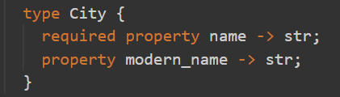

# Chapter 1 - Jonathan Harker travels to Transylvania

In the beginning of the book we see the main character Jonathan Harker, a young lawyer who is going to meet a client. The client is a rich man named Count Dracula who lives somewhere in Eastern Europe. Jonathan still doesn't know that Count Dracula is a vampire, so he's enjoying the trip to a new part of Europe. The book begins with Jonathan writing in his journal as he travels. The parts that are good for a database in **bold**:

>**3 May**. **Bistritz**.—Left **Munich** at **8:35 P.M.**, on **1st May**, arriving at **Vienna** early next morning; should have arrived at 6:46, but train was an hour late. **Buda-Pesth** seems a wonderful place, from the glimpse which I got of it from the train...

## Schema, object types

This is already a lot of information, and it helps us start to think about our database schema. The language used for EdgeDB is called EdgeQL, and is used to define, mutate, and query data. Inside it is [SDL (schema definition language)](https://edgedb.com/docs/edgeql/sdl/index#ref-eql-sdl) that makes migration easy, and which we will learn in this book. So far our schema needs the following:

- Some kind of City or Location type. These types that we can create are called [object types](https://www.edgedb.com/docs/datamodel/objects#object-types), made out of properties and links. What properties should a City type have? Perhaps a name and a location, and sometimes a different name or spelling. Bistritz for example is now called Bistrița (it's in Romania), and Buda-Pesth is now written Budapest.
- Some kind of Person type. We need it to have a name, and also a way to track the places that the person visited.
 
To make a type inside a schema, just use the keyword `type` followed by the type name, then `{}` curly brackets. Our `Person` type will start out like this:

```
type Person {
}
```

That's all you need to create a type, but there's nothing inside there yet. Inside the brackets we add the properties for our `Person` type. Use `required property` if the type needs it, and just `property` if it is optional.

```
type Person {
  required property name -> str;
  property places_visited -> array<str>;
}
```

With `required property name` our `Person` objects are always guaranteed to have a name - you can't make a `Person` object without it. Here's the error message if you try:

```
MissingRequiredError: missing value for required property default::Person.name
```

A `str` is just a string, and goes inside either single quotes: `'Jonathan Harker'` or double quotes: `"Jonathan Harker"`. The `\` escape character before a quote  makes EdgeDB treat it like just another letter: `'Jonathan Harker\'s journal'`.

An `array` is a collection of the same type, and our array here is an array of `str`s. We want it to look like this: `["Bistritz", "Vienna", "Buda-Pesth"]`. The idea is to easily search later and see which character has visited where.

`places_visited` is not a `required` property because we might later add minor characters that don't go anywhere. Maybe one person will be the "innkeeper_in_bistritz" or something, and we won't know or care about `places_visited` for him.

Now for our City type:

```
type City {
  required property name -> str;
  property modern_name -> str;
}
```

This is similar, just properties with strings. The book Dracula was published in 1897 when spelling for cities was sometimes different. All cities have a name in the book (that's why it's `required`), but some won't need a different modern name. Vienna is still Vienna, for example. We are imagining that our game will link the city names to their modern names so we can easily place them on a map.

## Migration

We haven't created our database yet, though. There are two small steps that we need to do first [after installing EdgeDB](https://edgedb.com/download). First we create a database with the `CREATE DATABASE` keyword and our name for it:

```
CREATE DATABASE dracula;
```

Then we type ```\c dracula``` to connect to it.

Lastly, we we need to do a migration. This will give the database the structure we need to start interacting with it. Migrations are not difficult with EdgeDB:

- First you start them with `START MIGRATION TO {}`
- Inside this you add at least one `module`, so your types can be accessed. A module is a namespace, a place where similar types go together. You go up and down a level inside a module with `::`. If you wrote `module default` and then `type Person`, the type `Person` would be at `default::Person`. So when you see a type like `std::bytes` for example, this means the type `bytes` inside `std` (the standard library).
- Then you add the types we mentioned above, and type `POPULATE MIGRATION` to add the data.
- Finally, you type `COMMIT MIGRATION` and the migration is done.

There are naturally a lot of other commands beyond this, though we won't need them for this book. You could bookmark these four pages for later use, however:

- [Admin commands](https://www.edgedb.com/docs/cheatsheet/admin): Creating user roles, setting passwords, configuring ports, etc.
- [CLI commands](https://www.edgedb.com/docs/cheatsheet/cli): Creating databases, roles, setting passwords for roles, connecting to databases, etc.
- [REPL commands](https://www.edgedb.com/docs/cheatsheet/repl): Mostly shortcuts for a lot of the commands we'll be using in this book.
- [Various commands](https://www.edgedb.com/docs/edgeql/statements/tx_rollback#rollback) about rolling back transactions, declaring savepoints, and so on.

There are also a few places to download packages to highlight your syntax if you like. EdgeDB has these packages available for [Atom](https://atom.io/packages/edgedb), [Visual Studio Code](https://marketplace.visualstudio.com/itemdetails?itemName=magicstack.edgedb), [Sublime Text](https://packagecontrol.io/packages/EdgeDB), and [Vim](https://github.com/edgedb/edgedb-vim).

Here's the `City` type we just made with syntax highlighting:



## Selecting

Here are three operators in EdgeDB that have the `=` sign: 

- `:=` is used to declare, 
- `=` is used to check equality (not `==`),
- `!=` is the opposite of `=`.

Let's try them out with `SELECT`. `SELECT` is the main query command in EdgeDB, and you use it to see results based on the input that comes after it. 

By the way, keywords in EdgeDB are case insensitive, so `SELECT`, `select` and `SeLeCT` are all the same. But using capital letters is the normal practice for databases so we'll continue to use them that way.

First we'll just select a string:

```
SELECT 'Jonathan Harker\'s journey begins.';
```

This returns `{'Jonathan Harker\'s journey begins.'}`, no surprise there.

Next we'll use `:=` to assign a variable:

```
SELECT jonathans_name := 'Jonathan Harker';
```

This just returns what we gave it: `{'Jonathan Harker'}`. But this time it's a string that we assigned called `jonathans_name` that is being returned.

Now let's do something with this variable. We can do a `SELECT` by first assigning to `jonathans_name` and then comparing it to `'Count Dracula'`:

```
SELECT jonathans_name := 'Jonathan Harker' = 'Count Dracula';
SELECT jonathans_name := 'Jonathan Harker' != 'Count Dracula';
```

The output is `{false}`, then `{true}`. Of course, you can just write `SELECT 'Jonathan Harker' = 'Count Dracula'` and `SELECT 'Jonathan Harker' != 'Count Dracula'` for the same result. Soon we will actually do something with the variables we assign with `:=`.

## Inserting objects

Let's get back to the schema. Later on we can think about adding time zones and locations for the cities for our imaginary game. But in the meantime, we will add some items to the database using `INSERT`. 

Don't forget to separate each property by a comma, and finish the `INSERT` with a semicolon. EdgeDB also prefers two spaces for indentation.

```
INSERT City {
  name := 'Munich',
};

INSERT City {
  name := 'Buda-Pesth',
  modern_name := 'Budapest'
};

INSERT City {
  name := 'Bistritz',
  modern_name := 'Bistrița'
};
```

Note that a comma at the end is optional - you can put it in or leave it out. Here we put a comma at the end sometimes and left it out at other times to show this.

Finally, the `Person` insert would look like this:

```
INSERT Person {
  name := 'Jonathan Harker',
  places_visited := ["Bistritz", "Vienna", "Buda-Pesth"],
};
```

But hold on a second. That insert won't link it to any of the `City` inserts that we already did. Here's where our schema needs some improvement:

- We have a `Person` type and a `City` type,
- The `Person` type has the property `places_visited` with the names of the cities, but they are just strings in an array. It would be better to link this property to the `City` type somehow.

So let's not do that `Person` insert. We'll fix the `Person` type soon by changing `array<str>` from a `property` to something called `multi link` to the `City` type. This will actually join them together.

But first let's look a bit closer at what happens when we use `INSERT`.

As you can see, `str`s are fine with unicode letters like ț. Even emojis and special characters are just fine: you could even create a `City` called '🤠' or '(╯°□°)╯︵ ┻━┻' if you wanted to.

EdgeDB also has a byte literal type that gives you the bytes of a string, but they must be characters that are 1 byte long. You create it by adding a `b` in front of the string:

```
SELECT b'Bistritz';
{b'Bistritz'}
```

And because the characters must be 1 byte, only ASCII works for this type. So the name in `modern_name` as a byte literal will generate an error because of the `ț`:

```
SELECT b'Bistrița';
error: invalid bytes literal: character 'ț' is unexpected, only ascii chars are allowed in bytes literals
```

Every time you `INSERT` an item, EdgeDB gives you a `uuid` back. That's the unique number for each item. It will look like this:

```
{Object {id: d2af670c-f1d6-11ea-a30f-8b40bc5413e0}}
```

It is also what shows up when you use `SELECT` to select a type. Just typing `SELECT` with a type will show you all the `uuid`s for the type. Let's look at all the cities we have so far:

```
SELECT City;
```

This gives us three items:

```
{
  Object {id: d2b64e00-f1d6-11ea-a30f-1f161d0b15ae},
  Object {id: d2c023b2-f1d6-11ea-a30f-e3069a47b57e},
  Object {id: d37bc838-f1d6-11ea-a30f-afb031317264},
}
```

This only tells us that there are three objects of type `City`. To see inside them, we can add property or link names to the query. This is called describing the [shape](https://www.edgedb.com/docs/edgeql/expressions/shapes/#ref-eql-expr-shapes) of the data we want. We'll select all `City` types and display their `modern_name` with this query:

```
SELECT City {
  modern_name,
};
```

Once again, you don't need the comma after `modern_name` because it's at the end of the query.

You will remember that one of our cities (Vienna) doesn't have anything for `modern_name`. But it still shows up as an "empty set", because every value in EdgeDB is a set of elements, even if there's nothing inside. Here is the result:

```
{Object {modern_name: {}}, Object {modern_name: 'Budapest'}, Object {modern_name: 'Bistrița'}}
```

So there is some object with an empty set for `modern_name`, while the other two have a name. This shows us that EdgeDB doesn't have `null` like in some languages: if nothing is there, it will return an empty set.

The first object is a mystery so we'll add `name` to the query so we can see that it's the city of Vienna:

```
SELECT City {
  name,
  modern_name
};
```

This gives the output:


```
{
  Object {name: 'Vienna', modern_name: {}},
  Object {name: 'Bistritz', modern_name: 'Bistrița'},
  Object {name: 'Buda-Pesth', modern_name: 'Budapest'}
}
```

If you just want to return a single part of a type without the object structure, you can use `.` after the type name. For example, `SELECT City.modern_name` will give this output:

```
{'Budapest', 'Bistrița'}
```

You can also change property names like `modern_name` to any other name if you want by using `:=` after the name you want. Those names you choose become the variable names that are displayed. For example:

```
SELECT City {
  name_in_dracula := .name,
  name_today := .modern_name,
};
```

This prints:

```
{
  Object {name_in_dracula: 'Munich', name_today: {}},
  Object {name_in_dracula: 'Buda-Pesth', name_today: 'Budapest'},
  Object {name_in_dracula: 'Bistritz', name_today: 'Bistrița'},
}
```

This will not change anything inside the schema - it's just a quick variable name to use in a query.

So if you can make a quick `name_in_dracula` property from `.name`, can we make other things too? Indeed we can. For the moment we'll just keep it simple but here is one example:

```
SELECT City {
  name_in_dracula := .name,
  name_today := .modern_name,
  oh_and_by_the_way := 'This is a city in the book Dracula'
};
```

And here is the output:

```
{
  Object {name_in_dracula: 'Munich', name_today: {}, oh_and_by_the_way: 'This is a city in the book Dracula'},
  Object {name_in_dracula: 'Buda-Pesth', name_today: 'Budapest', oh_and_by_the_way: 'This is a city in the book Dracula'},
  Object {name_in_dracula: 'Bistritz', name_today: 'Bistrița', oh_and_by_the_way: 'This is a city in the book Dracula'},
}
```

Also note that `oh_and_by_the_way` is of type `str` even though we didn't have to tell it. EdgeDB is strongly typed: everything needs a type and it will not try to mix them together. So if you write `SELECT 'Jonathan Harker' + 8;` it will simply refuse with an error: `QueryError: operator '+' cannot be applied to operands of type 'std::str' and 'std::int64'`.

On the other hand, it can use "type inference" to guess the type, and that is what it does here: it knows that we are creating a `str`. We will look at changing types and working with different types soon.

## Links

So now the last thing left to do is to change our `property` in `Person` called `places_visited` to a `link`. Right now, `places_visited` gives us the names we want, but it makes more sense to link `Person` and `City` together. After all, the `City` type has `.name` inside it which is better to link to than rewriting everything inside `Person`. We'll change `Person` to look like this:

```
type Person {
  required property name -> str;
  multi link places_visited -> City;
}
```

We wrote `multi` in front of `link` because one `Person` should be able to link to more than one `City`. The opposite of `multi` is `single`, which only allows one object to link to it. But `single` is the default, so if you just write `link` then EdgeDB will treat it as `single`.

Now when we insert Jonathan Harker, he will be connected to the type `City`. Don't forget that `places_visited` is not `required`, so we can still insert with just his name to create him:

```
INSERT Person {
  name := 'Jonathan Harker',
};
```

But this would only create a `Person` type connected to the `City` type but with nothing in it. Let's see what's inside:

```
SELECT Person {
  name,
  places_visited
};
```

Here is the output: `{Object {name: 'Jonathan Harker', places_visited: {}}}`

But we want to have Jonathan be connected to the cities he has traveled to. We'll change `places_visited` when we `INSERT` to `places_visited := City`:

```
INSERT Person {
  name := 'Jonathan Harker',
  places_visited := City,
};
```

We haven't filtered anything, so it will put all the `City` types in there. Now let's see the places that Jonathan has visited. The code below is almost but not quite what we need: 

```
select Person {
  name,
  places_visited
};
```

Here is the output:

```
  Object {
    name: 'Jonathan Harker',
    places_visited: {
      Object {id: 5ba2c9b2-f64d-11ea-acc7-d3a96742e345},
      Object {id: 5bbb2368-f64d-11ea-acc7-ffb002eabe1a},
      Object {id: 5bc2bba0-f64d-11ea-acc7-8b468bbfae39},
    },
  },
```

Close! But we didn't mention any properties inside `City` so we just got the object id numbers. Now we just need to let EdgeDB know that we want to see the `name` property of the `City` type. To do that, add a colon and then put `name` inside curly brackets.

```
select Person {
  name,
  places_visited: {
    name
  }
};
```

Success! Now we get the output we wanted:

```
  Object {
    name: 'Jonathan Harker',
    places_visited: {Object {name: 'Munich'}, Object {name: 'Buda-Pesth'}, Object {name: 'Bistritz'}},
  },
```

Of course, Jonathan Harker has been inserted with a connection to every city in the database. Right now we only have three `City` objects, so this is no problem yet. But later on we will have more cities and won't be able to just write `places_visited := City` for all the other characters. For that we will need `FILTER`, which we will learn to use in the next chapter.

[Here is all our code so far up to Chapter 1.](code.md)

## Time to practice

1. Entering `SELECT my_name = 'Timothy' != 'Benjamin';` returns an error. Try adding one character to make it return `{true}`.
2. Try inserting a `City` called Constantinople, but now known as İstanbul.
3. Try displaying all the names of the cities in the database. (Hint: you can do it in a single line of code and won't need `{}` to do it)
4. Try selecting all the `City` types along with their `name` and `modern_name` properties, but change `.name` to say `old_name` and change `modern_name` to say `name_now`.
5. Will typing `SelecT City;` produce an error?

[See the answers here.](answers.md)

Up next in Chapter 2: [Jonathan Harker arrives in Romania.](../chapter2/index.md)
