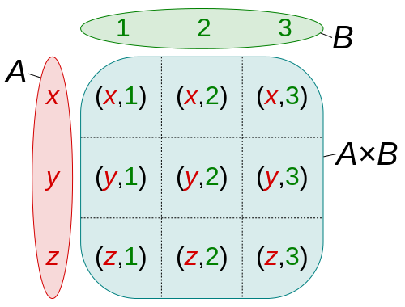

# Chapter 11 - What's wrong with Lucy?

> Dr. Van Helsing thinks that Lucy is being visited by a vampire. He doesn't tell the others yet because they won't believe him, but says they should close the windows and put garlic everywhere. They are confused, but Dr. Seward tells them to listen: Dr. Van Helsing is the smartest person he knows. It works, and Lucy gets better. But one night Lucy's mother walks into the room and thinks: "This place smells terrible! I'll open the windows for some fresh air." The next day Lucy wakes up pale and sick again. Every time someone makes a mistake like this Dracula gets in her room, and every time the men give Lucy their blood to help her get better. Meanwhile, Renfield continues to try to eat living things and Dr. Seward can't understand him. Then one day he didn't want to talk, only saying: “I don’t want to talk to you: you don’t count now; the Master is at hand.”

We are starting to see more and more events in the book with various characters. Some events have the three men and Dr. Van Helsing together, others have just Lucy and Dracula. Previous events had Jonathan Harker and Dracula, Jonathan Harker and the three women, and so on. In our game, we could use a sort of `Event` type to group everything together: the people, the time, the place, and so on.

This `Event` type is a bit long, but it would be the main type for our events in the game so it needs to be detailed. We can put it together like this:

```
type Event {
  required property description -> str;
  required property start_time -> cal::local_datetime;
  required property end_time -> cal::local_datetime;
  required multi link place -> Place;
  required multi link people -> Person;
  property exact_location -> tuple<float64, float64>;
  property east -> bool;
  property url := 'https://geohack.toolforge.org/geohack.php?params=' ++ <str>.exact_location.0 ++ ' N ' ++ <str>.exact_location.1 ++ ' ' ++ 'E' if .east = true else 'W';
}
```

You can see that most of the properties are `required`, because an `Event` type is not useful if it doesn't have all the information we need. It will always need a description, a time, place, and people participating. The interesting part is the `url` property: it's a computable that gives us an exact url for the location if we want. This one is not `required` because not every event in the book is in a perfectly known location.

The url that we are generating needs to know whether a location is east or west of Greenwich, and also whether they are north or south. Here is the url for Bistritz, for example:

`https://geohack.toolforge.org/geohack.php?pagename=Bistri%C8%9Ba&params=47_8_N_24_30_E`

Luckily for us, the events in the book all take place in the north part of the planet. So `N` is always going to be there. But sometimes they are east of Greenwich and sometimes west. To decide between east and west, we can use a simple `bool`. Then in the `url` property we put all the properties together to create a link, and finish it off with 'E' if `east` is `true`, and 'W' otherwise.

Let's insert one of the events in this chapter. It takes place on the night of September 11th when Dr. Van Helsing is trying to help Lucy. You can see that the `description` property is just a string that we write to make it easy to search later on. It can be as long or as short as we like, and we could even just paste in parts of the book.

```
INSERT Event {
  description := "Dr. Seward gives Lucy garlic flowers to help her sleep. She falls asleep and the others leave the room.",
  start_time := cal::to_local_datetime(1887, 9, 11, 18, 0, 0),
  end_time := cal::to_local_datetime(1887, 9, 11, 23, 0, 0),
  place := (SELECT Place FILTER .name = 'Whitby'),
  people := (SELECT Person FILTER .name ILIKE {'%helsing%', '%westenra%', '%seward%'}),
  exact_location := (54.4858, 0.6206),
  east := false
};
```

With all this information we can now find events by description, character, location, etc.

Now let's do a query for all events with the word `garlic flowers` in them:

```
SELECT Event {
  description,
  start_time,
  end_time,
  place: {
  __type__: {
    name
    },
  name
   },
  people: {
  name
    },
  exact_location,
  url
} FILTER .description ILIKE '%garlic flowers%';
```

It generates a nice output that shows us everything about the event:

```
{
  Object {
    description: 'Dr. Seward gives Lucy garlic flowers to help her sleep. She falls asleep and the others leave the room.',
    start_time: <cal::local_datetime>'1857-09-11T18:00:00',
    end_time: <cal::local_datetime>'1857-09-11T23:00:00',
    place: {Object {__type__: Object {name: 'default::City'}, name: 'Whitby'}},
    people: {
      Object {name: 'John Seward'},
      Object {name: 'Lucy Westenra'},
      Object {name: 'Abraham Van Helsing'},
    },
    exact_location: (54.4858, 0.6206),
    url: 'https://geohack.toolforge.org/geohack.php?params=54.4858 N 0.6206 W',
  },
}
```

The url works nicely too. Here it is: https://geohack.toolforge.org/geohack.php?params=54.4858_N_0.6206_W Clicking on it takes you directly to the city of Whitby.

## Writing our own functions

We saw that Renfield is quite strong: he has a strength of 10, compared to Jonathan's 5.

We could use this to experiment with making functions now. Because EdgeQL is strongly typed, you have to indicate both the input type and the return type in the signature. A function that takes an int16 and gives a float64 for example would have this signature:

```
function does_something(input: int16) -> float64
```

The `->` skinny arrow is used to show the return value.

For the body of the function we do the following:

- Write `using` and then follow it up with `()` brackets,
- Write the function inside it,
- Finish with a semicolon.

Here's a very simple function that takes a number and returns a string from it:

```
function make_string(input: int64) -> str
  using (<str>input);
```

That's all there is to it!

Now let's write a function where we have two characters fight. We will make it as simple as possible: the character with more strength wins, and if their strength is the same then the second player wins.

```
function fight(one: Person, two: Person) -> str
  using (
    SELECT one.name ++ ' wins!' IF one.strength > two.strength ELSE two.name ++ ' wins!'
);
```

So far only Jonathan and Renfield have the property `strength`, so let's put them up against each other:

```
WITH
  renfield := (SELECT Person filter .name = 'Renfield'),
  jonathan := (SELECT Person filter .name = 'Jonathan Harker')
    SELECT (
     fight(jonathan, renfield)
     );
```

It prints what we wanted to see: `{'Renfield wins!'}`

It might also be a good idea to add `LIMIT 1` when doing a filter for this function. Because EdgeDB returns sets, if it gets multiple results then it will use the function against each one. For example, let's imagine that we forgot that there were three women in the castle and wrote this:

```
WITH
  the_woman := (SELECT Person filter .name ILIKE '%woman%'),
  jonathan := (SELECT Person filter .name = 'Jonathan Harker')
  SELECT (
    fight(the_woman, jonathan)
    );
```

It would give us this result:

```
{'Jonathan Harker wins!', 'Jonathan Harker wins!', 'Jonathan Harker wins!'}
```

By the way, this result is unbelievable because Jonathan is weaker than all of the vampire women (vampires are very strong, both male and female). But right now their `strength` property just returns `{}`, so even Jonathan's strength of 5 is greater than this.

## Cartesian multiplication

This brings us to the subject of Cartesian multiplication. When you multiply sets in EdgeDB you are given the Cartesian product, which looks like this:



Source: [user quartl on Wikipedia](https://en.wikipedia.org/wiki/Cartesian_product#/media/File:Cartesian_Product_qtl1.svg)

This means that if we do a `SELECT` on `Person` for our `fight()` function, it will run the function following this formula:

- `{the number of items in the first set}` \* `{the number of items in the second set}`

So if there are two in the first set, and three in the second, it will run the function six times.

To demonstrate, let's put three objects in for each side of our function. We'll also make the output a little more clear:

```
WITH
  first_group := (SELECT Person FILTER .name in {'Jonathan Harker', 'Count Dracula', 'Arthur Holmwood'}),
  second_group := (SELECT Person FILTER .name in {'Renfield', 'Mina Murray', 'The innkeeper'}),
  SELECT(first_group.name ++ ' fights against ' ++ second_group.name ++ '. ' ++ fight(first_group, second_group));
```

Here is the output. It's a total of nine fights, where each person in Set 1 fights once against each person in Set 2.

```
{
  'Count Dracula fights against The innkeeper. The innkeeper wins!',
  'Count Dracula fights against Mina Murray. Mina Murray wins!',
  'Count Dracula fights against Renfield. Renfield wins!',
  'Jonathan Harker fights against The innkeeper. The innkeeper wins!',
  'Jonathan Harker fights against Mina Murray. Mina Murray wins!',
  'Jonathan Harker fights against Renfield. Renfield wins!',
  'Arthur Holmwood fights against The innkeeper. The innkeeper wins!',
  'Arthur Holmwood fights against Mina Murray. Mina Murray wins!',
  'Arthur Holmwood fights against Renfield. Renfield wins!',
}
```

And if you take out the filter and just write `SELECT Person` for the function, you will get well over 100 results. EdgeDB by default will only show the first 100, displaying this after showing you 100 results:

`` ... (further results hidden `\set limit 100`)``

[Here is all our code so far up to Chapter 11.](code.md)

## Time to practice

<!-- quiz-start -->

1. How would you write a function called `lucy()` that just returns all the `NPC` types matching the name 'Lucy Westenra'?

2. How would you write a function that takes two strings and returns `Person` types with names that match it?

   Hint: try using `SET OF Person` as the return type.

3. What will the output of this be?

   `SELECT {'Jonathan', 'Arthur'} ++ {' loves '} ++ {'Mina', 'Lucy'} ++ {' but '} ++ {'Dracula', 'The inkeeper'} ++ {' doesn\'t love '} ++ {'Mina', 'Jonathan'};`

4. How would you make a function that tells you how many times larger one city is than another?

5. Will `SELECT (City.population + City.population)` and `SELECT ((SELECT City.population) + (SELECT City.population))` produce different results?

[See the answers here.](answers.md)

<!-- quiz-end -->

Up next in Chapter 12: [Lucy one night: "Funny, what's that flapping against the window? Sounds like a bat or something..."](../chapter12/index.md)
