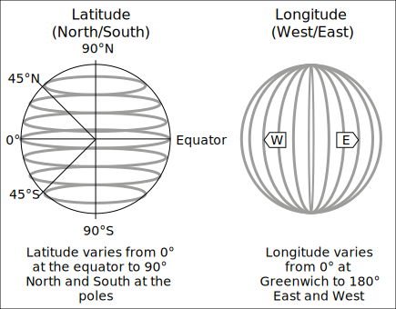

# Chapter 11 - What's wrong with Lucy?

> Dr. Van Helsing thinks that Lucy is being visited by a vampire. He doesn't tell the others yet because they won't believe him, but says they should close the windows and place garlic flowers everywhere in Lucy's room. They are confused, but Dr. Seward tells them to listen: Dr. Van Helsing is the smartest person he knows. It works, and Lucy gets better.
>
> But one night Lucy's mother walks into the room and thinks: "This place smells terrible! I'll open the windows for some fresh air." The next day Lucy wakes up pale and sick again. Every time someone makes a mistake like this Dracula gets in her room, and every time the men give Lucy their blood to help her get better. But Lucy is getting weaker and weaker as the days go by.
>
> Meanwhile, Renfield continues to try to eat living things and Dr. Seward can't understand him. Then one day Renfield doesn't want to talk at all, only saying: “I don’t want to talk to you: you don’t count now; the Master is at hand.”

We are starting to see more and more events in the book with various characters. Some events have the three men and Dr. Van Helsing together, others have just Lucy and Dracula. Previous events had Jonathan Harker and Dracula, Jonathan Harker and the three women, and so on. In our game, we could use a sort of `Event` type to group everything together: the people, the time, the place, and so on.

This `Event` type is a bit long, but it could be the main type for our events in the game so it needs to be detailed. We can put it together like this:

```sdl
type Event {
  required description: str;
  required start_time: cal::local_datetime;
  required end_time: cal::local_datetime;
  required multi place: Place;
  required multi people: Person;
  location: tuple<float64, float64>;
  ns_suffix := '_N_' if .location.0 > 0.0 else '_S_';
  ew_suffix := '_E' if .location.1 > 0.0 else '_W';
  url := 'https://geohack.toolforge.org/geohack.php?params=' 
    ++ <str>(math::abs(.location.0)) ++ .ns_suffix 
    ++ <str>(math::abs(.location.1)) ++ .ew_suffix;
}
```

You can see that most of the properties are `required`, because an `Event` type is not useful if it doesn't have all the information we need. It will always need a description, a time, place, and people participating. The interesting part is the `url` property: it's a computed property that gives us an exact url for the location if we want, which can then be looked up on the Geohack tool used by Wikipedia. This property is not `required` because not every event in the book is in a perfectly known location.

The url that we are generating needs to know whether a location is east or west of Greenwich, and also whether they are north or south. Here is the url for Bistritz, for example (modern name Bistrița):

```
https://geohack.toolforge.org/geohack.php?params=47.8_N_24.30_E
```

The `ns_suffix` property is either `_N_` or `_S_` depending on whether the latitute is greater than or less than zero. And `ew_suffix` is either `_E` or `_W` depending on whether the longitute is greater than or less than zero. The events in the book all take place in the north half of the planet, but we might as well give the possibility of exploring the south part of the globe. Who knows where the `PC` objects might end up exploring!

The `url` property is then computed using the two suffixes, plus the absolute values of the locations so that they show up as positive numbers in the url. EdgeDB just happens to have a function called `math::abs()` that will let us turn any number into an absolute number. So Whitby, which is located at 54.4858 and -0.6206, should show up as `54.4858_N_0.6206_W` in the url: both absolute numbers, but with a `W` to represent that Whitby is at 0.6206 degrees to the *west*.



Let's do a migration to add this `Event` type, and then insert two of the events from the story that we are familiar with.

One event takes place on the night of September 11th when Dr. Van Helsing is trying to help Lucy. The other event takes place when the Demeter left the Black Sea, entered the Bosphorous and was boarded by Turkish customs officials on its long and tragic journey to England. We aren't sure exactly where the boarding took place, but the lighthouse called Rumeli Feneri looks like a good place for Turkish government officials to notice a ship, so let's insert that as an `OtherPlace` as we insert the `Event`. And the `people` involved in this `Event` are all the sailors on the ship, plus Dracula. To join them together we can use the `union` keyword in a few places: once to join the `Ship.sailors` with the `Ship.crew`, and then finally to join them with the `Vampire` object named 'Count Dracula'.

You can see that the `description` property in the `Event` type is just a string to make it easy to search later on. It can be as long or as short as we like, and we can even outright paste in parts of the book.

Here are the inserts for these two `Event`s:

```edgeql
insert Event {
  description := "Dr. Seward gives Lucy garlic flowers to help her sleep. She falls asleep and the others leave the room.",
  start_time := cal::to_local_datetime(1893, 9, 11, 18, 0, 0),
  end_time := cal::to_local_datetime(1893, 9, 11, 23, 0, 0),
  place := (select Place filter .name = 'Whitby'),
  people := (select Person filter .name ilike 
    {'%helsing%', '%westenra%', '%seward%'}),
  location := (54.4858, -0.6206),
};

with 
  ship_people := (select Ship.sailors union Ship.crew filter Ship .name = 'The Demeter'),
  dracula := (select Vampire filter .name = 'Count Dracula'),
insert Event {
  description := "On 11 July at dawn entered Bosphorus. Boarded by Turkish Customs officers. Backsheesh. All correct. Under way at 4 p.m.",
  start_time := cal::to_local_datetime(1893, 7, 11, 7, 0, 0),
  end_time := cal::to_local_datetime(1893, 7, 11, 16, 0, 0),
  place := (insert OtherPlace {name := 'Rumeli Feneri'}),
  people := ship_people union dracula,
  location := (41.2350, 29.1100)
};
```

Let's do a query to show the location, place names, person names, and description for our events so far.

```edgeql
select Event { 
  place_name := .place.name,
  map_url := .url,
  people_names := .people.name,
  description,
  };
```

It generates a nice output that shows us everything about the event:

```
{
  default::Event {
    place_name: {'Whitby'},
    map_url: 'https://geohack.toolforge.org/geohack.php?params=54.4858_N_0.6206_W',
    people_names: {'John Seward', 'Abraham Van Helsing', 'Lucy Westenra'},
    description: 'Dr. Seward gives Lucy garlic flowers to help her sleep. She falls asleep and the others leave the room.',
  },
  default::Event {
    place_name: {'Rumeli Feneri'},
    map_url: 'https://geohack.toolforge.org/geohack.php?params=41.235_N_29.11_E',
    people_names: {
      'The Captain',
      'Petrofsky',
      'The First Mate',
      'The Cook',
      'Crewman 1',
      'Crewman 2',
      'Crewman 3',
      'Crewman 4',
      'Crewman 5',
      'Count Dracula',
    },
    description: 'On 11 July at dawn entered Bosphorus. Boarded by Turkish Customs officers. Backsheesh. All correct. Under way at 4 p.m.',
  },
}
```

The urls work nicely too. Here is one of them: <https://geohack.toolforge.org/geohack.php?params=54.4858_N_0.6206_W> Clicking on it takes you directly to the city of Whitby.

## Writing our own functions

We have seen quite a few functions in EdgeDB so far, but the number of functions is actually unlimited because you can also write your own! Similar to other languages, functions in EdgeDB take an input, apply some logic, and generate an output. But EdgeQL is strongly typed, so it won't accept just anything as is the case with languages like Javascript. That means that you have to indicate both the input type and the return type in the signature.

A function that takes an `int16` and returns a `float64` for example would have this signature:

```sdl
function does_something(input: int16) -> float64
```

The `->` (skinny arrow) is used to show the return value.

For the body of the function we do the following:

- Write `using` and then follow it up with `()` brackets,
- Write the function inside it,
- Finish with a semicolon.

Here's a very simple function that takes a number and returns a string from it:

```sdl
function make_string(input: int64) -> str
  using (<str>input);
```

That's all there is to it! If you put this into your schema and do a migration then you will now be able to use this function.

Now let's make something a little more useful: a quick function to make our `Event` type a little nicer to read. Instead of putting `'https://geohack.toolforge.org/geohack.php?params='` inside the `Event` type, we can make a function called `get_url()` that simply returns this `str` for us. With that, our `url` property definition can be 42 characters shorter. Let's add this function to the schema and change the `url` in the `Event` type to use it:

```sdl
function get_url() -> str
  using (<str>'https://geohack.toolforge.org/geohack.php?params=');

type Event {
  required description: str;
  required start_time: cal::local_datetime;
  required end_time: cal::local_datetime;
  required multi place: Place;
  required multi people: Person;
  location: tuple<float64, float64>;
  ns_suffix := '_N_' if .location.0 > 0.0 else '_S_';
  ew_suffix := '_E' if .location.1 > 0.0 else '_W';
  url := get_url() 
    ++ <str>(math::abs(.location.0)) ++ .ns_suffix 
    ++ <str>(math::abs(.location.1)) ++ .ew_suffix;
}
```

Next, let's write a function that's less useful but more fun and which will teach us some interesting concepts in EdgeDB. The function will have two `Person` objects fight each other, so we'll call it `fight()`. We will make it as simple as possible: the character with more strength wins, and if their strength is the same then the second player wins.

You might be tempted to write this function as follows, but it doesn't quite work yet!

```sdl
function fight(one: Person, two: Person) -> str
  using (
    one.name ++ ' wins!'
    if one.strength > two.strength
    else two.name ++ ' wins!'
  );
```

The function _looks_ good, but when you try to create it, you'll get an error. The line at the bottom of the error is the one to pay attention to.

```
error: return cardinality mismatch in function declared to return exactly one value
    ┌─ C:\rust\easy-edgedb\dbschema\default.esdl:118:9
    │
118 │     using (
    │ ╭─────────^
119 │ │     one.name ++ ' wins!'
120 │ │     if one.strength > two.strength
121 │ │     else two.name ++ ' wins!'
122 │ │   );
    │ ╰───^ error
    │
    = Function may return an empty set.
```

This happens because `strength` is not required on our `Person` type. That means that we might pass in one or two `Person` objects that have an empty set for `strength`, and then the function will return an empty set instead of a `str`. EdgeDB doesn't like this because we've told it in the function definition that the function will return a string.

We could go back and make `strength` a `required` property, but we would need to decide on values for all of our `Person` objects already in the database. That's a lot of trouble, and it's not something we're ready to do right now.

## Providing fallbacks with the coalescing operator

The easiest way to fix our function would be to provide some sort of fallback for the properties that might not be set. If someone doesn't have a strength, we could just default their strength to `0`.

To do that we can use the {eql:op}`coalescing operator <docs:coalesce>`, which is written `??`. It evaluates to whatever is on the left if that's not empty. Otherwise, it evaluates to whatever is on the right.

Here is a quick example of an empty set when the coalescing operator is not used:

```edgeql
select <str>{} ++ 'Count Dracula is now in Whitby';
```

Interestingly, the output is `{}`! An empty set combined with anything else is an empty set. But if we change `++` to `??` for the coalescing operator, we can return a default value even if there is an empty set to the left.

```edgeql
select <str>{} ?? 'Count Dracula is now in Whitby';
```

Since the set on the left is empty, the coalescing operator turns its attention to the set on the right and returns that: `{'Count Dracula is now in Whitby'}` If neither side of the operator is the empty set, the coalescing operator will produce whatever is on the left. If _both_ sides are the empty set, it will produce the empty set.

Here's how we can use the coalescing operator to fix our function:

```sdl
function fight(one: Person, two: Person) -> str
  using (
    one.name ++ ' wins!' if (one.strength ?? 0) > (two.strength ?? 0)
    else two.name ++ ' wins!'
  );
```

With this change, EdgeDB now has fallbacks in the event that a `Person` object has an empty set for its `strength` property: it will return a 0 instead of an empty set. This ensures that the function can always return the string response we promised.

Now that our function works, let's do a migration.

So far only Jonathan and Renfield have the property `strength`, so let's put them up against each other in this new `fight()` function:

```edgeql
with
  renfield := (select Person filter .name = 'Renfield'),
  jonathan := (select Person filter .name = 'Jonathan Harker')
select (
  fight(jonathan, renfield)
);
```

It prints what we wanted to see: `{'Renfield wins!'}`

It might also be a good idea to add `assert_single()` when doing a filter for this function. Because EdgeDB returns sets, if it gets multiple results then it will use the function against each one for each possible combination. The way EdgeDB handles this is through Cartesian multiplication, so let's learn about that now.

## Cartesian multiplication

Cartesian multiplication is a key concept in EdgeDB. The name sounds intimidating but it really just means "evaluate every item in one set with every item in the other set". It's easiest to understand when viewed as an illustration, which fortunately Wikipedia has already made for us. When you do operations on multiple sets in EdgeDB you are given the Cartesian product, which looks like this:


Source: [user quartl on Wikipedia](https://en.wikipedia.org/wiki/Cartesian_product#/media/File:Cartesian_Product_qtl1.svg)

Here is a quick example of a query that operates on two sets. Since it will "evaluate every item in one set with every item in the other set", what do you think the output will be?

```
select { 'Jonathan', 'Lucy' } ++ ' ' ++ { 'Harker', 'Westenra'};
```

That's right, it is using `++` to concatenate and will concatenate every item in one set with every item in the other. So that will return a set of four strings:

```
{'Jonathan Harker', 'Jonathan Westenra', 'Lucy Harker', 'Lucy Westenra'}
```

The extra `' '` in the middle doesn't increase the number of items in the set because it is just one item, and one multiplied by four is still four.

And if you add 'Mina' to the first set of names and 'Murray' to the second, the output will be a set of nine strings:

```
{
  'Jonathan Harker',
  'Jonathan Westenra',
  'Jonathan Murray',
  'Lucy Harker',
  'Lucy Westenra',
  'Lucy Murray',
  'Mina Harker',
  'Mina Westenra',
  'Mina Murray',
}
```

This means that if we do a `select` on `Person` for our `fight()` function, it will run the function following this formula:

```
{number of items in the first set}` \* `{number of items in the second set}
```

So if there are two in the first set, and three in the second, it will run the function six times.

To demonstrate, let's put three objects in for each side of our function. We'll be testing our `fight` function, so we'll just give all the characters strength value 5 if they don't already have some other value:

```edgeql
update Person filter not exists .strength
set {
  strength := 5
};
```

We'll also make the output a little more clear:

```edgeql
with
  first_group := (select Person filter .name in 
    {'Jonathan Harker', 'Count Dracula', 'Arthur Holmwood'}),
  second_group := (select Person filter .name in 
    {'Renfield', 'Mina Murray', 'The innkeeper'}),
select (
  first_group.name ++ ' fights against ' ++ second_group.name 
    ++ '. ' ++ fight(first_group, second_group)
);
```

Here is the output. It's a total of nine fights, where each person in Set 1 fights once against each person in Set 2.

```
{
  'Jonathan Harker fights against Renfield. Renfield wins!',
  'Jonathan Harker fights against The innkeeper. The innkeeper wins!',
  'Jonathan Harker fights against Mina Murray. Mina Murray wins!',
  'Arthur Holmwood fights against Renfield. Renfield wins!',
  'Arthur Holmwood fights against The innkeeper. The innkeeper wins!',
  'Arthur Holmwood fights against Mina Murray. Mina Murray wins!',
  'Count Dracula fights against Renfield. Renfield wins!',
  'Count Dracula fights against The innkeeper. The innkeeper wins!',
  'Count Dracula fights against Mina Murray. Mina Murray wins!',
}
```

And if you take out the filter and just write `select Person` for the function, you will get well over 100 results. EdgeDB by default will only show the first 100, eventually displaying this after the first 100 results:

```
# First 98 results...
'Count Dracula wins!',
'Fighter 2 wins!',
 ... (further results hidden `\set limit 100`)
```

If you want to display more or less than a maximum of 100 (the default), just type `\set limit` followed by whichever number you like.

## Grouping

In the last chapter we learned how to use `order by` to order the results of a query, which produces a single set in a certain order. Let's do a quick query to ensure that we remember how to do this:

```edgeql
select City {
  name, 
  population
} order by .population;
```

The result is a single set with the `City` objects ordered by population in ascending order (going up). If we had written `order by .population desc`, it would have gone in descending order.

```
{
  default::City {name: 'Bistritz', population: 9100},
  default::City {name: 'Whitby', population: 14400},
  default::City {name: 'Munich', population: 230023},
  default::City {name: 'Buda-Pesth', population: 402706},
  default::City {name: 'London', population: 3500000},
}
```

Now let's say we want to do a similar query to see which NPCs are single and which are not. Looks a bit weird, doesn't it? After all, `.is_single` only returns `true` or `false`.

```edgeql
select NPC {
  name, 
  is_single
} order by .is_single;
```

The output is indeed a bit weird:

```
{
  default::NPC {name: 'Jonathan Harker', is_single: false},
  default::NPC {name: 'Mina Murray', is_single: false},
  default::NPC {name: 'Lucy Westenra', is_single: false},
  default::NPC {name: 'Arthur Holmwood', is_single: false},
  default::NPC {name: 'Abraham Van Helsing', is_single: true},
  default::NPC {name: 'John Seward', is_single: true},
  default::NPC {name: 'Renfield', is_single: true},
  default::NPC {name: 'The innkeeper', is_single: true},
  default::NPC {name: 'Quincey Morris', is_single: true},
}
```

The objects returning `false` do come before those that return `true`, but this isn't really an ordering. A true ordering would be more along the lines of single*ness* (let's say from 0 to 100) where a singleness of 0 represents one extreme (someone who is married and never ever has time alone), and a singleness of 100 the other extreme (someone who is absolutely always alone). And most people would have a number somewhere in between.

So what we are looking for here with `is_single` is not an ordering, but a grouping: one group of NPC objects that are single, and another group of NPC objects that are not. EdgeDB has an operator called `group` which does just that! To do a `group` query, just change `select` to `group`:

```edgeql
group NPC {
  name, 
  is_single
} by .is_single;
```

The output for the `group` operator is quite nice, as each set includes two extra parameters:

- `grouping` to show how the set has been grouped,
- `key` to show which group the set belongs to.

```
{
  {
    key: {is_single: false},
    grouping: {'is_single'},
    elements: {
      default::NPC {name: 'Jonathan Harker', is_single: false},
      default::NPC {name: 'Mina Murray', is_single: false},
      default::NPC {name: 'Lucy Westenra', is_single: false},
      default::NPC {name: 'Arthur Holmwood', is_single: false},
    },
  },
  {
    key: {is_single: true},
    grouping: {'is_single'},
    elements: {
      default::NPC {name: 'Abraham Van Helsing', is_single: true},
      default::NPC {name: 'John Seward', is_single: true},
      default::NPC {name: 'Renfield', is_single: true},
      default::NPC {name: 'The innkeeper', is_single: true},
      default::NPC {name: 'Quincey Morris', is_single: true},
    },
  },
}
```

Grouping can be a lot more complex than adding `by` and a property name. For reference, here is what the full syntax looks like.

```
[ with with-item [, ...] ]

group [alias := ] expr

[ using using-alias := expr, [, ...] ]

by grouping-element, ... ;
```

You don't need to memorize the syntax, but a quick read shows us that the keyword `with` can be used before writing `group`, and the keyword `using` can be used after `group` to create our name for a grouping.

Take our `City` objects for example. Each one has a different population, so if we were to use this query we would simply get a big list of groups containing one `City` object each:

```edgeql
group City { population } by .population;
```

Instead, we can make up a grouping called `is_big` that we define as a population greater than 50,000:

```
group City {name, population}
  using is_big := .population > 50000,
  by is_big;
```

With that, we now have our cities divided into big and small while displaying their names and populations.

```
{
  {
    key: {is_big: false},
    grouping: {'is_big'},
    elements: {
      default::City {name: 'Whitby', population: 14400},
      default::City {name: 'Bistritz', population: 9100},
    },
  },
  {
    key: {is_big: true},
    grouping: {'is_big'},
    elements: {
      default::City {name: 'Munich', population: 230023},
      default::City {name: 'Buda-Pesth', population: 402706},
      default::City {name: 'London', population: 3500000},
    },
  },
}
```

We can define as many of these as we like. The query below defines `big` as any population greater than 50,000, `small` as any population less than 10,000, and `medium` as any population that is neither `big` nor `small`.

```edgeql
group City {name, population}
  using big := .population > 50000,
  small := .population < 10000,
  medium := not big and not small,
  by big, medium, small;
```

The output now shows three groups:

```
{
  {
    key: {big: false, small: false, medium: true},
    grouping: {'big', 'medium', 'small'},
    elements: {default::City {name: 'Whitby', population: 14400}},
  },
  {
    key: {big: false, small: true, medium: false},
    grouping: {'big', 'medium', 'small'},
    elements: {default::City {name: 'Bistritz', population: 9100}},
  },
  {
    key: {big: true, small: false, medium: false},
    grouping: {'big', 'medium', 'small'},
    elements: {
      default::City {name: 'Munich', population: 230023},
      default::City {name: 'Buda-Pesth', population: 402706},
      default::City {name: 'London', population: 3500000},
    },
  },
}
```

And because an expression comes right after the `group` keyword, we can use `with` and `select` to create an expression before typing `group`. This way we can filter an expression before we group it. Let's use this method to group our `NPC` objects to see who is still single and who has a title (perhaps for a dating app). But we want to make sure that they are alive first! To make sure that they are alive, we can filter by `not exists .last_appearance`. Here is the full query:

```edgeql
with still_alive := (select NPC filter not exists .last_appearance),
  group still_alive { name, title } using
  has_title := exists .title,
  by .is_single, has_title;
```

Note that `.is_single` has a `.` because it is a property on `NPC` while `has_title` does not because it is a name that we defined inside the query.

The result is three groups of people. Interestingly, the NPCs that are doctors are both single!

```edgeql
{
  {
    key: {has_title: false, is_single: false},
    grouping: {'is_single', 'has_title'},
    elements: {
      default::NPC {name: 'Jonathan Harker', title: {}},
      default::NPC {name: 'Mina Murray', title: {}},
      default::NPC {name: 'Lucy Westenra', title: {}},
      default::NPC {name: 'Arthur Holmwood', title: {}},
    },
  },
  {
    key: {has_title: false, is_single: true},
    grouping: {'is_single', 'has_title'},
    elements: {
      default::NPC {name: 'Quincey Morris', title: {}},
      default::NPC {name: 'Renfield', title: {}},
      default::NPC {name: 'The innkeeper', title: {}},
    },
  },
  {
    key: {has_title: true, is_single: true},
    grouping: {'is_single', 'has_title'},
    elements: {
      default::NPC {name: 'Abraham Van Helsing', title: 'Dr.'},
      default::NPC {name: 'John Seward', title: 'Dr.'},
    },
  },
}
```

Abraham van Helsing, however, is single because he is a widower. Our schema doesn't include that status so he has been grouped along with John Seward who has never been married. Sometimes a database query doesn't tell you the full story!

[Here is all our code so far up to Chapter 11.](code.md)

<!-- quiz-start -->

## Time to practice

1. How would you write a function called `get_lucies()` that just returns all the `Person` types matching the name 'Lucy Westenra'?

2. How would you write a function that takes two strings and returns `Person` objects with names that match each string?

   Hint: try using `set of Person` as the return type.

3. What will the output of this be?

   ```edgeql
   select {'Jonathan', 'Arthur'} ++ {' loves '} 
     ++ {'Mina', 'Lucy'} ++ {' but '} ++ {'Dracula', 'The inkeeper'} 
     ++ {' doesn\'t love '} ++ {'Mina', 'Jonathan'};
   ```

4. How would you make a function that tells you how many times larger one city is than another?

5. Will `select (City.population + City.population)` and `select ((select City.population) + (select City.population))` produce different results?

[See the answers here.](answers.md)

<!-- quiz-end -->

__Up next:__ _Lucy one night: "What's that flapping against the window? Sounds like a bat or something..."_
